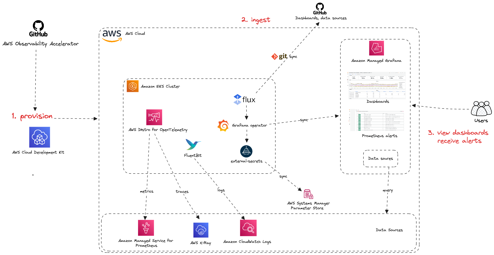

# AWS Observability Accelerator for AWS CDK

Welcome to the AWS Observability Accelerator for CDK!

The AWS Observability Accelerator for CDK is a set of opinionated modules
to help you set up observability for your AWS environments with AWS-managed observability services such as Amazon Managed Service for Prometheus,Amazon Managed Grafana, AWS Distro for OpenTelemetry (ADOT) and Amazon CloudWatch.

We provide curated metrics, logs, traces collection, alerting rules and Grafana dashboards for your EKS infrastructure, Java/JMX, NGINX based workloads and your custom applications.



## Patterns

The individual patterns can be found in the `lib` directory.  Most of the patterns are self-explanatory, for some more complex examples please use this guide and docs/patterns directory for more information.

## Documentation

Please refer to the AWS CDK Observability Accelertor [documentation site](tbd) for complete project documentation.

## Usage
Before proceeding, make sure [AWS CLI](https://docs.aws.amazon.com/cli/latest/userguide/getting-started-install.html) is installed on your machine.

To use the eks-blueprints and patterns module, you must have [Node.js](https://nodejs.org/en/) and [npm](https://docs.npmjs.com/downloading-and-installing-node-js-and-npm) installed. You will also use `make` to simplify build and other common actions. 

### Mac Setup:

Follow the below steps to setup and leverage `cdk-aws-observability-accelerator` in your local Mac laptop.

1. Install `make` and `node` using brew

```
brew install make
brew install node
```

2. Install `npm`

```
sudo npm install -g n
sudo n stable
```

3. Make sure the following pre-requisites are met:

- Node version is a current stable node version 18.x.

```bash
$ node -v
v18.12.1
```

Update (provided Node version manager is installed): `n stable`. May require `sudo`.

-  NPM version must be 8.4 or above:

```bash
$ npm -v
8.19.2
```

Updating npm: `sudo n stable` where stable can also be a specific version above 8.4. May require `sudo`.

4. Clone the `cdk-aws-observability-accelerator` repository

```
git clone https://github.com/aws-observability/cdk-aws-observability-accelerator.git
``` 

PS: If you are contributing to this repo, please make sure to fork the repo, add your changes and create a PR against it.

5. Once you have cloned the repo, you can open it using your favourite IDE and run the below commands to install the dependencies and build the existing patterns.

- Install project dependencies.

```
make deps
```

- To view patterns that are available to be deployed, execute the following:

```
npm i
make build
```

- To list the existing CDK AWS OBSERVABILITY ACCELERATOR PATTERNS

```
make list
```

Note: Some patterns have a hard dependency on AWS Secrets (for example GitHub access tokens). Initially you will see errors complaining about lack of the required secrets. It is normal. At the bottom, it will show the list of patterns which can be deployed, in case the pattern you are looking for is not available, it is due to the hard dependency which can be fixed by following the docs specific to those patterns.

```
To work with patterns use: 
        $ make pattern <pattern-name> <list | deploy | synth | destroy>
Example:
        $ make pattern single-new-eks-cluster-opensource deploy

Patterns:

	single-new-eks-awsnative-observability
	single-new-eks-mixed-observability
	single-new-eks-opensource-observability
```

- Bootstrap your CDK environment.

```
npx cdk bootstrap
```

- You can then deploy a specific pattern with the following:

```
make pattern multi-team deploy
```

# Developer Flow

## Modifications

All files are compiled to the dist folder including `lib` and `bin` directories. For iterative development (e.g. if you make a change to any of the patterns) make sure to run compile:

```bash
make compile
```

The `compile` command is optimized to build only modified files and is fast. 

## New Patterns

To create a new pattern, please follow these steps:

1. Under lib create a folder for your pattern, such as `<pattern-name>-construct`. If you plan to create a set of patterns that represent a particular subdomain, e.g. `security` or `hardening`, please create an issue to discuss it first. If approved, you will be able to create a folder with your subdomain name and group your pattern constructs under it. 
2. Blueprints generally don't require a specific class, however we use a convention of wrapping each pattern in a plain class like `<Pattern-Name>Construct`. This class is generally placed in `index.ts` under your pattern folder. 
3. Once the pattern implementation is ready, you need to include it in the list of the patterns by creating a file `bin/<pattern-name>.ts`. The implementation of this file is very light, and it is done to allow patterns to run independently.

Example simple synchronous pattern:
```typescript
import { configureApp } from '../lib/common/construct-utils';
import FargateConstruct from '../lib/fargate-construct';

new FargateConstruct(configureApp(), 'fargate'); // configureApp() will create app and configure loggers and perform other prep steps
```

4. In some cases, patterns need to use async APIs. For example, they may rely on external secrets that you want to validate ahead of the pattern deployment. 

Example async pattern:

```typescript
import { configureApp, errorHandler } from '../lib/common/construct-utils';

const app = configureApp();

new NginxIngressConstruct().buildAsync(app, 'nginx').catch((e) => {
    errorHandler(app, "NGINX Ingress pattern is not setup. This maybe due to missing secrets for ArgoCD admin pwd.", e);
});
```

5. There are a few utility functions that can be used in the pattern implementation such as secret prevalidation. This function will fail if the corresponding secret is not defined, this preventing the pattern to deploy. 

```typescript
await prevalidateSecrets(NginxIngressConstruct.name, undefined, SECRET_ARGO_ADMIN_PWD); 
await prevalidateSecrets("my-pattern-name", 'us-east-1', 'my-secret-name'); // 
```

## Security

See [CONTRIBUTING](./contributors.md#security-issue-notifications) for more information.

## License

This library is licensed under the MIT-0 License. See the LICENSE file.
