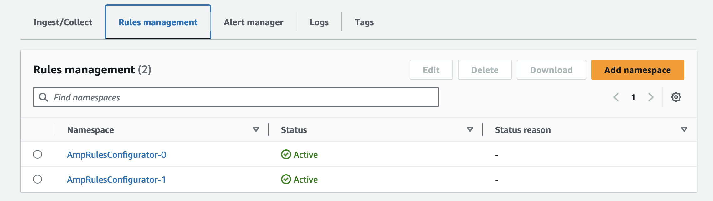

# AMP Rules Configurator Add-on

This add-on enables you to define rules for Amazon Managed Service for Prometheus (AMP).

## Prerequisites

You need to create one or multiple files encoding AMP recording rules and/or alerting rules, [according to the AWS AMP guidelines](https://docs.aws.amazon.com/prometheus/latest/userguide/AMP-ruler-rulesfile.html), e.g.:

```
groups:
  - name: test
    rules:
    - record: metric:recording_rule
      expr: avg(rate(container_cpu_usage_seconds_total[5m]))
  ...
```

## Usage

An AMP workspace needs to exist already or otherwise you can create one manually in the AWS Console or with the related resource provider as per below:

```
ObservabilityBuilder.builder()
    ...
    .resourceProvider(ampWorkspaceName, new blueprints.CreateAmpProvider(ampWorkspaceName, ampWorkspaceName))
    .addOns(...addOns)
    .build(scope, stackId);
```

## Configuration Options

- `ampWorkspaceArn`: (string) The ARN of the AMP workspace
- `ruleFilePaths`: (string[]) Paths of the files listing the AMP rules

## Validation

Once deployed, you can validate the application of your rules by accessing the AWS console and navigating to the given AMP workspace. Under the Rules management tab, you will see a list of rules similar to the following:

