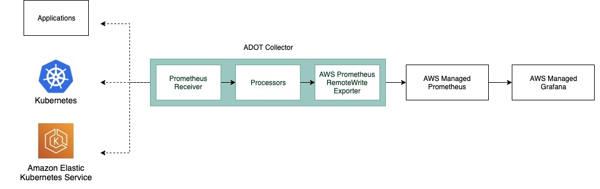
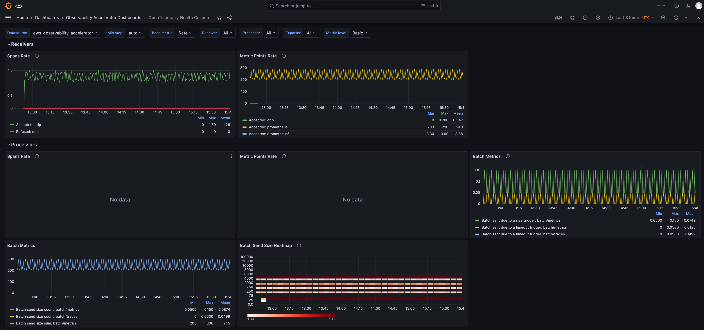
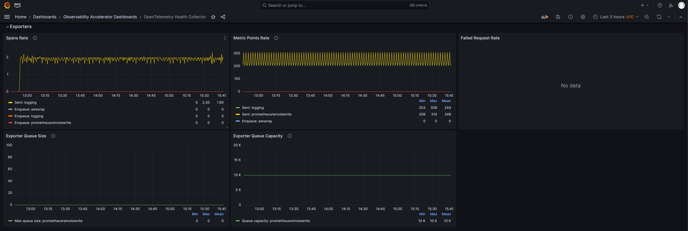
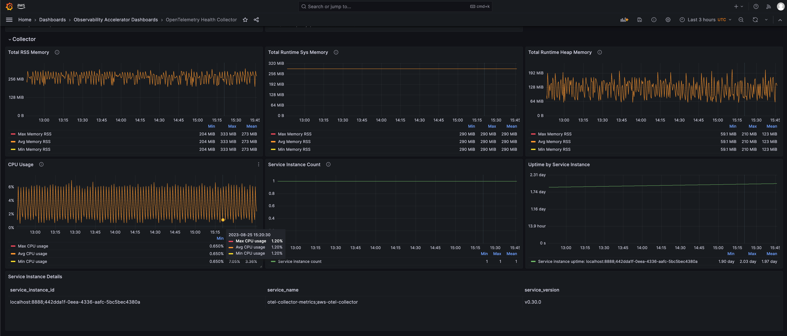
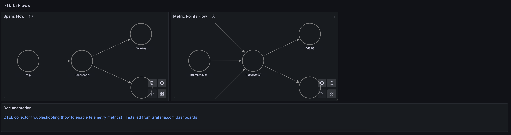

# Single Cluster Open Source Observability - OTEL Collector Monitoring

## Objective

This pattern aims to add Observability on top of an existing EKS cluster and adds monitoring for ADOT collector health, with open source managed AWS services.

## Prerequisites:

Ensure that you have installed the following tools on your machine:

1. [aws cli](https://docs.aws.amazon.com/cli/latest/userguide/install-cliv2.html)
2. [kubectl](https://Kubernetes.io/docs/tasks/tools/)
3. [cdk](https://docs.aws.amazon.com/cdk/v2/guide/getting_started.html#getting_started_install)
4. [npm](https://docs.npmjs.com/cli/v8/commands/npm-install)

You will also need:

1. Either an existing EKS cluster, or you can setup a new one with  [Single New EKS Cluster Observability Accelerator](../single-new-eks-observability-accelerators/single-new-eks-cluster.md)
2. An OpenID Connect (OIDC) provider, associated to the above EKS cluster (Note: Single EKS Cluster Pattern takes care of that for you)

## Deploying

1. Edit `~/.cdk.json` by setting the name of your existing cluster:

```json
    "context": {
        ...
        "existing.cluster.name": "...",
        ...
    }
```

2. Edit `~/.cdk.json` by setting the kubectl role name; if you used Single New EKS Cluster Observability Accelerator to setup your cluster, the kubectl role name would be provided by the output of the deployment, on your command-line interface (CLI):

```json
    "context": {
        ...
        "existing.kubectl.rolename":"...",
        ...
    }
```

3. Amazon Managed Grafana workspace: To visualize metrics collected, you need an Amazon Managed Grafana workspace. If you have an existing workspace, create an environment variable as described below. To create a new workspace, visit [our supporting example for Grafana](https://aws-observability.github.io/terraform-aws-observability-accelerator/helpers/managed-grafana/)

!!! note
For the URL `https://g-xyz.grafana-workspace.us-east-1.amazonaws.com`, the workspace ID would be `g-xyz`

```bash
export AWS_REGION=<YOUR AWS REGION>
export COA_AMG_WORKSPACE_ID=g-xxx
export COA_AMG_ENDPOINT_URL=https://g-xyz.grafana-workspace.us-east-1.amazonaws.com
```

!!! warning
Setting up environment variables `COA_AMG_ENDPOINT_URL` and `AWS_REGION` is mandatory for successful execution of this pattern.

4. GRAFANA API KEY: Amazon Managed Grafana provides a control plane API for generating Grafana API keys.

```bash
export AMG_API_KEY=$(aws grafana create-workspace-api-key \
  --key-name "grafana-operator-key" \
  --key-role "ADMIN" \
  --seconds-to-live 432000 \
  --workspace-id $COA_AMG_WORKSPACE_ID \
  --query key \
  --output text)
```

5. AWS SSM Parameter Store for GRAFANA API KEY: Update the Grafana API key secret in AWS SSM Parameter Store using the above new Grafana API key. This will be referenced by Grafana Operator deployment of our solution to access Amazon Managed Grafana from Amazon EKS Cluster

```bash
aws ssm put-parameter --name "/cdk-accelerator/grafana-api-key" \
    --type "SecureString" \
    --value $AMG_API_KEY \
    --region $AWS_REGION
```

6. Install project dependencies by running `npm install` in the main folder of this cloned repository.

7. The actual settings for dashboard urls are expected to be specified in the CDK context. Generically it is inside the cdk.json file of the current directory or in `~/.cdk.json` in your home directory.

Example settings: Update the context in `cdk.json` file located in `cdk-eks-blueprints-patterns` directory

```typescript
   "context": {
    "fluxRepository": {
      "name": "grafana-dashboards",
      "namespace": "grafana-operator",
      "repository": {
        "repoUrl": "https://github.com/aws-observability/aws-observability-accelerator",
        "name": "grafana-dashboards",
        "targetRevision": "main",
        "path": "./artifacts/grafana-operator-manifests/eks/infrastructure"
      },
      "values": {
        "GRAFANA_CLUSTER_DASH_URL" : "https://raw.githubusercontent.com/aws-observability/aws-observability-accelerator/main/artifacts/grafana-dashboards/eks/infrastructure/cluster.json",
        "GRAFANA_KUBELET_DASH_URL" : "https://raw.githubusercontent.com/aws-observability/aws-observability-accelerator/main/artifacts/grafana-dashboards/eks/infrastructure/kubelet.json",
        "GRAFANA_NSWRKLDS_DASH_URL" : "https://raw.githubusercontent.com/aws-observability/aws-observability-accelerator/main/artifacts/grafana-dashboards/eks/infrastructure/namespace-workloads.json",
        "GRAFANA_NODEEXP_DASH_URL" : "https://raw.githubusercontent.com/aws-observability/aws-observability-accelerator/main/artifacts/grafana-dashboards/eks/infrastructure/nodeexporter-nodes.json",
        "GRAFANA_NODES_DASH_URL" : "https://raw.githubusercontent.com/aws-observability/aws-observability-accelerator/main/artifacts/grafana-dashboards/eks/infrastructure/nodes.json",
        "GRAFANA_WORKLOADS_DASH_URL" : "https://raw.githubusercontent.com/aws-observability/aws-observability-accelerator/main/artifacts/grafana-dashboards/eks/infrastructure/workloads.json",
        "GRAFANA_ADOTHEALTH_DASH_URL": "https://raw.githubusercontent.com/aws-observability/aws-observability-accelerator/main/artifacts/grafana-dashboards/adot/adothealth.json"
      },
      "kustomizations": [
        {
          "kustomizationPath": "./artifacts/grafana-operator-manifests/eks/infrastructure"
        },
        {
          "kustomizationPath": "./artifacts/grafana-operator-manifests/eks/adot"
        }
      ]
    },
    "adotcollectormetrics.pattern.enabled": true
  }
```

8. Once all pre-requisites are set you are ready to deploy the pipeline. Run the following command from the root of this repository to deploy the pipeline stack:

```bash
make build
make pattern existing-eks-opensource-observability deploy
```

## Visualization

The OpenTelemetry collector produces metrics to monitor the entire pipeline. 

Login to your Grafana workspace and navigate to the Dashboards panel. You should see three new dashboard named `OpenTelemetry Health Collector`, under `Observability Accelerator Dashboards`

This dashboard shows useful telemetry information about the ADOT collector itself which can be helpful when you want to troubleshoot any issues with the collector or understand how much resources the collector is consuming.

Below diagram shows an example data flow and the components in an ADOT collector:




In this dashboard, there are five sections. Each section has [metrics](https://aws-observability.github.io/observability-best-practices/guides/operational/adot-at-scale/operating-adot-collector/#collecting-health-metrics-from-the-collector) relevant to the various [components](https://opentelemetry.io/docs/demo/collector-data-flow-dashboard/#data-flow-overview) of the AWS Distro for OpenTelemetry (ADOT) collector :

### Receivers
Shows the receiver’s accepted and refused rate/count of spans and metric points that are pushed into the telemetry pipeline.

### Processors
Shows the accepted and refused rate/count of spans and metric points pushed into next component in the pipeline. The batch metrics can help to understand how often metrics are sent to exporter and the batch size.




### Exporters
Shows the exporter’s accepted and refused rate/count of spans and metric points that are pushed to any of the destinations. It also shows the size and capacity of the retry queue. These metrics can be used to understand if the collector is having issues in sending trace or metric data to the destination configured.




### Collectors
Shows the collector’s operational metrics (Memory, CPU, uptime). This can be used to understand how much resources the collector is consuming.



### Data Flow
Shows the metrics and spans data flow through the collector’s components.



Note:
    To read more about the metrics and the dashboard used, visit the upstream documentation [here](https://opentelemetry.io/docs/demo/collector-data-flow-dashboard/).


## Disable ADOT health monitoring

Update the context in `cdk.json` file located in `cdk-eks-blueprints-patterns` directory

```typescript
   "context": {
    "adotcollectormetrics.pattern.enabled": false
  }
```

## Teardown

You can teardown the whole CDK stack with the following command:

```bash
make pattern existing-eks-opensource-observability destroy
```

If you setup your cluster with Single New EKS Cluster Observability Accelerator, you also need to run:

```bash
make pattern single-new-eks-cluster destroy
```
