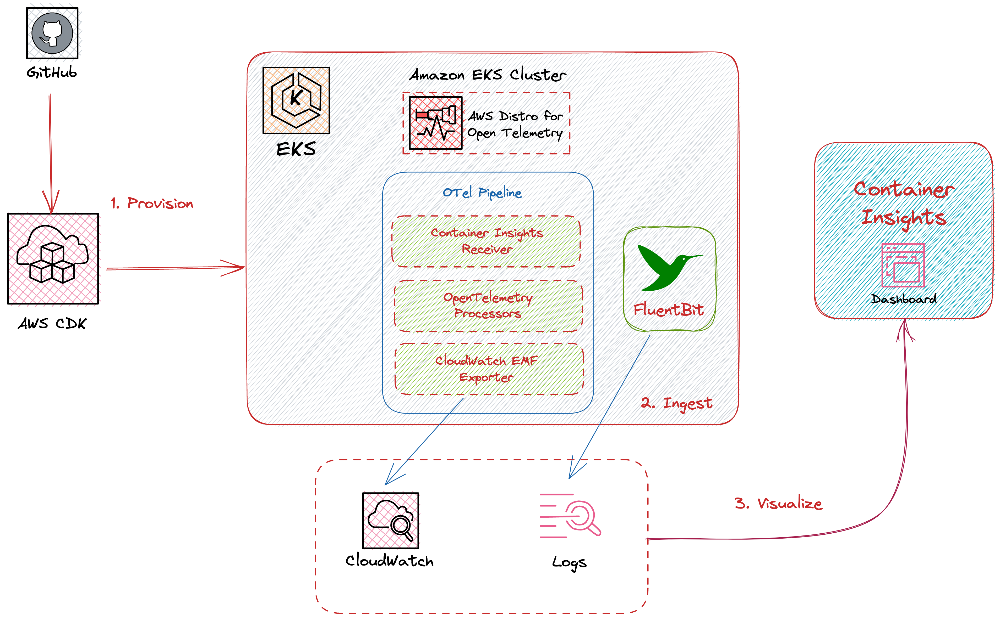
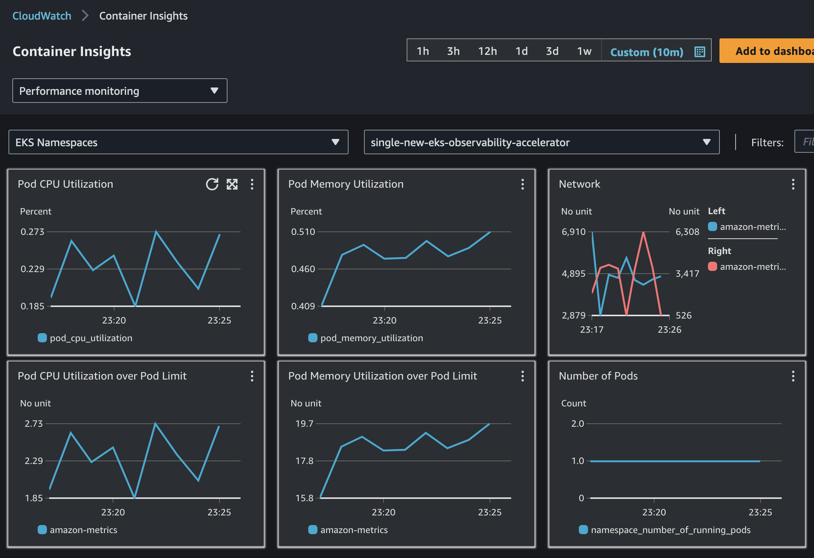
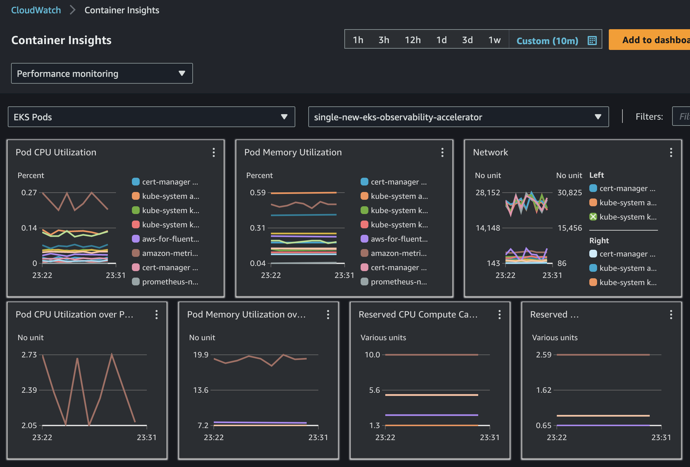

# Existing EKS Cluster AWS Native Observability Accelerator

## Architecture

The following figure illustrates the architecture of the pattern we will be deploying for Existing EKS Cluster AWS Native Observability pattern, using AWS native tools such as CloudWatch and Logs and Open Source tools such as Amazon Distro for OpenTelmetry (ADOT).



This example makes use of CloudWatch, as a metric and log aggregation layer. In order to collect the metrics and traces, we use the Open Source ADOT collector. Fluent Bit is used to export the logs to CloudWatch Logs.


## Objective

This pattern aims to add Observability on top of an existing EKS cluster, with AWS services.

## Prerequisites:

Ensure that you have installed the following tools on your machine:

1. [aws cli](https://docs.aws.amazon.com/cli/latest/userguide/install-cliv2.html)
2. [kubectl](https://Kubernetes.io/docs/tasks/tools/)
3. [cdk](https://docs.aws.amazon.com/cdk/v2/guide/getting_started.html#getting_started_install)
4. [npm](https://docs.npmjs.com/cli/v8/commands/npm-install)

You will also need:

1. Either an existing EKS cluster, or you can setup a new one with  [Single New EKS Cluster Observability Accelerator](../single-new-eks-observability-accelerators/single-new-eks-cluster.md)
2. An OpenID Connect (OIDC) provider, associated to the above EKS cluster (Note: Single EKS Cluster Pattern takes care of that for you)

## Deploying

1. Edit `~/.cdk.json` by setting the name of your existing cluster:

```json
    "context": {
        ...
        "existing.cluster.name": "...",
        ...
    }
```

2. Edit `~/.cdk.json` by setting the kubectl role name; if you used Single New EKS Cluster Observability Accelerator to setup your cluster, the kubectl role name would be provided by the output of the deployment, on your command-line interface (CLI):

```json
    "context": {
        ...
        "existing.kubectl.rolename":"...",
        ...
    }
```

3. Run the following command from the root of this repository to deploy the pipeline stack:

```bash
make build
make pattern existing-eks-awsnative-observability-construct deploy
```

## Verify the resources

Run update-kubeconfig command. You should be able to get the command from CDK output message.
```
aws eks update-kubeconfig --name single-new-eks-observability-accelerator --region <your-region> --role-arn arn:aws:iam::**************:role/single-new-eks-observabil-singleneweksobservabilit-CPAN247ASDF
```
Let’s verify the resources created by steps above.

```
kubectl get nodes -o wide
```

Output:
```
NAME                           STATUS   ROLES    AGE   VERSION
ip-10-0-145-216.ec2.internal   Ready    <none>   14m   v1.25.11-eks-a5565ad
```

Next, lets verify the namespaces in the cluster:
```
kubectl get ns # Output shows all namespace
```

Output:
```
NAME                       STATUS   AGE
amazon-metrics             Active   4m31s
aws-for-fluent-bit         Active   4m31s
cert-manager               Active   4m31s
default                    Active   24m
kube-node-lease            Active   24m
kube-public                Active   24m
kube-system                Active   24m
prometheus-node-exporter   Active   13m
```

## Visualization
- Navigate to CloudWatch > Insights > Container Insights and select cluster, select `single-new-eks-cluster` if you created cluster with pattern mentioned from above guide, otherwise select relevant cluster.
- Now select `amazon-metrics` namepsace

- On a same view, select 'EKS Pods', which provides insights overview of all the pods as shown below


- Please see [Single New EKS Cluster AWS Mixed Observability Accelerator](../single-new-eks-observability-accelerators/single-new-eks-mixed-observability.md#viewing-logs) for Logs.

## Teardown

You can teardown the whole CDK stack with the following command:

```bash
make pattern existing-eks-awsnative-observability-construct destroy
```

If you setup your cluster with Single New EKS Cluster Observability Accelerator, you also need to run:

```bash
make pattern single-new-eks-cluster destroy
```
