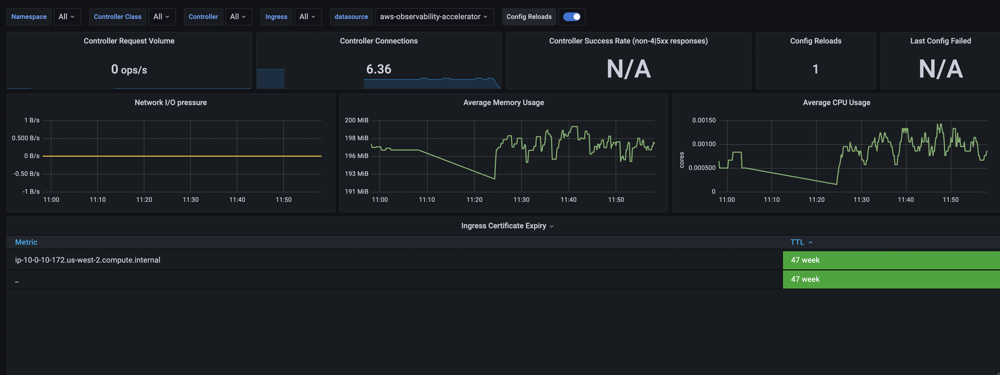

# Single Cluster Open Source Observability - NGINX Monitoring

## Architecture

The following figure illustrates the architecture of the pattern we will be deploying for Existing EKS Cluster NGINX pattern, using Open Source tools such as AWS Distro for OpenTelemetry (ADOT), Amazon Managed Grafana workspace and Prometheus.


The current example deploys the AWS Distro for OpenTelemetry Operator for Amazon EKS with its requirements and make use of an existing Amazon Managed Grafana workspace. It creates a new Amazon Managed Service for Prometheus workspace. And You will gain both visibility on the cluster and NGINX based applications.


## Objective 

This pattern aims to add Observability on top of an existing EKS cluster and NGINX workloads, with open source managed AWS services.

## Prerequisites:

Ensure that you have installed the following tools on your machine:

1. [aws cli](https://docs.aws.amazon.com/cli/latest/userguide/install-cliv2.html)
2. [kubectl](https://Kubernetes.io/docs/tasks/tools/)
3. [cdk](https://docs.aws.amazon.com/cdk/v2/guide/getting_started.html#getting_started_install)
4. [npm](https://docs.npmjs.com/cli/v8/commands/npm-install)

You will also need:

1. Either an existing EKS cluster, or you can setup a new one with  [Single New EKS Cluster Observability Accelerator](../single-new-eks-observability-accelerators/single-new-eks-cluster.md)
2. An OpenID Connect (OIDC) provider, associated to the above EKS cluster (Note: Single EKS Cluster Pattern takes care of that for you)

## Deploying

1. Edit `~/.cdk.json` by setting the name of your existing cluster:

```json
    "context": {
        ...
        "existing.cluster.name": "...",
        ...
    }
```

2. Edit `~/.cdk.json` by setting the kubectl role name; if you used Single New EKS Cluster Observability Accelerator to setup your cluster, the kubectl role name would be provided by the output of the deployment, on your command-line interface (CLI):

```json
    "context": {
        ...
        "existing.kubectl.rolename":"...",
        ...
    }
```

3. Amazon Managed Grafana workspace: To visualize metrics collected, you need an Amazon Managed Grafana workspace. If you have an existing workspace, create an environment variable as described below. To create a new workspace, visit [our supporting example for Grafana](https://aws-observability.github.io/terraform-aws-observability-accelerator/helpers/managed-grafana/)

!!! note
For the URL `https://g-xyz.grafana-workspace.us-east-1.amazonaws.com`, the workspace ID would be `g-xyz`

```bash
export AWS_REGION=<YOUR AWS REGION>
export COA_AMG_WORKSPACE_ID=g-xxx
export COA_AMG_ENDPOINT_URL=https://g-xyz.grafana-workspace.us-east-1.amazonaws.com
```

!!! warning
Setting up environment variables `COA_AMG_ENDPOINT_URL` and `AWS_REGION` is mandatory for successful execution of this pattern.

4. GRAFANA API KEY: Amazon Managed Grafana provides a control plane API for generating Grafana API keys.

```bash
export AMG_API_KEY=$(aws grafana create-workspace-api-key \
  --key-name "grafana-operator-key" \
  --key-role "ADMIN" \
  --seconds-to-live 432000 \
  --workspace-id $COA_AMG_WORKSPACE_ID \
  --query key \
  --output text)
```

5. AWS SSM Parameter Store for GRAFANA API KEY: Update the Grafana API key secret in AWS SSM Parameter Store using the above new Grafana API key. This will be referenced by Grafana Operator deployment of our solution to access Amazon Managed Grafana from Amazon EKS Cluster

```bash
aws ssm put-parameter --name "/cdk-accelerator/grafana-api-key" \
    --type "SecureString" \
    --value $AMG_API_KEY \
    --region $AWS_REGION
```

6. Install project dependencies by running `npm install` in the main folder of this cloned repository.

7. The actual settings for dashboard urls are expected to be specified in the CDK context. Generically it is inside the cdk.json file of the current directory or in `~/.cdk.json` in your home directory.

Example settings: Update the context in `cdk.json` file located in `cdk-eks-blueprints-patterns` directory

```typescript
  "context": {
    "fluxRepository": {
      "name": "grafana-dashboards",
      "namespace": "grafana-operator",
      "repository": {
        "repoUrl": "https://github.com/aws-observability/aws-observability-accelerator",
        "name": "grafana-dashboards",
        "targetRevision": "main",
        "path": "./artifacts/grafana-operator-manifests/eks/infrastructure"
      },
      "values": {
        "GRAFANA_CLUSTER_DASH_URL" : "https://raw.githubusercontent.com/aws-observability/aws-observability-accelerator/main/artifacts/grafana-dashboards/eks/infrastructure/cluster.json",
        "GRAFANA_KUBELET_DASH_URL" : "https://raw.githubusercontent.com/aws-observability/aws-observability-accelerator/main/artifacts/grafana-dashboards/eks/infrastructure/kubelet.json",
        "GRAFANA_NSWRKLDS_DASH_URL" : "https://raw.githubusercontent.com/aws-observability/aws-observability-accelerator/main/artifacts/grafana-dashboards/eks/infrastructure/namespace-workloads.json",
        "GRAFANA_NODEEXP_DASH_URL" : "https://raw.githubusercontent.com/aws-observability/aws-observability-accelerator/main/artifacts/grafana-dashboards/eks/infrastructure/nodeexporter-nodes.json",
        "GRAFANA_NODES_DASH_URL" : "https://raw.githubusercontent.com/aws-observability/aws-observability-accelerator/main/artifacts/grafana-dashboards/eks/infrastructure/nodes.json",
        "GRAFANA_WORKLOADS_DASH_URL" : "https://raw.githubusercontent.com/aws-observability/aws-observability-accelerator/main/artifacts/grafana-dashboards/eks/infrastructure/workloads.json",
        "GRAFANA_NGINX_DASH_URL" : "https://raw.githubusercontent.com/aws-observability/aws-observability-accelerator/main/artifacts/grafana-dashboards/eks/nginx/nginx.json"
      },
      "kustomizations": [
        {
          "kustomizationPath": "./artifacts/grafana-operator-manifests/eks/infrastructure"
        },
        {
          "kustomizationPath": "./artifacts/grafana-operator-manifests/eks/nginx"
        }
      ]
    },
    "nginx.pattern.enabled": true
  }
```

8. Once all pre-requisites are set you are ready to deploy the pipeline. Run the following command from the root of this repository to deploy the pipeline stack:

```bash
make build
make pattern existing-eks-opensource-observability deploy
```

## Deploy an example Nginx application

In this section we will deploy sample application and extract metrics using AWS OpenTelemetry collector.

1. Add NGINX ingress controller add-on into [lib/existing-eks-opensource-observability-pattern/index.ts](../../../lib/existing-eks-opensource-observability-pattern/index.ts) in add-on array.
```
        const addOns: Array<blueprints.ClusterAddOn> = [
            new blueprints.addons.CloudWatchLogsAddon({
                logGroupPrefix: `/aws/eks/${stackId}`,
                logRetentionDays: 30
            }),
            new blueprints.addons.XrayAdotAddOn(),
            new blueprints.addons.FluxCDAddOn({"repositories": [fluxRepository]}),
            new GrafanaOperatorSecretAddon(),
            new blueprints.addons.NginxAddOn({
                name: "ingress-nginx",
                chart: "ingress-nginx",
                repository: "https://kubernetes.github.io/ingress-nginx",
                version: "4.7.2",
                namespace: "nginx-ingress-sample",
                values: {
                    controller: { 
                        metrics: {
                            enabled: true,
                            service: {
                                annotations: {
                                    "prometheus.io/port": "10254",
                                    "prometheus.io/scrape": "true"
                                }
                            }
                        }
                    }
                }
            }),
        ];
```

2. Deploy pattern again 
```
make pattern existing-eks-opensource-observability deploy
```

3. Verify if the application is running
```
kubectl get pods -n nginx-ingress-sample
```

4. Set an EXTERNAL-IP variable to the value of the EXTERNAL-IP column in the row of the NGINX ingress controller.
```
EXTERNAL_IP=your-nginx-controller-external-ip
```

5. Start some sample NGINX traffic by entering the following command.
```
SAMPLE_TRAFFIC_NAMESPACE=nginx-sample-traffic
curl https://raw.githubusercontent.com/aws-samples/amazon-cloudwatch-container-insights/master/k8s-deployment-manifest-templates/deployment-mode/service/cwagent-prometheus/sample_traffic/nginx-traffic/nginx-traffic-sample.yaml |
sed "s/{{external_ip}}/$EXTERNAL_IP/g" |
sed "s/{{namespace}}/$SAMPLE_TRAFFIC_NAMESPACE/g" |
kubectl apply -f -
```

## Verify the resources

```
kubectl get pod -n nginx-sample-traffic 
```

## Visualization
1. Prometheus datasource on Grafana
- After a successful deployment, this will open the Prometheus datasource configuration on Grafana. You should see a notification confirming that the Amazon Managed Service for Prometheus workspace is ready to be used on Grafana.

2. Grafana dashboards
- Go to the Dashboards panel of your Grafana workspace. You should see a list of dashboards under the `Observability Accelerator Dashboards`.

 

3. Amazon Managed Service for Prometheus rules and alerts
- Open the Amazon Managed Service for Prometheus console and view the details of your workspace. Under the Rules management tab, you should find new rules deployed.

To setup your alert receiver, with Amazon SNS, follow [this documentation](https://docs.aws.amazon.com/prometheus/latest/userguide/AMP-alertmanager-receiver.html)

## Verify the resources

Please see [Single New Nginx Observability Accelerator](../single-new-eks-observability-accelerators/single-new-eks-nginx-opensource-observability.md).

## Teardown

You can teardown the whole CDK stack with the following command:

```bash
make pattern existing-eks-opensource-observability destroy
```

If you setup your cluster with Single New EKS Cluster Observability Accelerator, you also need to run:

```bash
make pattern single-new-eks-cluster destroy
```
