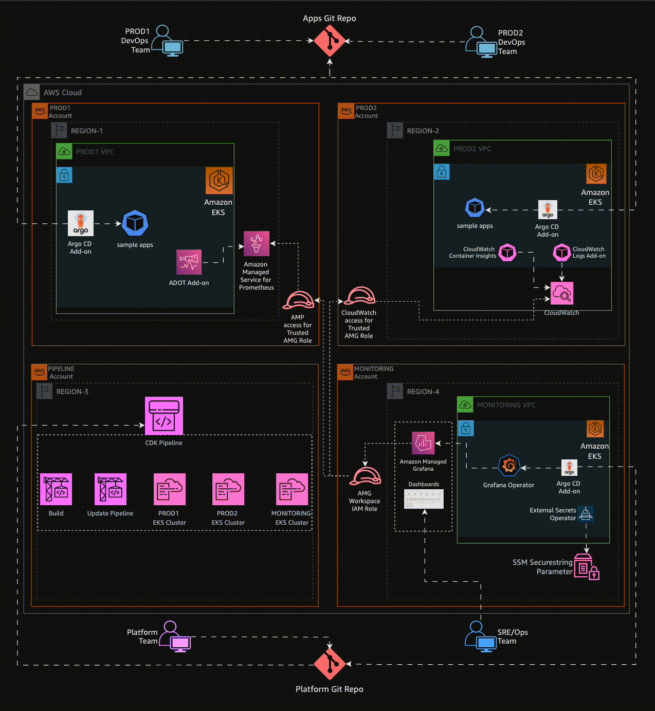
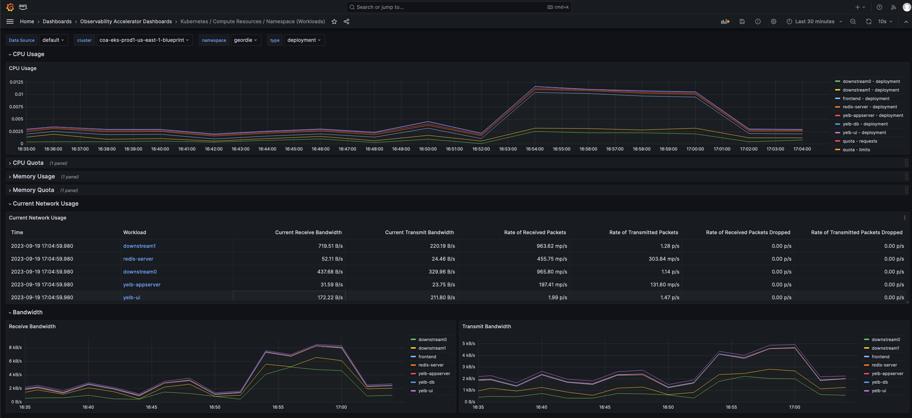
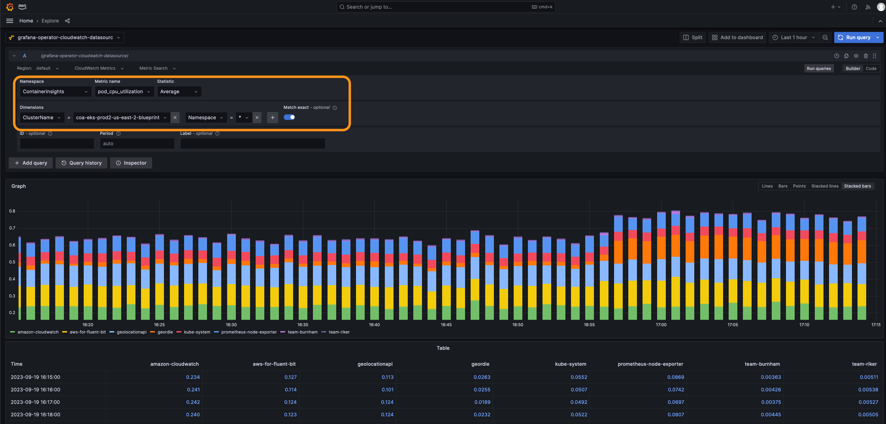
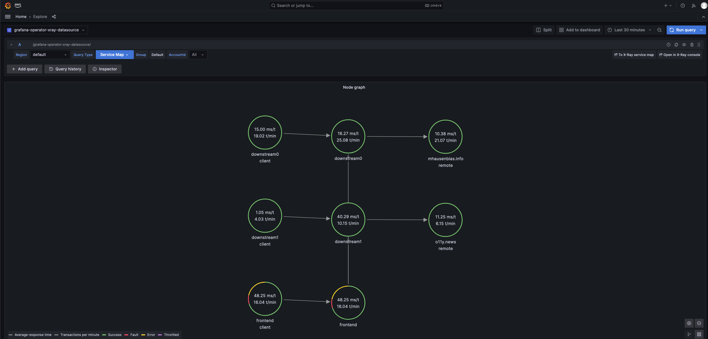

# Multi-Cluster Multi-Account Multi-Region (M3) Observability

## Architecture

The following figure illustrates the architecture of the pattern we will be deploying for Multi-Account Multi-Region Mixed Observability (M3) Accelerator using both AWS native tooling such as: CloudWatch ContainerInsights, CloudWatch logs and Open source tooling such as AWS Distro for Open Telemetry (ADOT), Amazon Managed Service for Prometheus (AMP), Amazon Managed Grafana :



## Objective

1. Deploying two production grade Amazon EKS cluster with control plane logging across two AWS Accounts (Prod1, Prod2 account) in two different regions through a Continuous Deployment infrastructure pipeline triggered upon a commit to the repository that holds the pipeline configuration in another AWS account (pipeline account).
2. Deploying ADOT add-on, AMP add-on to Prod 1 Amazon EKS Cluster to remote-write metrics to AMP workspace in Prod 1 AWS Account.
3. Deploying ADOT add-on, CloudWatch add-on to Prod 2 Amazon EKS Cluster to write metrics to CloudWatch in Prod 2 AWS Account.
4. Configuring GitOps tooling (Argo CD add-on) to support deployment of [ho11y](https://github.com/aws-observability/aws-o11y-recipes/tree/main/sandbox/ho11y) and [yelb](https://github.com/mreferre/yelb) sample applications, in a way that restricts each application to be deployed only into the team namespace, by using Argo CD projects.
5. Setting up IAM roles in Prod 1 and Prod 2 Accounts to allow an AMG service role in the Monitoring account (mon-account) to access metrics from AMP workspace in Prod 1 account and CloudWatch namespace in Prod 2 account.
6. Setting Amazon Managed Grafana to visualize AMP metrics from Amazon EKS cluster in Prod account 1 and CloudWatch metrics on workloads in Amazon EKS cluster in Prod account 2.
7. Installing Grafana Operator in Monitoring account (mon-account) to add AWS data sources and create Grafana Dashboards to Amazon Managed Grafana.
8. Installing External Secrets Operator in Monitoring account (mon-account) to retrieve and Sync the Grafana API keys.

### GitOps configuration

- For GitOps, this pattern bootstraps Argo CD add-on and points to [sample applications](https://github.com/aws-observability/aws-observability-accelerator/tree/main/artifacts/argocd-apps/sample-apps/envs) in [AWS Observability Accelerator](https://github.com/aws-observability/aws-observability-accelerator).
- You can find the team-geordie configuration for this pattern in the workload repository under the folder [`team-geordie`](https://github.com/aws-observability/aws-observability-accelerator/tree/main/artifacts/argocd-apps/teams/team-geordie).
- GitOps based management of Amazon Grafana resources (like: Datasources and Dashboards) is achieved using Argo CD application [`grafana-operator-app`](https://github.com/aws-observability/aws-observability-accelerator/tree/main/artifacts/argocd-apps/grafana-operator-app). Grafana Operator resources are deployed using [`grafana-operator-chart`](https://github.com/aws-observability/aws-observability-accelerator/tree/main/artifacts/argocd-apps/grafana-operator-chart).

## Prerequisites

Ensure following tools are installed in host machine:

1. [aws cli](https://docs.aws.amazon.com/cli/latest/userguide/install-cliv2.html)
2. [kubectl](https://Kubernetes.io/docs/tasks/tools/)
3. [cdk](https://docs.aws.amazon.com/cdk/v2/guide/getting_started.html#getting_started_install)
4. [npm](https://docs.npmjs.com/cli/v8/commands/npm-install)
5. [argocd](https://argo-cd.readthedocs.io/en/stable/cli_installation/)
6. [jq](https://jqlang.github.io/jq/download/)

### AWS Accounts

1. AWS Control Tower deployed in your AWS environment in the management account. If you have not already installed AWS Control Tower, follow the [Getting Started with AWS Control Tower documentation](https://docs.aws.amazon.com/controltower/latest/userguide/getting-started-with-control-tower.html), or you can enable AWS Organizations in the AWS Management Console account and enable AWS SSO.
2. An AWS account under AWS Control Tower called Prod 1 Account(Workloads Account A aka `prodEnv1`) provisioned using the [AWS Service Catalog Account Factory](https://docs.aws.amazon.com/controltower/latest/userguide/provision-as-end-user.html) product AWS Control Tower Account vending process or AWS Organization.
3. An AWS account under AWS Control Tower called Prod 2 Account(Workloads Account B aka `prodEnv2`) provisioned using the [AWS Service Catalog Account Factory](https://docs.aws.amazon.com/controltower/latest/userguide/provision-as-end-user.html)] product AWS Control Tower Account vending process or AWS Organization.
4. An AWS account under AWS Control Tower called Pipeline Account (aka `pipelineEnv`) provisioned using the [AWS Service Catalog Account Factory](https://docs.aws.amazon.com/controltower/latest/userguide/provision-as-end-user.html) product AWS Control Tower Account vending process or AWS Organization.
5. An AWS account under AWS Control Tower called Monitoring Account (Grafana Account aka `monitoringEnv`) provisioned using the [AWS Service Catalog Account Factory](https://docs.aws.amazon.com/controltower/latest/userguide/provision-as-end-user.html) product AWS Control Tower Account vending process or AWS Organization.
6. [An existing Amazon Managed Grafana Workspace](https://aws.amazon.com/blogs/mt/amazon-managed-grafana-getting-started/) in `monitoringEnv` region of `monitoringEnv` account. Enable Data sources **AWS X-Ray, Amazon Managed Service for Prometheus and Amazon Cloudwatch**.
7. If you are bringing new AWS accounts to deploy this pattern, then create a free-tier EC2 instance and let it run for 15-30 minutes in order to complete validation of account.

---

> ___NOTE:___ This pattern consumes multiple Elastic IP addresses, because 3 VPCs with 3 subnets are created in `ProdEnv1`, `ProdEnv2` and `monitoringEnv` AWS accounts. Make sure your account limits for EIP are increased to support additional 3 EIPs per account.

---

### Clone Repository

Clone [`cdk-aws-observability-accelerator`](https://github.com/aws-observability/cdk-aws-observability-accelerator) repository, if not done already.

``` bash
git clone https://github.com/aws-observability/cdk-aws-observability-accelerator.git
cd cdk-aws-observability-accelerator
```

---

> ___Pro Tip:___ This document is compatible to run as Notebook with [RUNME for VS Code](https://docs.runme.dev/install#runme-for-vs-code). There's no need to manually copy and paste commands. You can effortlessly execute them directly from this markdown file. Feel free to give it a try.
>
> Here is a sample usage of this document using RUNME:


---

### SSO Profile Setup

1. You will be accessing multiple accounts during deployment of this pattern. It is recommended to configure the AWS CLI to authenticate access with AWS IAM Identity Center (successor to AWS Single Sign-On). Let's configure Token provider with automatic authentication refresh for AWS IAM Identity Center. Ensure [Prerequisites mentioned here](https://docs.aws.amazon.com/cli/latest/userguide/sso-configure-profile-token.html) are complete before proceeding to next steps.
2. Create and use AWS IAM Identity Center login with `AWSAdministratorAccess` Permission set assigned to all AWS accounts required for this pattern (prodEnv1, prodEnv2, pipelineEnv and monitoringEnv).
3. Configure [AWS profile with sso](https://docs.aws.amazon.com/cli/latest/userguide/sso-configure-profile-token.html#sso-configure-profile-token-auto-sso) for `pipelineEnv` account:

``` bash
aws configure sso --profile pipeline-account
```

``` bash
# sample configuration
# SSO session name (Recommended): coa-multi-access-sso
# SSO start URL [None]: https://d-XXXXXXXXXX.awsapps.com/start
# SSO region [None]: us-west-2
# SSO registration scopes [sso:account:access]:sso:account:access

# Attempting to automatically open the SSO authorization page in your default browser.
# If the browser does not open or you wish to use a different device to authorize this request, open the following URL:

# https://device.sso.us-west-2.amazonaws.com/

# Then enter the code:

# XXXX-XXXX
# There are 7 AWS accounts available to you.
# Using the account ID 111122223333
# There are 2 roles available to you.
# Using the role name "AWSAdministratorAccess"
# CLI default client Region [None]: us-west-2
# CLI default output format [None]: json

# To use this profile, specify the profile name using --profile, as shown:

# aws s3 ls --profile pipeline-account

```

4. Then, configure profile for `ProdEnv1` AWS account.

``` bash
aws configure sso --profile prod1-account
```

``` bash
# sample configuration
# SSO session name (Recommended): coa-multi-access-sso
# There are 7 AWS accounts available to you.
# Using the account ID 444455556666
# There are 2 roles available to you.
# Using the role name "AWSAdministratorAccess"
# CLI default client Region [None]: us-west-2
# CLI default output format [None]: json

# To use this profile, specify the profile name using --profile, as shown:

# aws s3 ls --profile prod2-account
```

5. Then, configure profile for `ProdEnv2` AWS account.

``` bash
aws configure sso --profile prod2-account
```

6. Then, configure profile for `monitoringEnv` AWS account.

``` bash
aws configure sso --profile monitoring-account
```

7. Login to required SSO profile using `aws sso login --profile <profile name>`. Let's now log in to `pipelineEnv` account. When SSO login expires, you can use this command to re-login.

``` bash
export AWS_PROFILE='pipeline-account'
aws sso login --profile $AWS_PROFILE
```

8. Export required environment variables for further use. If not available already, you will be prompted for name of Amazon Grafana workspace in `monitoringEnv` region of `monitoringEnv` account. And, then its endpoint URL, ID, Role ARN will be captured as environment variables.

``` bash
source `git rev-parse --show-toplevel`/helpers/multi-acc-new-eks-mixed-observability-pattern/source-envs.sh
```

9. Create SSM SecureString Parameter `/cdk-accelerator/cdk-context` in `pipelineEnv` region of `pipelineEnv` account. This parameter contains account ID and region of all four AWS accounts used in this Observability Accelerator pattern.

``` bash
aws ssm put-parameter --profile pipeline-account --region ${COA_PIPELINE_REGION} \
    --type "SecureString" \
    --overwrite \
    --name "/cdk-accelerator/cdk-context" \
    --description "AWS account details of different environments used by Multi-Account Multi-Region Mixed Observability (M3) Accelerator pattern" \
    --value '{
        "context": {
            "pipelineEnv": {
                "account": "'$COA_PIPELINE_ACCOUNT_ID'",
                "region": "'$COA_PIPELINE_REGION'"

            },
            "prodEnv1": {
                "account": "'$COA_PROD1_ACCOUNT_ID'",
                "region": "'$COA_PROD1_REGION'"
            },
            "prodEnv2": {
                "account": "'$COA_PROD2_ACCOUNT_ID'",
                "region": "'$COA_PROD2_REGION'"
            },
            "monitoringEnv": {
                "account": "'$COA_MON_ACCOUNT_ID'",
                "region": "'$COA_MON_REGION'"
            }
        }
    }'
```

### Amazon Grafana Configuration

1. Run `helpers/multi-acc-new-eks-mixed-observability-pattern/amg-preconfig.sh` script to

   1. create SSM SecureString parameter `/cdk-accelerator/amg-info` in `pipelineEnv` region of `pipelineEnv` account. This will be used by CDK for Grafana Operator resources configuration.
   2. create Grafana workspace API key.
   3. create SSM SecureString parameter `/cdk-accelerator/grafana-api-key` in `monitoringEnv` region of `monitoringEnv` account. This will be used by [External Secrets Operator](https://github.com/external-secrets/external-secrets/tree/main/deploy/charts/external-secrets).

``` bash
eval bash `git rev-parse --show-toplevel`/helpers/multi-acc-new-eks-mixed-observability-pattern/amg-preconfig.sh
```

### GitHub Sources Configuration

1. Following GitHub sources used in this pattern:

   1. Apps Git Repo - This repository serves as the source for deploying and managing applications in `prodEnv1` and `prodEnv2` using GitOps by Argo CD. Here, it is configured to [sample-apps from aws-observability-accelerator](https://github.com/aws-observability/aws-observability-accelerator/tree/main/artifacts/argocd-apps/sample-apps/envs/prod).
   2. Source for CodePipeline - This repository serves as the CodePipeline source stage for retrieving and providing source code to downstream pipeline stages, facilitating automated CI/CD processes. Whenever a change is detected in the source code, the pipeline is initiated automatically. This is achieved using GitHub webhooks. We are using CodePipeline to deploy multi-account multi-region clusters.
   3. Source for `monitoringEnv` Argo CD - This repository serves as the source for deploying and managing applications in the `monitoringEnv` environment using GitOps by Argo CD. Here, it is configured to [grafana-operator-app from aws-observability-accelerator](https://github.com/aws-observability/aws-observability-accelerator/tree/main/artifacts/argocd-apps/grafana-operator-app), using which Grafana Datasoures and Dashboards are deployed.

---

> ___NOTE___: Argo CD source repositories used here for `prodEnv1`, `prodEnv2` and `monitoringEnv` are public. If you need to use private repositories, create secret called `github-ssh-key` in respective accounts and region. This secret should contain your GitHub SSH private key as a JSON structure with fields `sshPrivateKey` and `url` in AWS Secrets Manager. Argo CD add-on will use this secret for authentication with private GitHub repositories. For more details on setting up SSH credentials, please refer to [Argo CD Secrets Support](https://aws-quickstart.github.io/cdk-eks-blueprints/addons/argo-cd/#secrets-support).

---

2. Fork [`cdk-aws-observability-accelerator`](https://github.com/aws-observability/cdk-aws-observability-accelerator) repository to your GitHub account.
3. Create GitHub Personal Access Token (PAT) for your CodePipeline GitHub source. For more information on how to set it up, please refer [here](https://docs.github.com/en/enterprise-server@3.6/authentication/keeping-your-account-and-data-secure/managing-your-personal-access-tokens#creating-a-personal-access-token). The GitHub Personal Access Token should have these scopes:

   - **repo** - to read the repository
   - __admin:repo_hook__ - to use webhooks

4. Run `helpers/multi-acc-new-eks-mixed-observability-pattern/gitsource-preconfig.sh` script to

   1. create SSM SecureString Parameter `/cdk-accelerator/pipeline-git-info` in `pipelineEnv` region of `pipelineEnv` account which contains details of CodePipeline source. This parameter contains GitHub owner name where you forked [`cdk-aws-observability-accelerator`](https://github.com/aws-observability/cdk-aws-observability-accelerator), repository name (`cdk-aws-observability-accelerator`) and branch (`main`).
   2. create AWS Secret Manager secret `github-token` in `pipelineEnv` region of `pipelineEnv` account to hold GitHub Personal Access Token (PAT).

``` bash
eval bash `git rev-parse --show-toplevel`/helpers/multi-acc-new-eks-mixed-observability-pattern/gitsource-preconfig.sh
```

## Deployment

1. Fork [`cdk-aws-observability-accelerator`](https://github.com/aws-observability/cdk-aws-observability-accelerator) repository to your CodePioeline source GitHub organization/user.
2. Install the AWS CDK Toolkit globally on host machine.

``` bash
npm install -g aws-cdk
```

3. Install project dependencies.

``` bash
cd `git rev-parse --show-toplevel`
npm i
make build
```

4. Bootstrap all 4 AWS accounts using step mentioned for **different environment for deploying CDK applications** in [Deploying Pipelines](https://aws-quickstart.github.io/cdk-eks-blueprints/pipelines/#deploying-pipelines). If you have bootstrapped earlier, please remove them before proceeding with this step. Remember to set `pipelineEnv` account number in `--trust` flag. You can also refer to commands mentioned below:

``` bash
# bootstrap pipelineEnv account WITHOUT explicit trust
env CDK_NEW_BOOTSTRAP=1 npx cdk bootstrap --profile pipeline-account \
    --cloudformation-execution-policies arn:aws:iam::aws:policy/AdministratorAccess \
    aws://${COA_PIPELINE_ACCOUNT_ID}/${COA_PIPELINE_REGION}

# bootstrap prodEnv1 account with trust access from pipelineEnv account
env CDK_NEW_BOOTSTRAP=1 npx cdk bootstrap --profile prod1-account \
    --cloudformation-execution-policies arn:aws:iam::aws:policy/AdministratorAccess \
    --trust ${COA_PIPELINE_ACCOUNT_ID} \
    aws://${COA_PROD1_ACCOUNT_ID}/${COA_PROD1_REGION}

# bootstrap prodEnv2 account with trust access from pipelineEnv account
env CDK_NEW_BOOTSTRAP=1 npx cdk bootstrap --profile prod2-account \
    --cloudformation-execution-policies arn:aws:iam::aws:policy/AdministratorAccess \
    --trust ${COA_PIPELINE_ACCOUNT_ID} \
    aws://${COA_PROD2_ACCOUNT_ID}/${COA_PROD2_REGION}

# bootstrap monitoringEnv account with trust access from pipelineEnv account
env CDK_NEW_BOOTSTRAP=1 npx cdk bootstrap --profile monitoring-account \
    --cloudformation-execution-policies arn:aws:iam::aws:policy/AdministratorAccess \
    --trust ${COA_PIPELINE_ACCOUNT_ID} \
    aws://${COA_MON_ACCOUNT_ID}/${COA_MON_REGION}
```

5. Once all pre-requisites are set, you are ready to deploy the pipeline. Run the following command from the root of cloned repository to deploy the pipeline stack in `pipelineEnv` account. This step may require approximately **20 minutes** to finish.

``` bash
export AWS_PROFILE='pipeline-account'
export AWS_REGION=${COA_PIPELINE_REGION}
cd `git rev-parse --show-toplevel`

make pattern multi-acc-new-eks-mixed-observability deploy multi-account-COA-pipeline
```

6. Check status of pipeline that deploys multiple Amazon EKS clusters through CloudFromation stacks in respective accounts. This deployment also creates

   - `ampPrometheusDataSourceRole` with permissions to retrieve metrics from AMP in `ProdEnv1` account,
   - `cloudwatchDataSourceRole` with permissions to retrieve metrics from CloudWatch in `ProdEnv2` account and
   - Updates Amazon Grafana workspace IAM role in `monitoringEnv` account to assume roles in `ProdEnv1` and `ProdEnv2` accounts for retrieving and visualizing metrics in Grafana

   This step may require approximately **50 minutes** to finish. You may login to `pipelineEnv` account and navigate to [AWS CodePipeline console](https://console.aws.amazon.com/codesuite/codepipeline/pipelines) at `pipelineEnv` region to check the status.

``` bash
# script to check status of codepipeline
dots=""; while true; do status=$(aws codepipeline --profile pipeline-account list-pipeline-executions --pipeline-name multi-account-COA-pipeline --query 'pipelineExecutionSummaries[0].status' --output text); [ $status == "Succeeded" ] && echo -e "Pipeline execution SUCCEEDED." && break || [ "$status" == "Failed" ] && echo -e "Pipeline execution FAILED." && break ||  printf "\r" && echo -n "Pipeline execution status: $status$dots" && dots+="." && sleep 10; done
```

## Post Deployment

1. Once all steps of `multi-acc-stages` in `multi-account-COA-pipeline` are complete, run script to

   1. create entries in kubeconfig with contexts of newly created EKS clusters.
   2. export cluster specific and kubecontext environment variables (like: `COA_PROD1_CLUSTER_NAME` and `COA_PROD1_KUBE_CONTEXT`).
   3. get Amazon Prometheus Endpoint URL from `ProdEnv1` account and export to environment variable `COA_AMP_ENDPOINT_URL`.

``` bash
source `git rev-parse --show-toplevel`/helpers/multi-acc-new-eks-mixed-observability-pattern/post-deployment-source-envs.sh
```

2. Then, update parameter `AMP_ENDPOINT_URL` of Argo CD bootstrap app in `monitoringEnv` with Amazon Prometheus endpoint URL from `ProdEnv1` account (`COA_AMP_ENDPOINT_URL`) and sync Argo CD apps.

``` bash
if [[ `lsof -i:8080 | wc -l` -eq 0 ]]
then
    export ARGO_SERVER=$(kubectl --context ${COA_MON_KUBE_CONTEXT} -n argocd get svc -l app.kubernetes.io/name=argocd-server -o name)
    export ARGO_PASSWORD=$(kubectl --context ${COA_MON_KUBE_CONTEXT} -n argocd get secret argocd-initial-admin-secret -o jsonpath="{.data.password}" | base64 -d)
    echo "ARGO PASSWORD:: "$ARGO_PASSWORD
    kubectl --context ${COA_MON_KUBE_CONTEXT} port-forward $ARGO_SERVER -n argocd 8080:443 > /dev/null 2>&1 &
    argocdPid=$!
    echo pid: $argocdPid
    sleep 5s

    argocd --kube-context ${COA_MON_KUBE_CONTEXT} login localhost:8080 --insecure --username admin --password $ARGO_PASSWORD

    argocd --kube-context ${COA_MON_KUBE_CONTEXT} app set argocd/bootstrap-apps --helm-set AMP_ENDPOINT_URL=$COA_AMP_ENDPOINT_URL
    argocd --kube-context ${COA_MON_KUBE_CONTEXT} app sync argocd/bootstrap-apps

    echo -e '\033[0;33m' "\nConfirm update here.. You should see AMP endpoint URL and no error message." '\033[0m'
    kubectl --context ${COA_MON_KUBE_CONTEXT} get -n grafana-operator grafanadatasources grafanadatasource-amp -o jsonpath='{.spec.datasource.url}{"\n"}{.status}{"\n"}'

    kill -9 $argocdPid
else
    echo "Port 8080 is already in use by PID `lsof -i:8080 -t`. Please terminate it and rerun this step."
fi
```

---

> ___NOTE___: You can access Argo CD Admin UI using port-forwading. Here are commands to access `prodEnv1` Argo CD:

``` bash
export PROD1_ARGO_SERVER=$(kubectl --context ${COA_PROD1_KUBE_CONTEXT} -n argocd get svc -l app.kubernetes.io/name=argocd-server -o name)
export PROD1_ARGO_PASSWORD=$(kubectl --context ${COA_PROD1_KUBE_CONTEXT} -n argocd get secret argocd-initial-admin-secret -o jsonpath="{.data.password}" | base64 -d)
echo "PROD1 ARGO PASSWORD:: "$PROD1_ARGO_PASSWORD
nohup kubectl --context ${COA_PROD1_KUBE_CONTEXT} port-forward $PROD1_ARGO_SERVER -n argocd 8081:443 > /dev/null 2>&1 &
sleep 5
curl localhost:8081
```

---

3. Datasource `grafana-operator-amp-datasource` created by Grafana Operator needs to reflect AMP Endpoint URL. There is a limitation with Grafana Operator (or Grafana) which doesn't sync updated `grafana-datasources` to Grafana. To overcome this issue, we will simply delete Datasource and Grafana Operator syncs up with the latest configuration in 5 minutes. This is achieved using Grafana API and key stored in SecureString parameter `/cdk-accelerator/grafana-api-key` in `monitoringEnv` account.

``` bash
export COA_AMG_WORKSPACE_URL=$(aws ssm get-parameter --profile pipeline-account --region ${COA_PIPELINE_REGION} \
    --name "/cdk-accelerator/amg-info" \
    --with-decryption \
    --query Parameter.Value --output text | jq -r ".[] | .workspaceURL")

export COA_AMG_API_KEY=$(aws ssm get-parameter --profile monitoring-account --region ${COA_MON_REGION} \
    --name "/cdk-accelerator/grafana-api-key" \
    --with-decryption \
    --query Parameter.Value --output text)

export COA_AMP_DS_ID=$(curl -s -H "Authorization: Bearer ${COA_AMG_API_KEY}" ${COA_AMG_WORKSPACE_URL}/api/datasources \
    | jq -r ".[] |  select(.name==\"grafana-operator-amp-datasource\") | .id")

echo "Datasource Name:: grafana-operator-amp-datasource"
echo "Datasource ID:: "$COA_AMP_DS_ID

curl -X DELETE -H "Authorization: Bearer ${COA_AMG_API_KEY}" ${COA_AMG_WORKSPACE_URL}/api/datasources/${COA_AMP_DS_ID}

```

4. Then, deploy ContainerInsights in `ProdEnv2` account.

``` bash
prod2NGRole=$(aws cloudformation describe-stack-resources --profile prod2-account --region ${COA_PROD2_REGION} \
    --stack-name "coa-eks-prod2-${COA_PROD2_REGION}-coa-eks-prod2-${COA_PROD2_REGION}-blueprint" \
    --query "StackResources[?ResourceType=='AWS::IAM::Role' && contains(LogicalResourceId,'NodeGroupRole')].PhysicalResourceId" \
    --output text)

aws iam attach-role-policy --profile prod2-account --region ${COA_PROD2_REGION} \
    --role-name ${prod2NGRole} \
    --policy-arn arn:aws:iam::aws:policy/CloudWatchAgentServerPolicy

aws iam list-attached-role-policies --profile prod2-account --region ${COA_PROD2_REGION} \
    --role-name $prod2NGRole | grep CloudWatchAgentServerPolicy || echo 'Policy not found'

FluentBitHttpPort='2020'
FluentBitReadFromHead='Off'
[[ ${FluentBitReadFromHead} = 'On' ]] && FluentBitReadFromTail='Off'|| FluentBitReadFromTail='On'
[[ -z ${FluentBitHttpPort} ]] && FluentBitHttpServer='Off' || FluentBitHttpServer='On'
curl https://raw.githubusercontent.com/aws-samples/amazon-cloudwatch-container-insights/latest/k8s-deployment-manifest-templates/deployment-mode/daemonset/container-insights-monitoring/quickstart/cwagent-fluent-bit-quickstart.yaml | sed 's/{{cluster_name}}/'${COA_PROD2_CLUSTER_NAME}'/;s/{{region_name}}/'${COA_PROD2_REGION}'/;s/{{http_server_toggle}}/"'${FluentBitHttpServer}'"/;s/{{http_server_port}}/"'${FluentBitHttpPort}'"/;s/{{read_from_head}}/"'${FluentBitReadFromHead}'"/;s/{{read_from_tail}}/"'${FluentBitReadFromTail}'"/' | kubectl --context ${COA_PROD2_KUBE_CONTEXT} apply -f -
```

### Validating Grafana Dashboards

1. Run the below command in `ProdEnv1` cluster to generate test traffic to sample application and let us visualize traces to X-Ray and Amazon Managed Grafana Console out the sample `ho11y` app :

``` bash
frontend_pod=`kubectl --context ${COA_PROD1_KUBE_CONTEXT} get pod -n geordie --no-headers -l app=frontend -o jsonpath='{.items[*].metadata.name}'`
loop_counter=0
while [ $loop_counter -le 5000 ] ;
do
        kubectl exec --context ${COA_PROD1_KUBE_CONTEXT} -n geordie -it $frontend_pod -- curl downstream0.geordie.svc.cluster.local;
        echo ;
        loop_counter=$[$loop_counter+1];
done
```

2. Let it run for a few minutes and look in **Amazon Grafana Dashboards > Observability Accelerator Dashboards > Kubernetes / Compute Resources / Namespace (Workloads)**



Please also have a look at other Dashboards created using Grafana Operator under folder **Observability Accelerator Dashboards**.

3. Run the below command in `ProdEnv2` cluster to generate test traffic to sample application.

``` bash
frontend_pod=`kubectl --context ${COA_PROD2_KUBE_CONTEXT} get pod -n geordie --no-headers -l app=frontend -o jsonpath='{.items[*].metadata.name}'`
loop_counter=0
while [ $loop_counter -le 5000 ] ;
do
        kubectl exec --context ${COA_PROD2_KUBE_CONTEXT} -n geordie -it $frontend_pod -- curl downstream0.geordie.svc.cluster.local;
        echo ;
        loop_counter=$[$loop_counter+1];
done
```

4. Let it run for a few minutes and look in **Amazon Grafana Administration > Datasources > grafana-operator-cloudwatch-datasource > Explore**. Set values as highlighted in the snapshot and 'Run query'.



5. Then, let us look at X-Ray traces in **Amazon Grafana Administration > Datasources > grafana-operator-xray-datasource > Explore**. Set **Query Type = Service Map** and 'Run query'.



### Clean up

1. Run this command to destroy this pattern. This will delete pipeline.

``` bash
export AWS_PROFILE='pipeline-account'
aws sso login --profile $AWS_PROFILE
cd `git rev-parse --show-toplevel`

source `git rev-parse --show-toplevel`/helpers/multi-acc-new-eks-mixed-observability-pattern/source-envs.sh
make pattern multi-acc-new-eks-mixed-observability destroy multi-account-COA-pipeline
```

2. Next, run this script to clean up resources created in respective accounts. This script deletes Argo CD apps, unsets kubeconfig entries, initiates deletion of CloudFormation stacks, secrets, SSM parameters and Amazon Grafana Workspace API key from respective accounts.

``` bash
eval bash `git rev-parse --show-toplevel`/helpers/multi-acc-new-eks-mixed-observability-pattern/clean-up.sh
```

3. In certain scenarios, CloudFormation stack deletion might encounter issues when attempting to delete a nodegroup IAM role. In such situations, it's recommended to first delete the relevant IAM role and then proceed with deleting the CloudFormation stack.
4. Delete Dashboards and Data sources in Amazon Grafana.

