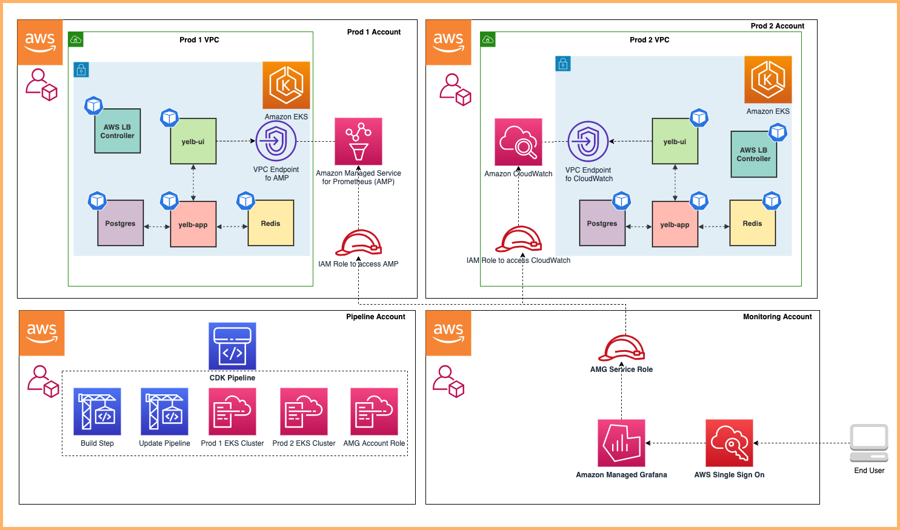

# Multi Account Mixed Observability Observability Accelerator

## Architecture

The following figure illustrates the architecture of the pattern we will be deploying for Multi Account Mixed Observability Accelerator using both AWS native tooling such as: CloudWatch ContainerInsights, CloudWatch logs and Open source tooling such as AWS Distro for Open Telemetry (ADOT), Amazon Managed Service for Prometheus (AMP), Amazon Managed Grafana :



## Objective

1. Deploying two production grade Amazon EKS cluster across 2 AWS Accounts ( Prod1, Prod2 account ) through a Continuous Deployment infrastructure pipeline triggered upon a commit to the repository that holds the pipeline configuration in an another AWS account (pipeline account).
2. Deploying ADOT add-on, AMP add-on to Prod 1 Amazon EKS Cluster to remote write metrics to AMP workspace in Prod 1 AWS Account.
3. Deploying ADOT add-on, CloudWatch add-on to Prod 2 Amazon EKS Cluster to write metrics to CloudWatch in Prod 2 AWS Account.
4. Configuring GitOps tooling (ArgoCD addon) to support deployment of [ho11y](https://github.com/aws-observability/aws-o11y-recipes/tree/main/sandbox/ho11y) and [yelb](https://github.com/mreferre/yelb) sample applications, in a way that restricts each application to be deployed only into the team namespace, by using ArgoCD projects.
5. Setting up IAM roles in Prod 1 and Prod 2 Accounts to allow an AMG service role in the Monitoring account (mon-account) to access metrics from AMP workspace in Prod 1 account and CloudWatch namespace in Prod 2 account.
6. Setting Amazon Managed Grafana to visualize AMP metrics from Amazon EKS cluster in Prod account 1 and CloudWatch metrics on workloads in Amazon EKS cluster in Prod account 2.
7. Installing Grafana Operator in Monitoring account (mon-account) to add AWS data sources and create Grafana Dashboards to Amazon Managed Grafana.
8. Installing External Secrets Operator in Monitoring account (mon-account) to retrieve and Sync the Grafana API keys.

### GitOps confguration

- For GitOps, the blueprint bootstrap the ArgoCD addon and points to [sample applications](https://github.com/aws-observability/aws-observability-accelerator/tree/main/artifacts/sample-apps/envs) in [AWS Observability Accelerator](https://github.com/aws-observability/aws-observability-accelerator).
- You can find the team-geordie configuration for this pattern in the workload repository under the folder [`team-geordie`](https://github.com/aws-observability/aws-observability-accelerator/tree/main/artifacts/teams/team-geordie).
- GitOps based management of Amazon Grafana resources (like: Datasources and Dashboards) is achieved using ArgoCD application [`grafana-operator-app`](https://github.com/aws-observability/aws-observability-accelerator/tree/main/artifacts/sample-apps/grafana-operator-app). Grafana Operator resources are deployed using [`grafana-operator-chart`](https://github.com/aws-observability/aws-observability-accelerator/tree/main/artifacts/grafana-operator-chart).

## Prerequisites

### AWS Accounts

1. AWS Control Tower deployed in your AWS environment in the management account. If you have not already installed AWS Control Tower, follow the [Getting Started with AWS Control Tower documentation](https://docs.aws.amazon.com/controltower/latest/userguide/getting-started-with-control-tower.html), or you can enable AWS Organizations in the AWS Management Console account and enable AWS SSO.
2. An AWS account under AWS Control Tower called Prod 1 Account(Workloads Account A aka `prodEnv1`) provisioned using the [AWS Service Catalog Account Factory](https://docs.aws.amazon.com/controltower/latest/userguide/provision-as-end-user.html) product AWS Control Tower Account vending process or AWS Organization.
3. An AWS account under AWS Control Tower called Prod 2 Account(Workloads Account B aka `prodEnv2`) provisioned using the [AWS Service Catalog Account Factory](https://docs.aws.amazon.com/controltower/latest/userguide/provision-as-end-user.html)] product AWS Control Tower Account vending process or AWS Organization.
4. An AWS account under AWS Control Tower called Pipeline Account (aka `pipelineEnv`) provisioned using the [AWS Service Catalog Account Factory](https://docs.aws.amazon.com/controltower/latest/userguide/provision-as-end-user.html) product AWS Control Tower Account vending process or AWS Organization.
5. An AWS account under AWS Control Tower called Monitoring Account (Grafana Account aka `monitoringEnv`) provisioned using the [AWS Service Catalog Account Factory](https://docs.aws.amazon.com/controltower/latest/userguide/provision-as-end-user.html) product AWS Control Tower Account vending process or AWS Organization.
6. [An existing Amazon Managed Grafana Workspace](https://aws.amazon.com/blogs/mt/amazon-managed-grafana-getting-started/) in `monitoringEnv` region of `monitoringEnv` account. Enable Data sources **AWS X-Ray, Amazon Managed Service for Prometheus and Amazon Cloudwatch**.

### SSO Profile Setup

1. You will be accessing multiple accounts during deployement of this pattern. It is recommended to configure the AWS CLI to authenticate access with AWS IAM Identity Center (successor to AWS Single Sign-On). Let's configure Token provider with automatic authentication refresh for AWS IAM Identity Center. Ensure [Prerequisites mentioned here](https://docs.aws.amazon.com/cli/latest/userguide/sso-configure-profile-token.html) are complete before proceeding to next steps.
2. Create and use AWS IAM Identity Center login with `AWSAdministratorAccess` Permission set assigned to all AWS accounts required for this pattern (prodEnv1, prodEnv2, pipelineEnv and monitoringEnv).
3. Configure [AWS profile with sso](https://docs.aws.amazon.com/cli/latest/userguide/sso-configure-profile-token.html#sso-configure-profile-token-auto-sso) for `pipelineEnv` account:

```bash
aws configure sso --profile pipeline-account
```

```bash
# sample configuration
# SSO session name (Recommended): coa-multi-access-sso
# SSO start URL [None]: https://d-XXXXXXXXXX.awsapps.com/start
# SSO region [None]: us-west-2
# SSO registration scopes [sso:account:access]:sso:account:access

# Attempting to automatically open the SSO authorization page in your default browser.
# If the browser does not open or you wish to use a different device to authorize this request, open the following URL:

# https://device.sso.us-west-2.amazonaws.com/

# Then enter the code:

# XXXX-XXXX
# There are 7 AWS accounts available to you.
# Using the account ID 111122223333
# There are 2 roles available to you.
# Using the role name "AWSAdministratorAccess"
# CLI default client Region [None]: us-west-2
# CLI default output format [None]: json

# To use this profile, specify the profile name using --profile, as shown:

# aws s3 ls --profile pipeline-account

```

4. Then, configure profile for `prod1Env` AWS account.

```bash
aws configure sso --profile prod1-account
```

```bash
# sample configuration
# SSO session name (Recommended): coa-multi-access-sso
# There are 7 AWS accounts available to you.
# Using the account ID 444455556666
# There are 2 roles available to you.
# Using the role name "AWSAdministratorAccess"
# CLI default client Region [None]: us-west-2
# CLI default output format [None]: json

# To use this profile, specify the profile name using --profile, as shown:

# aws s3 ls --profile prod2-account
```

5. Then, configure profile for `prod2Env` AWS account.

```bash { promptEnv=false }
aws configure sso --profile prod2-account
```

6. Then, configure profile for `monitoringEnv` AWS account.

```bash
aws configure sso --profile monitoring-account
```

7. Login to required SSO profile using `aws sso login --profile <profile name>`. Let's now login to `pipelineEnv` account.

```bash { promptEnv=false }
export AWS_PROFILE='pipeline-account'
aws sso login --profile $AWS_PROFILE
```

8. Export environment variables for further use.

```bash
export COA_PIPELINE_ACCOUNT_ID=$(aws configure get sso_account_id --profile pipeline-account)
export COA_PIPELINE_REGION=$(aws configure get region --profile pipeline-account)

export COA_PROD1_ACCOUNT_ID=$(aws configure get sso_account_id --profile prod1-account)
export COA_PROD1_REGION=$(aws configure get region --profile prod1-account)

export COA_PROD2_ACCOUNT_ID=$(aws configure get sso_account_id --profile prod2-account)
export COA_PROD2_REGION=$(aws configure get region --profile prod2-account)

export COA_MON_ACCOUNT_ID=$(aws configure get sso_account_id --profile monitoring-account)
export COA_MON_REGION=$(aws configure get region --profile monitoring-account)
```

### Amazon Grafana Configuration

1. Get details of Amazon Grafana in `monitoringEnv` region of `monitoringEnv` account for further use.

```bash { promptEnv=false }
read -p "NAME of AMG Workspace in monitoringEnv of monitoringEnv account: " amgname_input
export COA_AMG_WORKSPACE_NAME=$amgname_input
```

2. Get Amazon Grafana Workspace URL and IAM Role.

```bash { promptEnv=false }
export COA_AMG_WORKSPACE_URL="https://$(aws grafana list-workspaces --profile monitoring-account --region ${COA_MON_REGION} \
    --query "workspaces[?name=='${COA_AMG_WORKSPACE_NAME}'].endpoint" \
    --output text)"

export COA_AMG_WORKSPACE_ID=$(aws grafana list-workspaces --profile monitoring-account --region ${COA_MON_REGION} \
    --query "workspaces[?name=='${COA_AMG_WORKSPACE_NAME}'].id" \
    --output text)

export COA_AMG_WORKSPACE_ROLE_ARN=$(aws grafana describe-workspace --profile monitoring-account --region ${COA_MON_REGION} \
    --workspace-id $COA_AMG_WORKSPACE_ID \
    --query "workspace.workspaceRoleArn" \
    --output text)
```

3. Store info on Amazon Grafana in SSM SecureString Parameter `/cdk-accelerator/amg-info` in `pipelineEnv` region of `pipelineEnv` account. This will be used by CDK for Grafana Operator resources configuration.

```bash
aws ssm put-parameter --profile pipeline-account --region ${COA_PIPELINE_REGION} \
    --type "SecureString" \
    --overwrite \
    --name "/cdk-accelerator/amg-info" \
    --description "Info on Amazon Grafana in Monitoring Account" \
    --value '{
    "amg": {
        "workspaceName": "'${COA_AMG_WORKSPACE_NAME}'",
        "workspaceURL": "'${COA_AMG_WORKSPACE_URL}'",
        "workspaceIAMRoleARN": "'${COA_AMG_WORKSPACE_ROLE_ARN}'"
    }
}'   
```

4. Create Grafana workspace API key

```bash { promptEnv=false }
export COA_AMG_API_KEY=$(aws grafana create-workspace-api-key --profile monitoring-account --region ${COA_MON_REGION} \
    --key-name "grafana-operator-key" \
    --key-role "ADMIN" \
    --seconds-to-live 432000 \
    --workspace-id $COA_AMG_WORKSPACE_ID \
    --query key \
    --output text)
```

5. Store Amazon Grafana workspace API key in SSM SecureString Parameter `/cdk-accelerator/grafana-api-key` in `monitoringEnv` region of `monitoringEnv` account. This will be used by [External Secrets Operator](https://github.com/external-secrets/external-secrets/tree/main/deploy/charts/external-secrets).

```bash { promptEnv=false }
aws ssm put-parameter --profile monitoring-account --region ${COA_MON_REGION} \
    --type "SecureString" \
    --overwrite \
    --name "/cdk-accelerator/grafana-api-key" \
    --description "Amazon Grafana workspace API key for use by External Secrets Operator" \
    --value ${COA_AMG_API_KEY}
```

### CodePipeline GitHub Source Configuration

1. Create SSM SecureString Parameter `/cdk-accelerator/pipeline-git-info` in `pipelineEnv` region of `pipelineEnv` account. This parameter contains GitHub owner name, repository name (`cdk-aws-observability-accelerator`) and branch (`main`) which will be used as source for CodePipeline. [`cdk-aws-observability-accelerator`](https://github.com/aws-observability/cdk-aws-observability-accelerator) repository should be available in this GitHub source, ideally through forking.

```bash { promptEnv=true }
read -p "Pipeline source GitHub Owner Name: " gitowner_input
export COA_PIPELINE_GIT_OWNER=$gitowner_input
```

```bash { promptEnv=false }
aws ssm put-parameter --profile pipeline-account --region ${COA_PIPELINE_REGION} \
    --type "SecureString" \
    --overwrite \
    --name "/cdk-accelerator/pipeline-git-info" \
    --description "CodePipeline source GitHub info" \
    --value '{
        "pipelineSource": {
            "gitOwner": "'${COA_PIPELINE_GIT_OWNER}'",
            "gitRepoName": "cdk-aws-observability-accelerator",
            "gitBranch": "main"
        }
    }'
```

2. Create secret `github-ssh-key` in `pipelineEnv` region of `pipelineEnv` account. This secret must contain GitHub SSH private key as a JSON structure containing fields `sshPrivateKey` and `url` in AWS Secrets Manager. This will be used by ArgoCD addon to authenticate against any GitHub repository (private or public). This secret is expected to be defined in the region where the pipeline will be deployed to. For more information on SSH credentials setup see [ArgoCD Secrets Support](https://aws-quickstart.github.io/cdk-eks-blueprints/addons/argo-cd/#secrets-support).

```bash { promptEnv=false }
read -p "GitHub SSH PRIVATE key PEM filename along with path: " gitpemfile_input
curl -sSL https://raw.githubusercontent.com/iamprakkie/cdk-aws-observability-accelerator/multi-account-COA/scripts/create-input-json-for-git-ssh-key.sh | eval bash -s $gitpemfile_input > /tmp/input-json-for-git-ssh-key.json
# eval bash `git rev-parse --show-toplevel`/scripts/create-input-json-for-git-ssh-key.sh $gitpemfile_input > /tmp/input-json-for-git-ssh-key.json
aws secretsmanager create-secret --profile pipeline-account --region ${COA_PIPELINE_REGION} \
    --name "github-ssh-key" \
    --description "SSH private key for ArgoCD authentication to GitHub repository" \
    --cli-input-json file:///tmp/input-json-for-git-ssh-key.json
rm /tmp/input-json-for-git-ssh-key.json
```

3. Create `github-token` secret in `pipelineEnv` region of `pipelineEnv` account. This secret must be stored as a plain text in AWS Secrets Manager. For more information on how to set it up, please refer [here](https://docs.github.com/en/enterprise-server@3.6/authentication/keeping-your-account-and-data-secure/managing-your-personal-access-tokens#creating-a-personal-access-token). The GitHub Personal Access Token should have these scopes:

- **repo** - to read the repository
- __admin:repo_hook__ - to use webhooks

```bash
read -p "GitHub Personal Access Token: " gitpat_input
export COA_GIT_PAT=$gitpat_input
unset gitpat_input
```

```bash
aws secretsmanager create-secret --profile pipeline-account --region ${COA_PIPELINE_REGION} \
    --name "github-token" \
    --description "GitHub Personal Access Token for CodePipeline to access GitHub account" \
    --secret-string "${COA_GIT_PAT}"

unset $COA_GIT_PAT
```

### Other Configurations

1. Create SSM SecureString Parameter `/cdk-accelerator/cdk-context` in `pipelineEnv` region of `pipelineEnv` account. This parameter contains account ID and region of all four AWS accounts used in this Observability Accelerator pattern.

```bash
aws ssm put-parameter --profile pipeline-account --region ${COA_PIPELINE_REGION} \
    --type "SecureString" \
    --overwrite \
    --name "/cdk-accelerator/cdk-context" \
    --description "AWS account details of different environments used by Multi account mixed CDK Observability Accelerator pattern" \
    --value '{
        "context": {
            "pipelineEnv": {
                "account": "'$COA_PIPELINE_ACCOUNT_ID'",
                "region": "'$COA_PIPELINE_REGION'"

            },            
            "prodEnv1": {
                "account": "'$COA_PROD1_ACCOUNT_ID'",
                "region": "'$COA_PROD1_REGION'"
            },
            "prodEnv2": {
                "account": "'$COA_PROD2_ACCOUNT_ID'",
                "region": "'$COA_PROD2_REGION'"
            },
            "monitoringEnv": {
                "account": "'$COA_MON_ACCOUNT_ID'",
                "region": "'$COA_MON_REGION'"
            }
        }
    }'
```

2. Create IAM user `team-geordi` in `prod1Env` and `prod2Env` AWS Account

```bash
aws iam create-user --profile prod1-account --user-name team-geordi
aws iam create-user --profile prod2-account --user-name team-geordi
```

3. Create IAM user `team-platform` in Prod 1 and Prod 2 AWS Account

```bash
aws iam create-user --profile prod1-account --user-name team-platform
aws iam create-user --profile prod2-account --user-name team-platform
```

## Deployment

1. Fork [`cdk-aws-observability-accelerator`](https://github.com/aws-observability/cdk-aws-observability-accelerator) repository to your CodePioeline source GitHub organisation/user.
2. Install the AWS CDK Toolkit globally on host machine.

```bash
npm install -g aws-cdk
```

3. Clone [`cdk-aws-observability-accelerator`](https://github.com/aws-observability/cdk-aws-observability-accelerator) repository.

```bash
git clone https://github.com/aws-observability/cdk-aws-observability-accelerator.git
cd cdk-aws-observability-accelerator
```

4. Install project dependencies.

```bash
npm i
```

5. Bootstrap all 4 AWS accounts using step mentioned for **different environment for deploying CDK applications** in [Deploying Pipelines](https://aws-quickstart.github.io/cdk-eks-blueprints/pipelines/#deploying-pipelines). If you have bootstrapped earlier, please remove them before proceeding with this step. Remember to set `pipelineEnv` account number in `--trust` flag. You can also refer to commands mentioned below:

```bash
# bootstrap pipelineEnv account WITHOUT explicit trust 
env CDK_NEW_BOOTSTRAP=1 npx cdk bootstrap --profile pipeline-account \
    --cloudformation-execution-policies arn:aws:iam::aws:policy/AdministratorAccess \
    aws://${COA_PIPELINE_ACCOUNT_ID}/${COA_PIPELINE_REGION}

# bootstrap prodEnv1 account with trust access from pipelineEnv account
env CDK_NEW_BOOTSTRAP=1 npx cdk bootstrap --profile prod1-account \
    --cloudformation-execution-policies arn:aws:iam::aws:policy/AdministratorAccess \
    --trust ${COA_PIPELINE_ACCOUNT_ID} \
    aws://${COA_PROD1_ACCOUNT_ID}/${COA_PROD1_REGION}

# bootstrap prodEnv2 account with trust access from pipelineEnv account
env CDK_NEW_BOOTSTRAP=1 npx cdk bootstrap --profile prod1-account \
    --cloudformation-execution-policies arn:aws:iam::aws:policy/AdministratorAccess \
    --trust ${COA_PIPELINE_ACCOUNT_ID} \
    aws://${COA_PROD2_ACCOUNT_ID}/${COA_PROD2_REGION}

# bootstrap monitoringEnv account with trust access from pipelineEnv account
env CDK_NEW_BOOTSTRAP=1 npx cdk bootstrap --profile prod1-account \
    --cloudformation-execution-policies arn:aws:iam::aws:policy/AdministratorAccess \
    --trust ${COA_PIPELINE_ACCOUNT_ID} \
    aws://${COA_MON_ACCOUNT_ID}/${COA_MON_REGION}
```

6. Once all pre-requisites are set, you are ready to deploy the pipeline. Run the following command from the root of cloned repository to deploy the pipeline stack in `pipelineEnv` account.

```bash
export AWS_PROFILE='pipeline-account'
export AWS_REGION=${COA_PIPELINE_REGION}

make build
make pattern pipeline-multienv-monitoring deploy multi-account-central-pipeline
```

7. Login to `pipelineEnv` account and navigate to [AWS CodePipeline console](https://console.aws.amazon.com/codesuite/codepipeline/pipelines) to check pipeline that deploys multiple Amazon EKS clusters to different environments.
8. The deployment automation will create

   - `ampPrometheusDataSourceRole` with permissions to retrieve metrics from AMP in `prod1Env` account,
   - `cloudwatchDataSourceRole` with permissions to retrieve metrics from CloudWatch in `prod2Env` account and
   - Updates Amazon Grafana workspace IAM role in `monitoringEnv` account to assume roles in `prod1Env` and `prod2Env` accounts for retrieving and visualizing metrics in Grafana.

9. 

   <NEED STEPS TO FIX GF DS>


### Validating Custom Metrics and Traces from ho11y App

1. Run the below command in both clusters to generate traces to X-Ray and Amazon Managed Grafana Console out the sample `ho11y` app :

```sh
frontend_pod=`kubectl get pod -n geordie --no-headers -l app=frontend -o jsonpath='{.items[*].metadata.name}'`
loop_counter=0
while [ $loop_counter -le 5000 ] ;
do
        kubectl exec -n geordie -it $frontend_pod -- curl downstream0.geordie.svc.cluster.local;
        echo ;
        loop_counter=$[$loop_counter+1];
done
```

### Traces and Service Map screenshots from X-Ray Console


### Custom Metrics from ho11y App on Amazon Managed Grafana Console using AMP as data source


### Custom Metrics from ho11y App on Amazon Managed Grafana Console using CloudWatch as data source


### Notes

This pattern consumes multiple Elastic IP addresses, because 3 VPCs with 3 subnets are created by this pattern in Prod 1 and Prod 2 AWS Accounts. Make sure your account limits for EIP are increased to support additional 9 EIPs (1 per Subnets).

