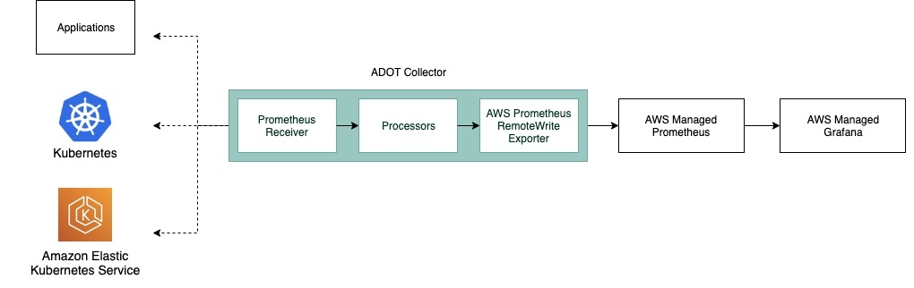
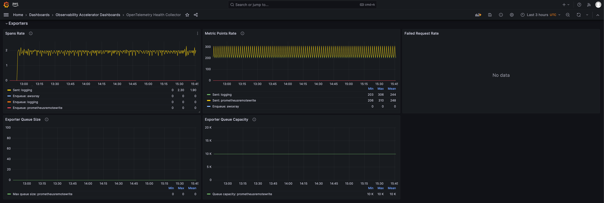

# Single Cluster Open Source Observability - OTEL Collector Monitoring

## Objective

This pattern demonstrates how to use the _New EKS Cluster Open Source Observability Accelerator_ with monitoring for ADOT collector health.

## Prerequisites

Ensure that you have installed the following tools on your machine.

1. [aws cli](https://docs.aws.amazon.com/cli/latest/userguide/install-cliv2.html)
2. [kubectl](https://Kubernetes.io/docs/tasks/tools/)
3. [cdk](https://docs.aws.amazon.com/cdk/v2/guide/getting_started.html#getting_started_install)
4. [npm](https://docs.npmjs.com/cli/v8/commands/npm-install)

## Deploying

Please follow the _Deploying_ instructions of the [New EKS Cluster Open Source Observability Accelerator](./single-new-eks-opensource-observability.md) pattern, except for step 7, where you need to replace "context" in `~/.cdk.json` with the following:

```typescript
 "context": {
    "fluxRepository": {
      "name": "grafana-dashboards",
      "namespace": "grafana-operator",
      "repository": {
        "repoUrl": "https://github.com/aws-observability/aws-observability-accelerator",
        "name": "grafana-dashboards",
        "targetRevision": "main",
        "path": "./artifacts/grafana-operator-manifests/eks/infrastructure"
      },
      "values": {
        "GRAFANA_CLUSTER_DASH_URL" : "https://raw.githubusercontent.com/aws-observability/aws-observability-accelerator/main/artifacts/grafana-dashboards/eks/infrastructure/cluster.json",
        "GRAFANA_KUBELET_DASH_URL" : "https://raw.githubusercontent.com/aws-observability/aws-observability-accelerator/main/artifacts/grafana-dashboards/eks/infrastructure/kubelet.json",
        "GRAFANA_NSWRKLDS_DASH_URL" : "https://raw.githubusercontent.com/aws-observability/aws-observability-accelerator/main/artifacts/grafana-dashboards/eks/infrastructure/namespace-workloads.json",
        "GRAFANA_NODEEXP_DASH_URL" : "https://raw.githubusercontent.com/aws-observability/aws-observability-accelerator/main/artifacts/grafana-dashboards/eks/infrastructure/nodeexporter-nodes.json",
        "GRAFANA_NODES_DASH_URL" : "https://raw.githubusercontent.com/aws-observability/aws-observability-accelerator/main/artifacts/grafana-dashboards/eks/infrastructure/nodes.json",
        "GRAFANA_WORKLOADS_DASH_URL" : "https://raw.githubusercontent.com/aws-observability/aws-observability-accelerator/main/artifacts/grafana-dashboards/eks/infrastructure/workloads.json",
        "GRAFANA_ADOTHEALTH_DASH_URL": "https://raw.githubusercontent.com/aws-observability/aws-observability-accelerator/main/artifacts/grafana-dashboards/adot/adothealth.json"
      },
      "kustomizations": [
        {
          "kustomizationPath": "./artifacts/grafana-operator-manifests/eks/infrastructure"
        },
        {
          "kustomizationPath": "./artifacts/grafana-operator-manifests/eks/adot"
        }
      ]
    },
    "adotcollectormetrics.pattern.enabled": true
  }
```

## Visualization

The OpenTelemetry collector produces metrics to monitor the entire pipeline.

Login to your Grafana workspace and navigate to the Dashboards panel. You should see three new dashboard named `OpenTelemetry Health Collector`, under `Observability Accelerator Dashboards`

This dashboard shows useful telemetry information about the ADOT collector itself which can be helpful when you want to troubleshoot any issues with the collector or understand how much resources the collector is consuming.

Below diagram shows an example data flow and the components in an ADOT collector:




In this dashboard, there are five sections. Each section has [metrics](https://aws-observability.github.io/observability-best-practices/guides/operational/adot-at-scale/operating-adot-collector/#collecting-health-metrics-from-the-collector) relevant to the various [components](https://opentelemetry.io/docs/demo/collector-data-flow-dashboard/#data-flow-overview) of the AWS Distro for OpenTelemetry (ADOT) collector :

### Receivers
Shows the receiver’s accepted and refused rate/count of spans and metric points that are pushed into the telemetry pipeline.

### Processors
Shows the accepted and refused rate/count of spans and metric points pushed into next component in the pipeline. The batch metrics can help to understand how often metrics are sent to exporter and the batch size.


### Exporters
Shows the exporter’s accepted and refused rate/count of spans and metric points that are pushed to any of the destinations. It also shows the size and capacity of the retry queue. These metrics can be used to understand if the collector is having issues in sending trace or metric data to the destination configured.




### Collectors
Shows the collector’s operational metrics (Memory, CPU, uptime). This can be used to understand how much resources the collector is consuming.


### Data Flow
Shows the metrics and spans data flow through the collector’s components.


Note:
    To read more about the metrics and the dashboard used, visit the upstream documentation [here](https://opentelemetry.io/docs/demo/collector-data-flow-dashboard/).


## Disable ADOT health monitoring

Update the context in `cdk.json` file located in `cdk-eks-blueprints-patterns` directory

```typescript
   "context": {
    "adotcollectormetrics.pattern.enabled": false
  }
```

## Teardown

You can teardown the whole CDK stack with the following command:

```bash
make pattern single-new-eks-opensource-observability destroy
```