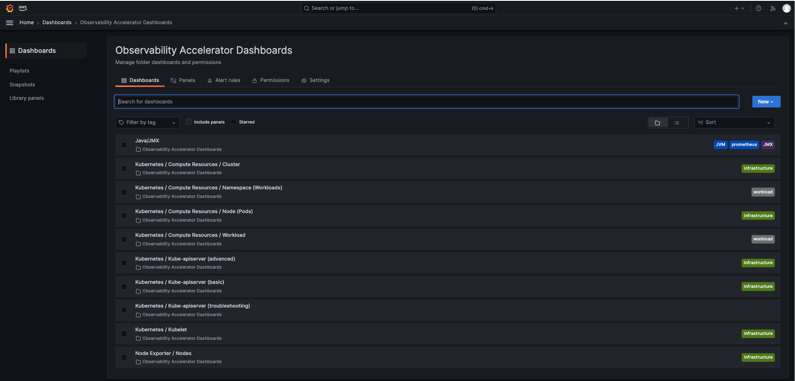
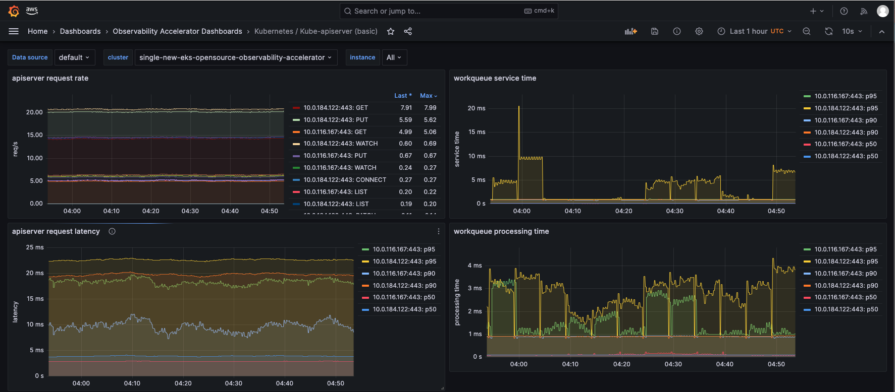
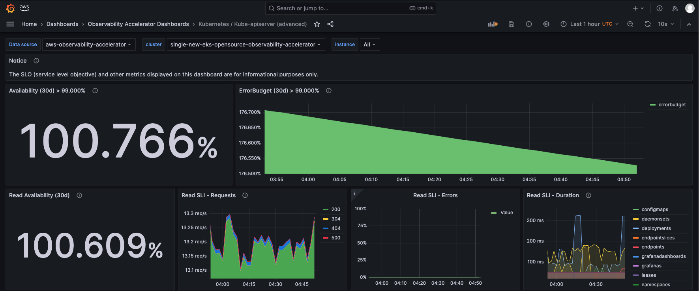
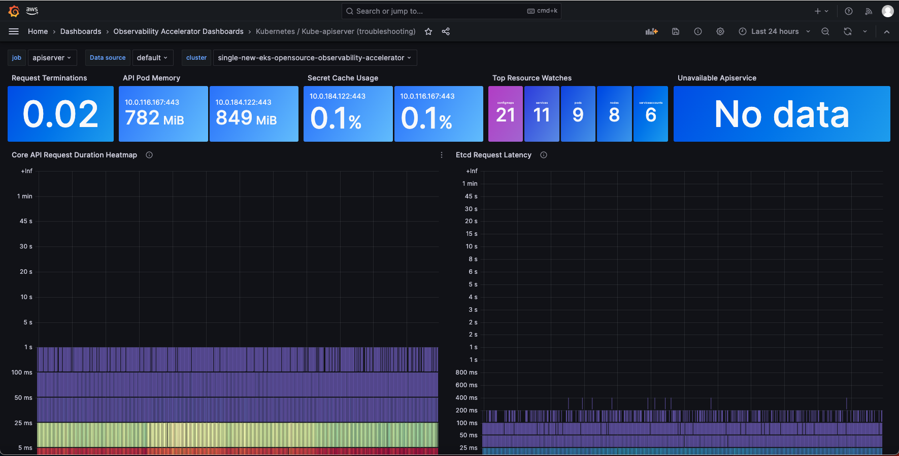

# Single Cluster Open Source Observability - API Server Monitoring

## Objective

This pattern demonstrates how to use the _New EKS Cluster Open Source Observability Accelerator_ with API Server monitoring.

## Prerequisites

Ensure that you have installed the following tools on your machine.

1. [aws cli](https://docs.aws.amazon.com/cli/latest/userguide/install-cliv2.html)
2. [kubectl](https://Kubernetes.io/docs/tasks/tools/)
3. [cdk](https://docs.aws.amazon.com/cdk/v2/guide/getting_started.html#getting_started_install)
4. [npm](https://docs.npmjs.com/cli/v8/commands/npm-install)

## Deploying

Please follow the _Deploying_ instructions of the [New EKS Cluster Open Source Observability Accelerator](./single-new-eks-opensource-observability.md) pattern, except for step 7, where you need to replace "context" in `~/.cdk.json` with the following:

```typescript
  "context": {
    "fluxRepository": {
      "name": "grafana-dashboards",
      "namespace": "grafana-operator",
      "repository": {
        "repoUrl": "https://github.com/aws-observability/aws-observability-accelerator",
        "name": "grafana-dashboards",
        "targetRevision": "main",
        "path": "./artifacts/grafana-operator-manifests/eks/infrastructure"
      },
      "values": {
        "GRAFANA_CLUSTER_DASH_URL" : "https://raw.githubusercontent.com/aws-observability/aws-observability-accelerator/main/artifacts/grafana-dashboards/eks/infrastructure/cluster.json",
        "GRAFANA_KUBELET_DASH_URL" : "https://raw.githubusercontent.com/aws-observability/aws-observability-accelerator/main/artifacts/grafana-dashboards/eks/infrastructure/kubelet.json",
        "GRAFANA_NSWRKLDS_DASH_URL" : "https://raw.githubusercontent.com/aws-observability/aws-observability-accelerator/main/artifacts/grafana-dashboards/eks/infrastructure/namespace-workloads.json",
        "GRAFANA_NODEEXP_DASH_URL" : "https://raw.githubusercontent.com/aws-observability/aws-observability-accelerator/main/artifacts/grafana-dashboards/eks/infrastructure/nodeexporter-nodes.json",
        "GRAFANA_NODES_DASH_URL" : "https://raw.githubusercontent.com/aws-observability/aws-observability-accelerator/main/artifacts/grafana-dashboards/eks/infrastructure/nodes.json",
        "GRAFANA_WORKLOADS_DASH_URL" : "https://raw.githubusercontent.com/aws-observability/aws-observability-accelerator/main/artifacts/grafana-dashboards/eks/infrastructure/workloads.json",
        "GRAFANA_APISERVER_BASIC_DASH_URL" : "https://raw.githubusercontent.com/aws-observability/aws-observability-accelerator/main/artifacts/grafana-dashboards/eks/apiserver/apiserver-basic.json",
        "GRAFANA_APISERVER_ADVANCED_DASH_URL" : "https://raw.githubusercontent.com/aws-observability/aws-observability-accelerator/main/artifacts/grafana-dashboards/eks/apiserver/apiserver-advanced.json",
        "GRAFANA_APISERVER_TROUBLESHOOTING_DASH_URL" : "https://raw.githubusercontent.com/aws-observability/aws-observability-accelerator/main/artifacts/grafana-dashboards/eks/apiserver/apiserver-troubleshooting.json"
      },
      "kustomizations": [
        {
          "kustomizationPath": "./artifacts/grafana-operator-manifests/eks/infrastructure"
        },
        {
          "kustomizationPath": "./artifacts/grafana-operator-manifests/eks/apiserver"
        }
      ]
    },
    "apiserver.pattern.enabled": true,
  }
```

## Visualization

Login to your Grafana workspace and navigate to the Dashboards panel. You should see three new dashboard named `Kubernetes/Kube-apiserver (basic), Kubernetes/Kube-apiserver (advanced), Kubernetes/Kube-apiserver (troubleshooting)`, under `Observability Accelerator Dashboards`:



Open the `Kubernetes/Kube-apiserver (basic)` dashboard and you should be able to view its visualization as shown below:



Open the `Kubernetes/Kube-apiserver (advanced)` dashboard and you should be able to view its visualization as shown below:



Open the `Kubernetes/Kube-apiserver (troubleshooting)` dashboard and you should be able to view its visualization as shown below:



## Teardown

You can teardown the whole CDK stack with the following command:

```bash
make pattern single-new-eks-opensource-observability destroy
```