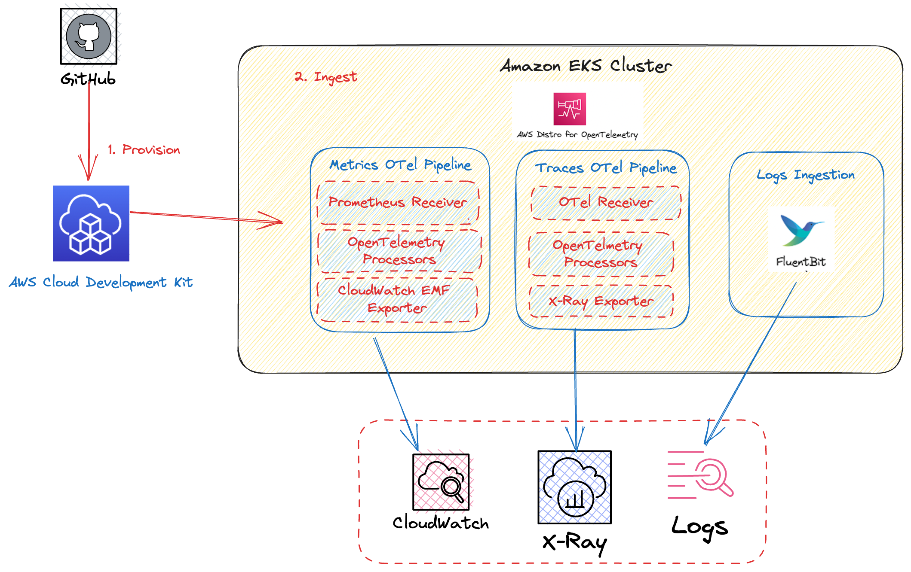
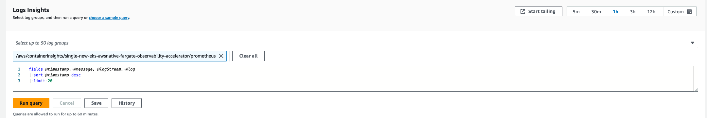
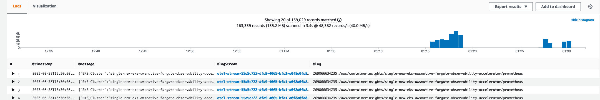
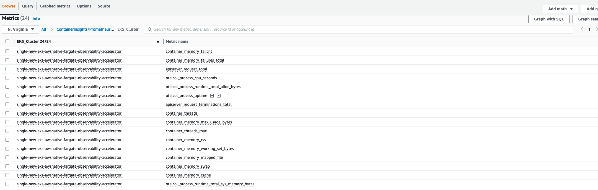
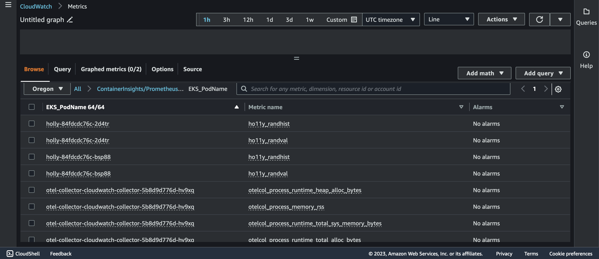

# Single Cluster AWS Native Observability - Fargate

## Architecture

The following figure illustrates the architecture of the pattern we will be deploying for Single EKS Fargate Cluster Native Observability pattern using AWS native tools such as CloudWatch Logs and Container Insights.



This example makes use of CloudWatch Container Insights as a vizualization and metric-aggregation layer.
Amazon CloudWatch Container Insights helps customers collect, aggregate, and summarize metrics and logs from containerized applications and microservices. Metrics data is collected as performance log events using the embedded metric format. These performance log events use a structured JSON schema that enables high-cardinality data to be ingested and stored at scale. From this data, CloudWatch creates aggregated metrics at the cluster, node, pod, task, and service level as CloudWatch metrics. The metrics that Container Insights collects are available in CloudWatch automatic dashboards.

 AWS Distro for OpenTelemetry (ADOT) is a secure, AWS-supported distribution of the OpenTelemetry project. With ADOT, users can instrument their applications just once to send correlated metrics and traces to multiple monitoring solutions. With ADOT support for CloudWatch Container Insights, customers can collect system metrics such as CPU, memory, disk, and network usage from Amazon EKS clusters running on Amazon Elastic Cloud Compute (Amazon EC2), providing the same experience as Amazon CloudWatch agent. In EKS Fargate networking architecture, a pod is not allowed to directly reach the kubelet on that worker node. Hence, the ADOT Collector calls the Kubernetes API Server to proxy the connection to the kubelet on a worker node, and collect kubelet’s cAdvisor metrics for workloads on that node. 

By combining Container Insights and CloudWatch logs, we are able to provide a foundation for EKS (Amazon Elastic Kubernetes Service) Observability. Monitoring EKS for metrics has two categories:
the control plane and the Amazon EKS nodes (with Kubernetes objects).
The Amazon EKS control plane consists of control plane nodes that run the Kubernetes software,
such as etcd and the Kubernetes API server. To read more on the components of an Amazon EKS cluster,
please read the [service documentation](https://docs.aws.amazon.com/eks/latest/userguide/clusters.html).


## Objective

- Deploys one production grade Amazon EKS Fargate cluster.
- Logs with CloudWatch Logs
- Enables CloudWatch Container Insights.
- Installs Prometheus Node Exporter and Metrics Server for infrastructure metrics.

## Prerequisites:

Ensure that you have installed the following tools on your machine.

1. [aws cli](https://docs.aws.amazon.com/cli/latest/userguide/install-cliv2.html)
2. [kubectl](https://Kubernetes.io/docs/tasks/tools/)
3. [cdk](https://docs.aws.amazon.com/cdk/v2/guide/getting_started.html#getting_started_install)
4. [npm](https://docs.npmjs.com/cli/v8/commands/npm-install)


## Deploying

1. Clone your forked repository

```sh
git clone https://github.com/aws-observability/cdk-aws-observability-accelerator.git
```

2. Install the AWS CDK Toolkit globally on your machine using

```bash
npm install -g aws-cdk
```

3. Install project dependencies by running `npm install` in the main folder of this cloned repository

4. Once all pre-requisites are set you are ready to deploy the pipeline. Run the following command from the root of this repository to deploy the pipeline stack:

```bash
make build
make pattern single-new-eks-awsnative-fargate-observability deploy
```


## Verify the resources

Run update-kubeconfig command. You should be able to get the command from CDK output message.

```bash
aws eks update-kubeconfig --name single-new-eks-awsnative-fargate-observability-accelerator --region <your region> --role-arn arn:aws:iam::xxxxxxxxx:role/single-new-eks-awsnative-singleneweksawsnativeobs-xxxxxxxx
```


Let’s verify the resources created by steps above.

```bash
kubectl get nodes -o wide
```
```
Output:
NAME                                   STATUS   ROLES    AGE   VERSION               INTERNAL-IP    EXTERNAL-IP   OS-IMAGE         KERNEL-VERSION                  CONTAINER-RUNTIME
fargate-ip-10-0-102-84.ec2.internal    Ready    <none>   15m   v1.27.1-eks-2f008fe   10.0.102.84    <none>        Amazon Linux 2   5.10.184-175.749.amzn2.x86_64   containerd://1.6.6
fargate-ip-10-0-124-175.ec2.internal   Ready    <none>   12m   v1.27.1-eks-2f008fe   10.0.124.175   <none>        Amazon Linux 2   5.10.184-175.749.amzn2.x86_64   containerd://1.6.6
fargate-ip-10-0-126-244.ec2.internal   Ready    <none>   15m   v1.27.1-eks-2f008fe   10.0.126.244   <none>        Amazon Linux 2   5.10.184-175.749.amzn2.x86_64   containerd://1.6.6
fargate-ip-10-0-132-165.ec2.internal   Ready    <none>   12m   v1.27.1-eks-2f008fe   10.0.132.165   <none>        Amazon Linux 2   5.10.186-179.751.amzn2.x86_64   containerd://1.6.6
fargate-ip-10-0-159-96.ec2.internal    Ready    <none>   15m   v1.27.1-eks-2f008fe   10.0.159.96    <none>        Amazon Linux 2   5.10.186-179.751.amzn2.x86_64   containerd://1.6.6
fargate-ip-10-0-170-28.ec2.internal    Ready    <none>   14m   v1.27.1-eks-2f008fe   10.0.170.28    <none>        Amazon Linux 2   5.10.186-179.751.amzn2.x86_64   containerd://1.6.6
fargate-ip-10-0-173-57.ec2.internal    Ready    <none>   15m   v1.27.1-eks-2f008fe   10.0.173.57    <none>        Amazon Linux 2   5.10.186-179.751.amzn2.x86_64   containerd://1.6.6
fargate-ip-10-0-175-87.ec2.internal    Ready    <none>   15m   v1.27.1-eks-2f008fe   10.0.175.87    <none>        Amazon Linux 2   5.10.186-179.751.amzn2.x86_64   containerd://1.6.6
fargate-ip-10-0-187-27.ec2.internal    Ready    <none>   15m   v1.27.1-eks-2f008fe   10.0.187.27    <none>        Amazon Linux 2   5.10.186-179.751.amzn2.x86_64   containerd://1.6.6
fargate-ip-10-0-188-225.ec2.internal   Ready    <none>   15m   v1.27.1-eks-2f008fe   10.0.188.225   <none>        Amazon Linux 2   5.10.186-179.751.amzn2.x86_64   containerd://1.6.6
fargate-ip-10-0-189-234.ec2.internal   Ready    <none>   15m   v1.27.1-eks-2f008fe   10.0.189.234   <none>        Amazon Linux 2   5.10.186-179.751.amzn2.x86_64   containerd://1.6.6
fargate-ip-10-0-96-29.ec2.internal     Ready    <none>   15m   v1.27.1-eks-2f008fe   10.0.96.29     <none>        Amazon Linux 2   5.10.184-175.749.amzn2.x86_64   containerd://1.6.6
```

```bash
kubectl get pods -o wide -A
```
```
NAMESPACE                       NAME                                                   READY   STATUS    RESTARTS       AGE   IP             NODE                                   NOMINATED NODE   READINESS GATES
cert-manager                    cert-manager-875c7579b-5kzg5                           1/1     Running   0              17m   10.0.188.225   fargate-ip-10-0-188-225.ec2.internal   <none>           <none>
cert-manager                    cert-manager-cainjector-7bb6786867-xrtbx               1/1     Running   0              17m   10.0.102.84    fargate-ip-10-0-102-84.ec2.internal    <none>           <none>
cert-manager                    cert-manager-webhook-79d574fbd5-9b7mx                  1/1     Running   0              17m   10.0.187.27    fargate-ip-10-0-187-27.ec2.internal    <none>           <none>
default                         otel-collector-cloudwatch-collector-65bb5d7cb6-x8gdl   1/1     Running   1 (114s ago)   14m   10.0.132.165   fargate-ip-10-0-132-165.ec2.internal   <none>           <none>
default                         otel-collector-xray-collector-796b57b657-tnx86         1/1     Running   0              14m   10.0.124.175   fargate-ip-10-0-124-175.ec2.internal   <none>           <none>
kube-system                     aws-load-balancer-controller-8dcffbf6c-6qgfn           1/1     Running   0              17m   10.0.96.29     fargate-ip-10-0-96-29.ec2.internal     <none>           <none>
kube-system                     aws-load-balancer-controller-8dcffbf6c-dgqn6           1/1     Running   0              17m   10.0.189.234   fargate-ip-10-0-189-234.ec2.internal   <none>           <none>
kube-system                     blueprints-addon-metrics-server-6765c9bc59-v98h5       1/1     Running   0              17m   10.0.175.87    fargate-ip-10-0-175-87.ec2.internal    <none>           <none>
kube-system                     coredns-788dbcccd5-7lf2g                               1/1     Running   0              17m   10.0.173.57    fargate-ip-10-0-173-57.ec2.internal    <none>           <none>
kube-system                     coredns-788dbcccd5-wn8nc                               1/1     Running   0              17m   10.0.126.244   fargate-ip-10-0-126-244.ec2.internal   <none>           <none>
kube-system                     kube-state-metrics-7f4b8b9f5-g994r                     1/1     Running   0              17m   10.0.159.96    fargate-ip-10-0-159-96.ec2.internal    <none>           <none>
opentelemetry-operator-system   opentelemetry-operator-5fbdd4f5f9-lm2nf                2/2     Running   0              16m   10.0.170.28    fargate-ip-10-0-170-28.ec2.internal    <none>           <none>
```

```bash
kubectl get ns # Output shows all namespace
```
```
NAME                       STATUS   AGE
aws-for-fluent-bit              Active   17m
cert-manager                    Active   17m
default                         Active   27m
kube-node-lease                 Active   27m
kube-public                     Active   27m
kube-system                     Active   27m
opentelemetry-operator-system   Active   17m
```

## Viewing Logs

By default, we deploy a FluentBit daemon set in the cluster to collect worker logs for all namespaces. Logs are collected and exported to Amazon CloudWatch Logs, which enables you to centralize the logs from all of your systems, applications,
and AWS services that you use, in a single, highly scalable service.

## Using CloudWatch Logs Insights to Query Logs

Navigate to CloudWatch, then go to "Logs Insights"

In the dropdown, select any of the logs that begin with "/aws/eks/single-new-eks-awsnative-fargate-observability-accelerator" and run a query.

Example with "kubesystem" log group:



Then you can view the results of your query:



## Viewing Metrics

Metrics are collected by the cloudWatchAdotAddon as based on the metricsNameSelectors we defined (default `['apiserver_request_.*', 'container_memory_.*', 'container_threads', 'otelcol_process_.*']`). These metrics can be found in the Cloudwatch metrics dashboard. 

Navigate to Cloudwatch, then go to "Metrics"

Select "All Metrics" from the dropdown and select any logs in the ContainerInsights namespace

Example with "EKS_Cluster" metrics



## Monitoring workloads on EKS

Although the default metrics exposed by cloudWatchAdotAddon are useful for getting some standardized metrics from our application we often instrument our own application with OLTP to expose metrics. Fortunately, the otel-collector-cloudwatch-collector can be specified as the endpoint for collecting these metrics and getting metrics and logs to cloudwatch. 

We will be fetching metrics from `ho11y` a synthetic signal generator allowing you to test observability solutions for microservices. It emits logs, metrics, and traces in a configurable manner. 

### Deploying Workload


```bash
cat << EOF | kubectl apply -f -
apiVersion: v1
kind: Namespace
metadata:
  name: ho11y
---
apiVersion: apps/v1
kind: Deployment
metadata:
  name: frontend
  namespace: default
spec:
  selector:
    matchLabels:
      app: frontend
  replicas: 1
  template:
    metadata:
      labels:
        app: frontend
    spec:
      containers:
      - name: ho11y
        image: public.ecr.aws/z0a4o2j5/ho11y:latest
        ports:
        - containerPort: 8765
        env:
        - name: DISABLE_OM
          value: "on"
        - name: HO11Y_LOG_DEST
          value: "stdout"
        - name: OTEL_RESOURCE_ATTRIB
          value: "frontend"
        - name: OTEL_EXPORTER_OTLP_ENDPOINT
          value: "otel-collector-cloudwatch-collector.default.svc.cluster.local:4317"
        - name: HO11Y_INJECT_FAILURE
          value: "enabled"
        - name: DOWNSTREAM0
          value: "http://downstream0"
        - name: DOWNSTREAM1
          value: "http://downstream1"
        imagePullPolicy: Always
---
apiVersion: apps/v1
kind: Deployment
metadata:
  name: downstream0
  namespace: default
spec:
  selector:
    matchLabels:
      app: downstream0
  replicas: 1
  template:
    metadata:
      labels:
        app: downstream0
    spec:
      containers:
      - name: ho11y
        image: public.ecr.aws/mhausenblas/ho11y:stable
        ports:
        - containerPort: 8765
        env:
        - name: DISABLE_OM
          value: "on"
        - name: HO11Y_LOG_DEST
          value: "stdout"
        - name: OTEL_RESOURCE_ATTRIB
          value: "downstream0"
        - name: OTEL_EXPORTER_OTLP_ENDPOINT
          value: "otel-collector-cloudwatch-collector.default.svc.cluster.local:4317"
        - name: DOWNSTREAM0
          value: "https://mhausenblas.info/"
        imagePullPolicy: Always
---
apiVersion: apps/v1
kind: Deployment
metadata:
  name: downstream1
  namespace: default
spec:
  selector:
    matchLabels:
      app: downstream1
  replicas: 1
  template:
    metadata:
      labels:
        app: downstream1
    spec:
      containers:
      - name: ho11y
        image: public.ecr.aws/mhausenblas/ho11y:stable
        ports:
        - containerPort: 8765
        env:
        - name: DISABLE_OM
          value: "on"
        - name: HO11Y_LOG_DEST
          value: "stdout"
        - name: OTEL_RESOURCE_ATTRIB
          value: "downstream1"
        - name: OTEL_EXPORTER_OTLP_ENDPOINT
          value: "otel-collector-cloudwatch-collector.default.svc.cluster.local:4317"
        - name: DOWNSTREAM0
          value: "https://o11y.news/2021-03-01/"
        - name: DOWNSTREAM1
          value: "DUMMY:187kB:42ms"
        - name: DOWNSTREAM2
          value: "DUMMY:13kB:2ms"
        imagePullPolicy: Always
---
apiVersion: v1
kind: Service
metadata:
  name: frontend
  namespace: default
  annotations:
    scrape: "true"
spec:
  type: LoadBalancer
  ports:
  - port: 80
    targetPort: 8765
  selector:
    app: frontend
---
apiVersion: v1
kind: Service
metadata:
  name: downstream0
  namespace: default
  annotations:
    scrape: "true"
spec:
  ports:
  - port: 80
    targetPort: 8765
  selector:
    app: downstream0
---
apiVersion: v1
kind: Service
metadata:
  name: downstream1
  namespace: default
  annotations:
    scrape: "true"
spec:
  ports:
  - port: 80
    targetPort: 8765
  selector:
    app: downstream1
---
EOF
```

To verify the Pod was successfully deployed, please run:

```bash
kubectl get pods
```

```console
kubectl get pods
NAME                                                   READY   STATUS    RESTARTS   AGE
downstream0-6b665bbfd-6zdsb                            1/1     Running   0          61s
downstream1-749d75f6c-9t5dl                            1/1     Running   0          61s
frontend-557fd48b4f-gx8ff                              1/1     Running   0          61s
```

Once deployed you will be able to monitor the Ho11y metrics in cloudwatch as shown:



## Teardown

You can teardown the whole CDK stack with the following command:

```bash
make pattern single-new-eks-awsnative-fargate-observability destroy
```