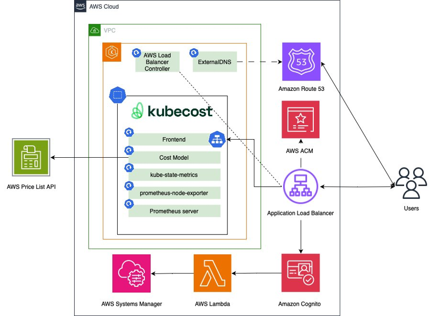
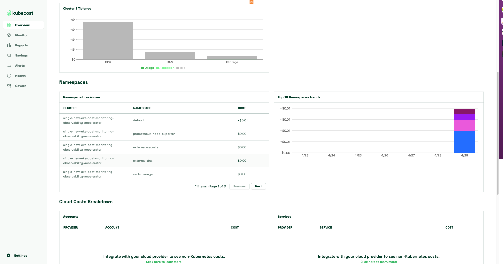

# Single Cluster Observability - Kubecost Cost Monitoring with Secure Ingress using Cognito

Implementing Kubecost for monitoring EKS clusters provides invaluable insights into resource utilization and cost management. Kubecost offers granular visibility into the cost breakdown of Kubernetes workloads, enabling efficient allocation of resources and optimization of infrastructure spending. By integrating with Amazon Managed Prometheus (AMP) and AWS services such as Application Load Balancer, Amazon Cognito, and Amazon Route 53, Kubecost ensures a comprehensive monitoring solution with secure access control mechanisms. With alerts and recording rules provided by Amazon Managed Service for Prometheus, teams can proactively identify and address potential issues, ensuring optimal performance and cost-effectiveness of EKS deployments. Kubecost's user-friendly dashboard and reporting capabilities empower organizations to make informed decisions, maximize resource efficiency, and maintain cost predictability in their EKS environments, ultimately enhancing operational excellence and driving business growth.

## Architecture

The following figure illustrates the architecture of the pattern we will be deploying for Single EKS cost monitoring (Kubecost) pattern with Application Load Balancer, Amazon Cognito, and a Transport Layer Security (TLS) Certificate on AWS Certificate Manager (ACM) with Amazon Route 53 hosted zone to authenticate users to Kubecost



## Objective

- Deploys one production grade Amazon EKS cluster.
- AWS Kubecost with Amazon Managed Prometheus (AMP) integration
- [Secure Ingress with AWS Cognito](https://aws.amazon.com/blogs/containers/securing-kubecost-access-with-amazon-cognito/)
- AWS Certificate Manager with Amazon Route 53 hosted zone 
- Alerts and recording rules with Amazon Managed Service for Prometheus

## Prerequisites:

An existing hosted zone in Route53 with the ability to add records.

Ensure that you have installed the following tools on your machine.

1. [aws cli](https://docs.aws.amazon.com/cli/latest/userguide/install-cliv2.html)
2. [kubectl](https://Kubernetes.io/docs/tasks/tools/)
3. [cdk](https://docs.aws.amazon.com/cdk/v2/guide/getting_started.html#getting_started_install)
4. [npm](https://docs.npmjs.com/cli/v8/commands/npm-install)

## Configuring domain

The CDK code expects the allowed domain and subdomain names in the CDK context file (cdk.json).

Create two environment variables. The PARENT_HOSTED_ZONE variable contains the name of your Route 53 public hosted zone. The DEV_SUBZONE_NAME will be the address for your Kubecost dashboard.

When users register to cognito they will have to provide an email address, using the `allowed.domains.list` you can specify you enterprise's email domain to only allow your employees to sign up for the service

Generate the cdk.json file:

```bash
PARENT_HOSTED_ZONE=mycompany.a2z.com
DEV_SUBZONE_NAME=kubecost.mycompany.a2z.com
ALLOWED_DOMAIN_LIST=amazon.com
cat << EOF > cdk.json
{
    "app": "npx ts-node dist/lib/common/default-main.js",
    "context": {
        "parent.hostedzone.name": "${PARENT_HOSTED_ZONE}",
        "dev.subzone.name": "${DEV_SUBZONE_NAME}",
        "allowed.domains.list": "${ALLOWED_DOMAIN_LIST}"
      }
}
EOF
```


## Deploying

Please follow the _Deploying_ instructions of the [New EKS Cluster Open Source Observability Accelerator](./single-new-eks-opensource-observability.md) pattern till step 7.
At step 8, execute the following

```bash
make build
make pattern single-new-eks-cost-monitoring deploy
```
## Verifying A record for Route53

Open the AWS console once the deployment is complete. 
Navigate to Route53 in AWS console and select the hosted zone you used for the deployment. 
Verify the entry of a record matching the DEV_SUBZONE_NAME we used.

## Verify the resources

Run update-kubeconfig command. You should be able to get the command from CDK output message.

```bash
aws eks update-kubeconfig --name single-new-eks-fargate-opensource-observability-accelerator --region <your region> --role-arn arn:aws:iam::xxxxxxxxx:role/single-new-eks-fargate-op-singleneweksfargateopens-xxxxxxxx
```


Let’s verify the resources created by steps above.

```bash
kubectl get pods -o wide -A
```
```
Output:
NAMESPACE                       NAME                                                              READY   STATUS    RESTARTS   AGE     IP             NODE                                         NOMINATED NODE   READINESS GATES
amazon-guardduty                aws-guardduty-agent-5lblf                                         1/1     Running   0          3h43m   10.0.184.135   ip-10-0-184-135.us-west-2.compute.internal   <none>           <none>
amazon-guardduty                aws-guardduty-agent-qzm4j                                         1/1     Running   0          3h43m   10.0.153.58    ip-10-0-153-58.us-west-2.compute.internal    <none>           <none>
argocd                          blueprints-addon-argocd-application-controller-0                  1/1     Running   0          3h40m   10.0.128.187   ip-10-0-153-58.us-west-2.compute.internal    <none>           <none>
argocd                          blueprints-addon-argocd-applicationset-controller-7d77d5cdjjhm8   1/1     Running   0          3h40m   10.0.148.136   ip-10-0-153-58.us-west-2.compute.internal    <none>           <none>
argocd                          blueprints-addon-argocd-dex-server-84dc54844f-lwgss               1/1     Running   0          3h40m   10.0.178.159   ip-10-0-184-135.us-west-2.compute.internal   <none>           <none>
argocd                          blueprints-addon-argocd-notifications-controller-597477df8q4btr   1/1     Running   0          3h40m   10.0.166.196   ip-10-0-184-135.us-west-2.compute.internal   <none>           <none>
argocd                          blueprints-addon-argocd-redis-79cb6b87dc-tddlm                    1/1     Running   0          3h40m   10.0.160.149   ip-10-0-184-135.us-west-2.compute.internal   <none>           <none>
argocd                          blueprints-addon-argocd-repo-server-584549c456-5gfs8              1/1     Running   0          3h40m   10.0.146.88    ip-10-0-153-58.us-west-2.compute.internal    <none>           <none>
argocd                          blueprints-addon-argocd-server-7b7b488dd4-686tx                   1/1     Running   0          3h40m   10.0.175.70    ip-10-0-184-135.us-west-2.compute.internal   <none>           <none>
aws-for-fluent-bit              blueprints-addon-aws-fluent-bit-for-cw-aws-for-fluent-bit-lr99l   1/1     Running   0          3h40m   10.0.160.194   ip-10-0-184-135.us-west-2.compute.internal   <none>           <none>
aws-for-fluent-bit              blueprints-addon-aws-fluent-bit-for-cw-aws-for-fluent-bit-z2pm7   1/1     Running   0          3h40m   10.0.146.233   ip-10-0-153-58.us-west-2.compute.internal    <none>           <none>
cert-manager                    cert-manager-6d988558d6-wm746                                     1/1     Running   0          3h40m   10.0.188.100   ip-10-0-184-135.us-west-2.compute.internal   <none>           <none>
cert-manager                    cert-manager-cainjector-6976895488-mk9sw                          1/1     Running   0          3h40m   10.0.173.79    ip-10-0-184-135.us-west-2.compute.internal   <none>           <none>
cert-manager                    cert-manager-webhook-fcf48cc54-92wqm                              1/1     Running   0          3h40m   10.0.133.37    ip-10-0-153-58.us-west-2.compute.internal    <none>           <none>
default                         otel-collector-amp-collector-6d768bcbf5-vbmqr                     1/1     Running   0          3h39m   10.0.171.253   ip-10-0-184-135.us-west-2.compute.internal   <none>           <none>
external-dns                    blueprints-addon-external-dns-78bcd6c7c5-df74q                    1/1     Running   0          3h40m   10.0.180.87    ip-10-0-184-135.us-west-2.compute.internal   <none>           <none>
external-secrets                blueprints-addon-external-secrets-675f847b97-kbn98                1/1     Running   0          3h40m   10.0.178.180   ip-10-0-184-135.us-west-2.compute.internal   <none>           <none>
external-secrets                blueprints-addon-external-secrets-cert-controller-68cbb65dspf8c   1/1     Running   0          3h40m   10.0.154.4     ip-10-0-153-58.us-west-2.compute.internal    <none>           <none>
external-secrets                blueprints-addon-external-secrets-webhook-6cfdbdf896-j9ng7        1/1     Running   0          3h40m   10.0.142.78    ip-10-0-153-58.us-west-2.compute.internal    <none>           <none>
kube-system                     aws-load-balancer-controller-7cd4b895d4-gvxtv                     1/1     Running   0          3h40m   10.0.131.188   ip-10-0-153-58.us-west-2.compute.internal    <none>           <none>
kube-system                     aws-load-balancer-controller-7cd4b895d4-m2dh5                     1/1     Running   0          3h40m   10.0.173.13    ip-10-0-184-135.us-west-2.compute.internal   <none>           <none>
kube-system                     aws-node-7l22p                                                    2/2     Running   0          3h43m   10.0.184.135   ip-10-0-184-135.us-west-2.compute.internal   <none>           <none>
kube-system                     aws-node-rfc76                                                    2/2     Running   0          3h43m   10.0.153.58    ip-10-0-153-58.us-west-2.compute.internal    <none>           <none>
kube-system                     blueprints-addon-metrics-server-7cb6564d98-jhwmj                  1/1     Running   0          3h40m   10.0.182.218   ip-10-0-184-135.us-west-2.compute.internal   <none>           <none>
kube-system                     blueprints-addon-secret-store-csi-driver-secrets-store-csi5fbjj   3/3     Running   0          3h40m   10.0.190.108   ip-10-0-184-135.us-west-2.compute.internal   <none>           <none>
kube-system                     blueprints-addon-secret-store-csi-driver-secrets-store-csigdgfd   3/3     Running   0          3h40m   10.0.148.234   ip-10-0-153-58.us-west-2.compute.internal    <none>           <none>
kube-system                     coredns-5b8cc885bc-t9dpp                                          1/1     Running   0          3h47m   10.0.132.167   ip-10-0-153-58.us-west-2.compute.internal    <none>           <none>
kube-system                     coredns-5b8cc885bc-tkq6g                                          1/1     Running   0          3h47m   10.0.152.126   ip-10-0-153-58.us-west-2.compute.internal    <none>           <none>
kube-system                     csi-secrets-store-provider-aws-ktklg                              1/1     Running   0          3h40m   10.0.190.207   ip-10-0-184-135.us-west-2.compute.internal   <none>           <none>
kube-system                     csi-secrets-store-provider-aws-qmg44                              1/1     Running   0          3h40m   10.0.142.192   ip-10-0-153-58.us-west-2.compute.internal    <none>           <none>
kube-system                     ebs-csi-controller-5c4b7b9549-cvv8b                               6/6     Running   0          3h40m   10.0.163.2     ip-10-0-184-135.us-west-2.compute.internal   <none>           <none>
kube-system                     ebs-csi-controller-5c4b7b9549-d9wfc                               6/6     Running   0          3h40m   10.0.146.91    ip-10-0-153-58.us-west-2.compute.internal    <none>           <none>
kube-system                     ebs-csi-node-9sxtr                                                3/3     Running   0          3h40m   10.0.155.48    ip-10-0-153-58.us-west-2.compute.internal    <none>           <none>
kube-system                     ebs-csi-node-bcsjk                                                3/3     Running   0          3h40m   10.0.187.96    ip-10-0-184-135.us-west-2.compute.internal   <none>           <none>
kube-system                     kube-proxy-djbgh                                                  1/1     Running   0          3h43m   10.0.153.58    ip-10-0-153-58.us-west-2.compute.internal    <none>           <none>
kube-system                     kube-proxy-mck62                                                  1/1     Running   0          3h43m   10.0.184.135   ip-10-0-184-135.us-west-2.compute.internal   <none>           <none>
kube-system                     kube-state-metrics-6cf6f65cf7-nzqkb                               1/1     Running   0          3h40m   10.0.186.50    ip-10-0-184-135.us-west-2.compute.internal   <none>           <none>
kube-system                     ssm-installer-fsfjn                                               1/1     Running   0          3h41m   10.0.189.79    ip-10-0-184-135.us-west-2.compute.internal   <none>           <none>
kube-system                     ssm-installer-vbqqm                                               1/1     Running   0          3h41m   10.0.154.228   ip-10-0-153-58.us-west-2.compute.internal    <none>           <none>
kubecost                        kubecost-cost-analyzer-5769d5f47f-fjwkz                           3/3     Running   0          3h40m   10.0.137.248   ip-10-0-153-58.us-west-2.compute.internal    <none>           <none>
kubecost                        kubecost-cost-analyzer-prometheus-server-6f48bdc56c-d6789         2/2     Running   0          3h40m   10.0.187.76    ip-10-0-184-135.us-west-2.compute.internal   <none>           <none>
opentelemetry-operator-system   opentelemetry-operator-98f5b9c89-7kp6x                            2/2     Running   0          3h39m   10.0.148.126   ip-10-0-153-58.us-west-2.compute.internal    <none>           <none>
prometheus-node-exporter        prometheus-node-exporter-czsx8                                    1/1     Running   0          3h40m   10.0.184.135   ip-10-0-184-135.us-west-2.compute.internal   <none>           <none>
prometheus-node-exporter        prometheus-node-exporter-jg9tw                                    1/1     Running   0          3h40m   10.0.153.58    ip-10-0-153-58.us-west-2.compute.internal    <none>           <none>
```

Now, lets navigate to the URL described as our dev.subzone.name in the cdk.json file and signup with a new cognito user profile.

- **Kubecost Dashboards**
  


- **Kubecost Namespace Dashboards**
  


## Teardown

You can teardown the whole CDK stack with the following command:

```bash
make pattern single-new-eks-cost-monitoring destroy 
```