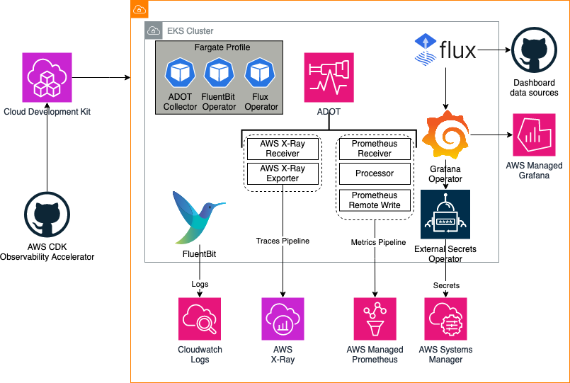
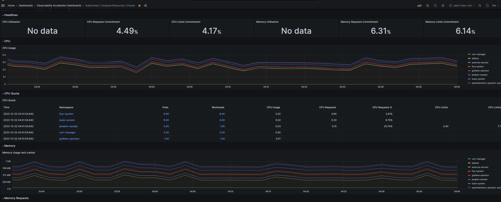
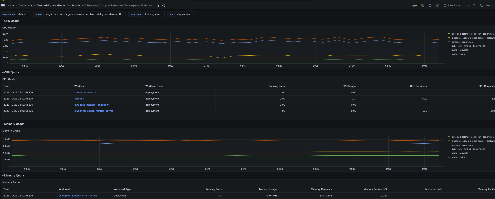
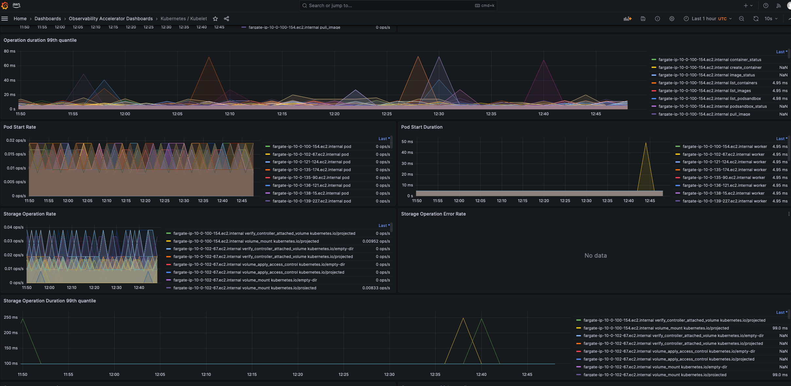
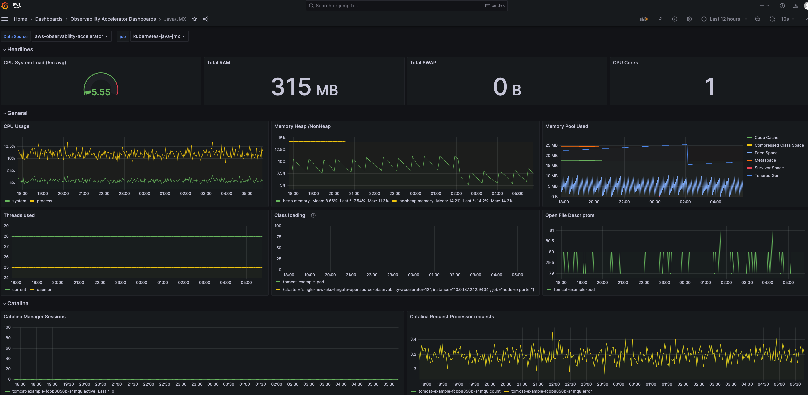

# Single New EKS Cluster Opensource Observability - Fargate

## Architecture

The following figure illustrates the architecture of the pattern we will be deploying for Single EKS Fargate Open Source Observability pattern using open source tooling such as AWS Distro for Open Telemetry (ADOT), FluentBit (Logs), Amazon Managed Service for Prometheus and Amazon Managed Grafana:



### Metrics and Traces
AWS Distro for OpenTelemetry (ADOT) is a secure, AWS-supported distribution of the OpenTelemetry project. With ADOT, users can instrument their applications just once to send correlated metrics and traces to multiple monitoring solutions. 

The ADOT Collector has the concept of a pipeline which comprises three key types of components, namely, receiver, processor, and exporter. A receiver is how data gets into the collector. It accepts data in a specified format, translates it into the internal format and passes it to processors and exporters defined in the pipeline. It can be pull or push based. A processor is an optional component that is used to perform tasks such as batching, filtering, and transformations on data between being received and being exported. An exporter is used to determine which destination to send the metrics, logs or traces.

In the above architecture, the kubelet on a worker node in a Kubernetes cluster exposes resource metrics such as CPU, memory, disk, and network usage at the /metrics/cadvisor endpoint. However, in EKS Fargate networking architecture, a pod is not allowed to directly reach the kubelet on that worker node. Hence, the ADOT Collector calls the Kubernetes API Server to proxy the connection to the kubelet on a worker node, and collect kubelet's cAdvisor metrics for workloads on that node. These metrics are made available in Prometheus format. Therefore, the collector uses an instance of Prometheus Receiver as a drop-in replacement for a Prometheus server and scrapes these metrics from the Kubernetes API server endpoint. Using Kubernetes service discovery, the receiver can discover all the worker nodes in an EKS cluster. Hence, more than one instances of ADOT Collector will suffice to collect resource metrics from all the nodes in a cluster. Having a single instance of ADOT collector can be overwhelming during higher loads so always recommend to deploy more than one collector.

### Logs
With Amazon EKS on Fargate, you can deploy pods without allocating or managing your Kubernetes nodes. This removes the need to capture system-level logs for your Kubernetes nodes. To capture the logs from your Fargate pods, we use Fluent Bit to forward the logs directly to CloudWatch. This enables you to automatically route logs to CloudWatch without further configuration or a sidecar container for your Amazon EKS pods on Fargate. For more information about this, see [Fargate logging](https://docs.aws.amazon.com/eks/latest/userguide/fargate-logging.html) in the Amazon EKS documentation and [Fluent Bit for Amazon EKS](http://aws.amazon.com/blogs/containers/fluent-bit-for-amazon-eks-on-aws-fargate-is-here/) on the AWS Blog. This solution captures the STDOUT and STDERR input/output (I/O) streams from your container and sends them to CloudWatch through Fluent Bit, based on the Fluent Bit configuration established for the Amazon EKS cluster on Fargate

## Objective

- Deploys one production grade Amazon EKS cluster.
- AWS Distro For OpenTelemetry Operator and Collector for Metrics and Traces
- Logs with [AWS for FluentBit](https://github.com/aws/aws-for-fluent-bit)
- Installs Grafana Operator to add AWS data sources and create Grafana Dashboards to Amazon Managed Grafana.
- Installs FluxCD to perform GitOps sync of a Git Repo to EKS Cluster. We will use this later for creating Grafana Dashboards and AWS datasources to Amazon Managed Grafana. You can also use your own GitRepo  to sync your own Grafana resources such as Dashboards, Datasources etc. Please check our One observability module - [GitOps with Amazon Managed Grafana](https://catalog.workshops.aws/observability/en-US/aws-managed-oss/gitops-with-amg) to learn more about this.
- Installs External Secrets Operator to retrieve and Sync the Grafana API keys.
- Amazon Managed Grafana Dashboard and data source
- Alerts and recording rules with Amazon Managed Service for Prometheus

## Prerequisites:

Ensure that you have installed the following tools on your machine.

1. [aws cli](https://docs.aws.amazon.com/cli/latest/userguide/install-cliv2.html)
2. [kubectl](https://Kubernetes.io/docs/tasks/tools/)
3. [cdk](https://docs.aws.amazon.com/cdk/v2/guide/getting_started.html#getting_started_install)
4. [npm](https://docs.npmjs.com/cli/v8/commands/npm-install)


## Deploying

Please follow the _Deploying_ instructions of the [New EKS Cluster Open Source Observability Accelerator](./single-new-eks-opensource-observability.md) pattern till step 7.
At step 8, execute the following

```bash
make build
make pattern single-new-eks-fargate-opensource-observability deploy
```


## Verify the resources

Run update-kubeconfig command. You should be able to get the command from CDK output message.

```bash
aws eks update-kubeconfig --name single-new-eks-fargate-opensource-observability-accelerator --region <your region> --role-arn arn:aws:iam::xxxxxxxxx:role/single-new-eks-fargate-op-singleneweksfargateopens-xxxxxxxx
```


Let’s verify the resources created by steps above.

```bash
kubectl get nodes -o wide
```
```
Output:
NAME                                   STATUS   ROLES    AGE   VERSION               INTERNAL-IP    EXTERNAL-IP   OS-IMAGE         KERNEL-VERSION                  CONTAINER-RUNTIME
fargate-ip-10-0-100-154.ec2.internal   Ready    <none>   12d     v1.27.1-eks-2f008fe   10.0.100.154   <none>        Amazon Linux 2   5.10.192-183.736.amzn2.x86_64   containerd://1.6.6
fargate-ip-10-0-102-67.ec2.internal    Ready    <none>   12d     v1.27.1-eks-2f008fe   10.0.102.67    <none>        Amazon Linux 2   5.10.192-183.736.amzn2.x86_64   containerd://1.6.6
fargate-ip-10-0-121-124.ec2.internal   Ready    <none>   7d11h   v1.27.1-eks-2f008fe   10.0.121.124   <none>        Amazon Linux 2   5.10.192-183.736.amzn2.x86_64   containerd://1.6.6
fargate-ip-10-0-135-174.ec2.internal   Ready    <none>   12d     v1.27.1-eks-2f008fe   10.0.135.174   <none>        Amazon Linux 2   5.10.192-182.736.amzn2.x86_64   containerd://1.6.6
fargate-ip-10-0-135-90.ec2.internal    Ready    <none>   12d     v1.27.1-eks-2f008fe   10.0.135.90    <none>        Amazon Linux 2   5.10.192-182.736.amzn2.x86_64   containerd://1.6.6
fargate-ip-10-0-136-121.ec2.internal   Ready    <none>   12d     v1.27.1-eks-2f008fe   10.0.136.121   <none>        Amazon Linux 2   5.10.192-182.736.amzn2.x86_64   containerd://1.6.6
fargate-ip-10-0-138-15.ec2.internal    Ready    <none>   2d8h    v1.27.6-eks-f8587cb   10.0.138.15    <none>        Amazon Linux 2   5.10.192-183.736.amzn2.x86_64   containerd://1.6.6
fargate-ip-10-0-139-227.ec2.internal   Ready    <none>   12d     v1.27.1-eks-2f008fe   10.0.139.227   <none>        Amazon Linux 2   5.10.192-182.736.amzn2.x86_64   containerd://1.6.6
fargate-ip-10-0-148-152.ec2.internal   Ready    <none>   12d     v1.27.1-eks-2f008fe   10.0.148.152   <none>        Amazon Linux 2   5.10.192-182.736.amzn2.x86_64   containerd://1.6.6
fargate-ip-10-0-151-22.ec2.internal    Ready    <none>   12d     v1.27.1-eks-2f008fe   10.0.151.22    <none>        Amazon Linux 2   5.10.192-182.736.amzn2.x86_64   containerd://1.6.6
fargate-ip-10-0-158-82.ec2.internal    Ready    <none>   12d     v1.27.1-eks-2f008fe   10.0.158.82    <none>        Amazon Linux 2   5.10.192-182.736.amzn2.x86_64   containerd://1.6.6
fargate-ip-10-0-161-151.ec2.internal   Ready    <none>   2d8h    v1.27.6-eks-f8587cb   10.0.161.151   <none>        Amazon Linux 2   5.10.192-183.736.amzn2.x86_64   containerd://1.6.6
fargate-ip-10-0-164-251.ec2.internal   Ready    <none>   87m     v1.27.6-eks-f8587cb   10.0.164.251   <none>        Amazon Linux 2   5.10.192-183.736.amzn2.x86_64   containerd://1.6.6
fargate-ip-10-0-165-99.ec2.internal    Ready    <none>   2d9h    v1.27.1-eks-2f008fe   10.0.165.99    <none>        Amazon Linux 2   5.10.192-183.736.amzn2.x86_64   containerd://1.6.6
fargate-ip-10-0-167-115.ec2.internal   Ready    <none>   12d     v1.27.1-eks-2f008fe   10.0.167.115   <none>        Amazon Linux 2   5.10.192-182.736.amzn2.x86_64   containerd://1.6.6
fargate-ip-10-0-178-170.ec2.internal   Ready    <none>   12d     v1.27.1-eks-2f008fe   10.0.178.170   <none>        Amazon Linux 2   5.10.192-182.736.amzn2.x86_64   containerd://1.6.6
fargate-ip-10-0-186-44.ec2.internal    Ready    <none>   87m     v1.27.6-eks-f8587cb   10.0.186.44    <none>        Amazon Linux 2   5.10.192-183.736.amzn2.x86_64   containerd://1.6.6
```

```bash
kubectl get pods -o wide -A
```
```
NAMESPACE                       NAME                                                              READY   STATUS    RESTARTS        AGE     IP             NODE                                   NOMINATED NODE   READINESS GATES
cert-manager                    cert-manager-8694c7d4fd-pwmhh                                     1/1     Running   0               12d     10.0.135.90    fargate-ip-10-0-135-90.ec2.internal    <none>           <none>
cert-manager                    cert-manager-cainjector-744cb68868-m2j25                          1/1     Running   0               12d     10.0.136.121   fargate-ip-10-0-136-121.ec2.internal   <none>           <none>
cert-manager                    cert-manager-webhook-5f6fff764b-4nq5q                             1/1     Running   0               12d     10.0.151.22    fargate-ip-10-0-151-22.ec2.internal    <none>           <none>
default                         otel-collector-amp-collector-7cc9cfb77f-kjp5b                     1/1     Running   0               2d9h    10.0.165.99    fargate-ip-10-0-165-99.ec2.internal    <none>           <none>
external-secrets                blueprints-addon-external-secrets-797c97cc56-qnqvb                1/1     Running   0               12d     10.0.189.201   fargate-ip-10-0-189-201.ec2.internal   <none>           <none>
external-secrets                blueprints-addon-external-secrets-cert-controller-75ccc646775f6   1/1     Running   0               12d     10.0.100.154   fargate-ip-10-0-100-154.ec2.internal   <none>           <none>
external-secrets                blueprints-addon-external-secrets-webhook-749d46f5df-slb88        1/1     Running   0               12d     10.0.189.119   fargate-ip-10-0-189-119.ec2.internal   <none>           <none>
flux-system                     helm-controller-69ff5c96c7-xkbpc                                  1/1     Running   0               12d     10.0.190.34    fargate-ip-10-0-190-34.ec2.internal    <none>           <none>
flux-system                     image-automation-controller-65887476b7-8tvl6                      1/1     Running   0               12d     10.0.167.115   fargate-ip-10-0-167-115.ec2.internal   <none>           <none>
flux-system                     image-reflector-controller-57847dc9cf-6pbts                       1/1     Running   0               12d     10.0.178.170   fargate-ip-10-0-178-170.ec2.internal   <none>           <none>
flux-system                     kustomize-controller-68c6c766-hrxh4                               1/1     Running   0               12d     10.0.102.67    fargate-ip-10-0-102-67.ec2.internal    <none>           <none>
flux-system                     notification-controller-5dbc9fc9c4-b7gvt                          1/1     Running   0               12d     10.0.188.107   fargate-ip-10-0-188-107.ec2.internal   <none>           <none>
flux-system                     source-controller-5b669588f-jtgc6                                 1/1     Running   0               12d     10.0.148.152   fargate-ip-10-0-148-152.ec2.internal   <none>           <none>
grafana-operator                grafana-operator-7d7ccc88f4-fw99n                                 1/1     Running   0               12d     10.0.99.84     fargate-ip-10-0-99-84.ec2.internal     <none>           <none>
kube-system                     aws-load-balancer-controller-7c7f88558d-rlzh6                     1/1     Running   0               12d     10.0.158.82    fargate-ip-10-0-158-82.ec2.internal    <none>           <none>
kube-system                     aws-load-balancer-controller-7c7f88558d-v797p                     1/1     Running   1 (5h40m ago)   12d     10.0.190.41    fargate-ip-10-0-190-41.ec2.internal    <none>           <none>
kube-system                     blueprints-addon-metrics-server-6765c9bc59-85jqq                  1/1     Running   0               90m     10.0.186.44    fargate-ip-10-0-186-44.ec2.internal    <none>           <none>
kube-system                     coredns-6549dc85b9-586mh                                          1/1     Running   0               12d     10.0.139.227   fargate-ip-10-0-139-227.ec2.internal   <none>           <none>
kube-system                     coredns-6549dc85b9-n6xdr                                          1/1     Running   0               12d     10.0.135.174   fargate-ip-10-0-135-174.ec2.internal   <none>           <none>
kube-system                     kube-state-metrics-596b5dbf46-c9mdt                               1/1     Running   0               90m     10.0.164.251   fargate-ip-10-0-164-251.ec2.internal   <none>           <none>
opentelemetry-operator-system   opentelemetry-operator-5ddbdcdc57-nh5dr                           2/2     Running   0               7d11h   10.0.121.124   fargate-ip-10-0-121-124.ec2.internal   <none>           <none>
```

```bash
kubectl get ns # Output shows all namespace
```
```
NAME                       STATUS   AGE
aws-for-fluent-bit              Active   12d
cert-manager                    Active   12d
default                         Active   12d
external-secrets                Active   12d
flux-system                     Active   12d
grafana-operator                Active   12d
kube-node-lease                 Active   12d
kube-public                     Active   12d
kube-system                     Active   12d
opentelemetry-operator-system   Active   7d11h
```

## Visualize Dashboards in Amazon Managed Grafana

Login to your Grafana workspace and navigate to the Dashboards panel. You should see a number of dashboards under `Observability Accelerator Dashboards`. Open `Kubernetes / Compute Resources / Cluster` and `Kubernetes / Kubelet` Dashboards, you should see data as below

- **Cluster Dashboards**
  


You can also visualize cluster metrics for specific namespaces by clicking on a particular namespace. For instance, below is a snapshot of the `kube-system` namespace.



- **Kubelet Dashboard**
  


### Deploy Sample Java Workload

We'll deploy a sample java workload in our newly created EKS cluster running on AWS Fargate. To do that, follow the instructions in [New EKS Cluster Java Open Source Observability Accelerator](./single-new-eks-java-opensource-observability.md) pattern till step number 4.

Since we're deploying the sample workload on AWS Fargate compute, we need to create a Fargate profile for running the java application.

Execute the following command to create a Fargate profile

```
SAMPLE_TRAFFIC_NAMESPACE=javajmx-sample
CLUSTER_NAME=single-new-eks-fargate-opensource-observability-accelerator
eksctl create fargateprofile --namespace $SAMPLE_TRAFFIC_NAMESPACE --cluster $CLUSTER_NAME --name sample-java-workload-profile
```

Check if the profile got created successfully by running

```
$ eksctl get fargateprofile --cluster $CLUSTER_NAME
NAME                                                            SELECTOR_NAMESPACE              SELECTOR_LABELS POD_EXECUTION_ROLE_ARN                                                                          SUBNETS          TAGS     STATUS
sample-java-workload-profile                                    javajmx-sample                  <none>          arn:aws:iam::200202725330:role/eksctl-single-new-eks-farga-FargatePodExecutionRole-pBT3sLM15PYx subnet-0d9ae01b957d93732,subnet-07e7079de2ee19ee1,subnet-0d1f688becf9864ff        <none>  ACTIVE
singleneweksfargateopensourceo-153ba837dcf44bbe84881aa5336f0bf1 default                         <none>          arn:aws:iam::200202725330:role/single-new-eks-fargate-op-singleneweksfargateopens-1UCAAI02CIG27 subnet-0d9ae01b957d93732,subnet-07e7079de2ee19ee1,subnet-0d1f688becf9864ff        <none>  ACTIVE
singleneweksfargateopensourceo-153ba837dcf44bbe84881aa5336f0bf1 kube-system                     <none>          arn:aws:iam::200202725330:role/single-new-eks-fargate-op-singleneweksfargateopens-1UCAAI02CIG27 subnet-0d9ae01b957d93732,subnet-07e7079de2ee19ee1,subnet-0d1f688becf9864ff        <none>  ACTIVE
singleneweksfargateopensourceo-8faabc1806d44e4bb0f656aa6785e276 cert-manager                    <none>          arn:aws:iam::200202725330:role/single-new-eks-fargate-op-singleneweksfargateopens-FDF881YCTAAT  subnet-0d9ae01b957d93732,subnet-07e7079de2ee19ee1,subnet-0d1f688becf9864ff        <none>  ACTIVE
singleneweksfargateopensourceo-8faabc1806d44e4bb0f656aa6785e276 external-secrets                <none>          arn:aws:iam::200202725330:role/single-new-eks-fargate-op-singleneweksfargateopens-FDF881YCTAAT  subnet-0d9ae01b957d93732,subnet-07e7079de2ee19ee1,subnet-0d1f688becf9864ff        <none>  ACTIVE
singleneweksfargateopensourceo-8faabc1806d44e4bb0f656aa6785e276 flux-system                     <none>          arn:aws:iam::200202725330:role/single-new-eks-fargate-op-singleneweksfargateopens-FDF881YCTAAT  subnet-0d9ae01b957d93732,subnet-07e7079de2ee19ee1,subnet-0d1f688becf9864ff        <none>  ACTIVE
singleneweksfargateopensourceo-8faabc1806d44e4bb0f656aa6785e276 grafana-operator                <none>          arn:aws:iam::200202725330:role/single-new-eks-fargate-op-singleneweksfargateopens-FDF881YCTAAT  subnet-0d9ae01b957d93732,subnet-07e7079de2ee19ee1,subnet-0d1f688becf9864ff        <none>  ACTIVE
singleneweksfargateopensourceo-8faabc1806d44e4bb0f656aa6785e276 opentelemetry-operator-system   <none>          arn:aws:iam::200202725330:role/single-new-eks-fargate-op-singleneweksfargateopens-FDF881YCTAAT  subnet-0d9ae01b957d93732,subnet-07e7079de2ee19ee1,subnet-0d1f688becf9864ff        <none>  ACTIVE
```

Now run step 5 of the instructions at [New EKS Cluster Java Open Source Observability Accelerator](./single-new-eks-java-opensource-observability.md) pattern.

Check whether the Sample Java Workload got deployed successfully

```
kubectl get po -n $SAMPLE_TRAFFIC_NAMESPACE

NAME                             READY   STATUS    RESTARTS   AGE
tomcat-bad-traffic-generator     1/1     Running   0          2d9h
tomcat-example-fcbb8856b-s4mq8   1/1     Running   0          2d9h
tomcat-traffic-generator         1/1     Running   0          2d9h
```

You should now see a new dashboard named `Java/JMX`, under `Observability Accelerator Dashboards`:




## Teardown

You can teardown the whole CDK stack with the following command:

```bash
make pattern single-new-eks-fargate-opensource-observability destroy
```