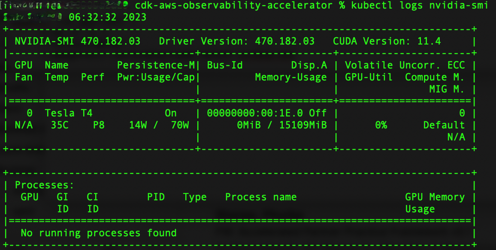

# Single Cluster Open Source Observability - NVIDIA GPU

Graphics Processing Units (GPUs) play an integral part in the Machine Learning (ML) workflow, by providing the scalable performance needed for fast ML training and cost-effective ML inference. On top of that, they are used in flexible remote virtual workstations and powerful HPC computations.

This pattern shows you how to monitor the performance of the GPUs units, used in an Amazon EKS cluster leveraging GPU-based instances.

Amazon Managed Service for Prometheus and Amazon Managed Grafana are open source tools used in this pattern to collect and visualise metrics respectively.

Amazon Managed Service for Prometheus is a Prometheus-compatible service that monitors and provides alerts on containerized applications and infrastructure at scale.

Amazon Managed Grafana is a managed service for Grafana, a popular open-source analytics platform that enables you to query, visualize, and alert on your metrics, logs, and traces.

## Objective

This pattern deploys an Amazon EKS cluster and a node group that includes instance types featuring NVIDIA GPUs.

The AMI type of the node group is `AL2_x86_64_GPU AMI`, which uses the [Amazon EKS-optimized Linux AMI with GPU support](https://aws.amazon.com/marketplace/pp/prodview-nwwwodawoxndm). In addition to the standard Amazon EKS-optimized AMI configuration, the GPU AMI includes the NVIDIA drivers.

The [NVIDIA Data Center GPU Manager](https://docs.nvidia.com/data-center-gpu-manager-dcgm/index.html) (DCGM) is a suite of tools for managing and monitoring NVIDIA datacenter GPUs in cluster environments. It includes health monitoring, diagnostics, system alerts and governance policies.
GPU metrics are exposed to Amazon Managed Service for Prometheus by the [DCGM Exporter](https://github.com/NVIDIA/dcgm-exporter), that uses the Go bindings to collect GPU telemetry data from DCGM and then exposes the metrics for Amazon Managed Service for Prometheus to pull from, using an http endpoint (`/metrics`).

The pattern deploys the [NVIDIA GPU Operator add-on](https://aws-quickstart.github.io/cdk-eks-blueprints/addons/gpu-operator/). The [GPU Operator](https://docs.nvidia.com/datacenter/cloud-native/gpu-operator/latest/overview.html) uses the NVIDIA DCGM Exporter to expose GPU telemetry to Amazon Managed Service for Prometheus.

Data is visualised in Amazon Managed Grafana by the [NVIDIA DCGM Exporter Dashboard](https://grafana.com/grafana/dashboards/12239-nvidia-dcgm-exporter-dashboard).

The rest of the setup to collect and visualise metrics with Amazon Managed Service for Prometheus and Amazon Managed Grafana, is similar to that used in other open-source based patterns included in this repository.

It also enables control plane logging on the EKS cluster for a comprehensive overview of cluster health.

## Prerequisites:

Ensure that you have installed the following tools on your machine.

1. [aws cli](https://docs.aws.amazon.com/cli/latest/userguide/install-cliv2.html)
2. [kubectl](https://Kubernetes.io/docs/tasks/tools/)
3. [cdk](https://docs.aws.amazon.com/cdk/v2/guide/getting_started.html#getting_started_install)
4. [npm](https://docs.npmjs.com/cli/v8/commands/npm-install)

## Deploying

1. Clone your forked repository

```sh
git clone https://github.com/aws-observability/cdk-aws-observability-accelerator.git
```

2. Install the AWS CDK Toolkit globally on your machine using

```bash
npm install -g aws-cdk
```

3. Amazon Managed Grafana workspace: To visualize metrics collected, you need an Amazon Managed Grafana workspace. If you have an existing workspace, create an environment variable as described below. To create a new workspace, visit [our supporting example for Amazon Managed Grafana](https://aws-observability.github.io/terraform-aws-observability-accelerator/helpers/managed-grafana/)

!!! note
    For the URL `https://g-xyz.grafana-workspace.us-east-1.amazonaws.com`, the workspace ID would be `g-xyz`

```bash
export AWS_REGION=<YOUR AWS REGION>
export COA_AMG_WORKSPACE_ID=g-xxx
export COA_AMG_ENDPOINT_URL=https://g-xyz.grafana-workspace.us-east-1.amazonaws.com
```

!!! warning
    Setting up environment variables `COA_AMG_ENDPOINT_URL` and `AWS_REGION` is mandatory for successful execution of this pattern.

4. GRAFANA API KEY: Amazon Managed Grafana provides a control plane API for generating Grafana API keys.

```bash
export AMG_API_KEY=$(aws grafana create-workspace-api-key \
  --key-name "grafana-operator-key" \
  --key-role "ADMIN" \
  --seconds-to-live 432000 \
  --workspace-id $COA_AMG_WORKSPACE_ID \
  --query key \
  --output text)
```

5. AWS SSM Parameter Store for GRAFANA API KEY: Update the Grafana API key secret in AWS SSM Parameter Store using the above new Grafana API key. This will be referenced by Grafana Operator deployment of our solution to access Amazon Managed Grafana from Amazon EKS Cluster

```bash
aws ssm put-parameter --name "/cdk-accelerator/grafana-api-key" \
    --type "SecureString" \
    --value $AMG_API_KEY \
    --region $AWS_REGION
```

6. Install project dependencies by running `npm install` in the main folder of this cloned repository. 

7. The actual settings for dashboard urls are expected to be specified in the CDK context. Generically it is inside the cdk.json file of the current directory or in `~/.cdk.json` in your home directory.

Example settings: Update the context in `cdk.json` file located in `cdk-eks-blueprints-patterns` directory

```typescript
  "context": {
    "fluxRepository": {
      "name": "grafana-dashboards",
      "namespace": "grafana-operator",
      "repository": {
        "repoUrl": "https://github.com/aws-observability/aws-observability-accelerator",
        "name": "grafana-dashboards",
        "targetRevision": "main",
        "path": "./artifacts/grafana-operator-manifests/eks/infrastructure"
      },
      "values": {
        "GRAFANA_CLUSTER_DASH_URL" : "https://raw.githubusercontent.com/aws-observability/aws-observability-accelerator/main/artifacts/grafana-dashboards/eks/infrastructure/cluster.json",
        "GRAFANA_KUBELET_DASH_URL" : "https://raw.githubusercontent.com/aws-observability/aws-observability-accelerator/main/artifacts/grafana-dashboards/eks/infrastructure/kubelet.json",
        "GRAFANA_NSWRKLDS_DASH_URL" : "https://raw.githubusercontent.com/aws-observability/aws-observability-accelerator/main/artifacts/grafana-dashboards/eks/infrastructure/namespace-workloads.json",
        "GRAFANA_NODEEXP_DASH_URL" : "https://raw.githubusercontent.com/aws-observability/aws-observability-accelerator/main/artifacts/grafana-dashboards/eks/infrastructure/nodeexporter-nodes.json",
        "GRAFANA_NODES_DASH_URL" : "https://raw.githubusercontent.com/aws-observability/aws-observability-accelerator/main/artifacts/grafana-dashboards/eks/infrastructure/nodes.json",
        "GRAFANA_WORKLOADS_DASH_URL" : "https://raw.githubusercontent.com/aws-observability/aws-observability-accelerator/main/artifacts/grafana-dashboards/eks/infrastructure/workloads.json"
      },
      "kustomizations": [
        {
          "kustomizationPath": "./artifacts/grafana-operator-manifests/eks/infrastructure"
        },
        {
          "kustomizationPath": "./artifacts/grafana-operator-manifests/eks/gpu"
        }
      ]
    },
    "gpuNodeGroup": {
      "instanceType": "g4dn.xlarge",
      "desiredSize": 2, 
      "minSize": 2, 
      "maxSize": 3,
      "ebsSize": 50
    },
  }
```

**Note**: insure your selected instance type is available in your region. To check that, you can run the following command (amend `Values` below as you see fit):

```bash
aws ec2 describe-instance-type-offerings \
    --filters Name=instance-type,Values="g4*" \
    --query "InstanceTypeOfferings[].InstanceType" \
    --region us-east-2
```

8. Once all pre-requisites are set you are ready to deploy the pipeline. Run the following command from the root of this repository to deploy the pipeline stack:

```bash
make build
make pattern single-new-eks-gpu-opensource-observability deploy
```

## Verify the resources

Run update-kubeconfig command. You should be able to get the command from CDK output message.

```bash
aws eks update-kubeconfig --name single-new-eks-opensource-observability-accelerator --region <your region> --role-arn arn:aws:iam::xxxxxxxxx:role/single-new-eks-opensource-singleneweksgpuopensourc...
```

Let’s verify the resources created by steps above:

```bash
kubectl get pods -A
```

Output:


Next, let's verify that each node has allocatable GPUs:

```bash
kubectl get nodes  "-o=custom-columns=NAME:.metadata.name,GPU:.status.allocatable.nvidia\.com/gpu"
```

Output:


We can now deploy the [`nvidia-smi` binary](https://developer.download.nvidia.com/compute/DCGM/docs/nvidia-smi-367.38.pdf), which shows diagnostic information about all GPUs visible to the container:

```bash
cat << EOF | kubectl apply -f -
apiVersion: v1
kind: Pod
metadata:
  name: nvidia-smi
spec:
  restartPolicy: OnFailure
  containers:
  - name: nvidia-smi
    image: "nvidia/cuda:11.0.3-base-ubuntu20.04"
    args:
    - "nvidia-smi"
    resources:
      limits:
        nvidia.com/gpu: 1
EOF
```

Then request the logs from the Pod:

```bash
kubectl logs nvidia-smi
```

Output:



## Visualization

### Grafana NVIDIA DCGM Exporter Dashboard

Login to your Amazon Managed Grafana workspace and navigate to the Dashboards panel. You should see a dashboard named `NVIDIA DCGM Exporter Dashboard`.

We will now generate some load, to see some metrics in the dashboard. Please run the following command from terminal:

```bash
cat << EOF | kubectl create -f -
 apiVersion: v1
 kind: Pod
 metadata:
   name: dcgmproftester
 spec:
   restartPolicy: OnFailure
   containers:
   - name: dcgmproftester11
     image: nvidia/samples:dcgmproftester-2.0.10-cuda11.0-ubuntu18.04
     args: ["--no-dcgm-validation", "-t 1004", "-d 120"]
     resources:
       limits:
          nvidia.com/gpu: 1
     securityContext:
       capabilities:
          add: ["SYS_ADMIN"]
EOF
```

To verify the Pod was successfully deployed, please run:

```bash
kubectl get pods
```

Expected output:


After a few minutes, looking into the `NVIDIA DCGM Exporter Dashboard`, you should see the gathered metrics, similar to: 


Grafana Operator and Flux always work together to synchronize your dashboards with Git. If you delete your dashboards by accident, they will be re-provisioned automatically.
    
## Teardown

You can teardown the whole CDK stack with the following command:

```bash
make pattern single-new-eks-gpu-opensource-observability destroy
```
