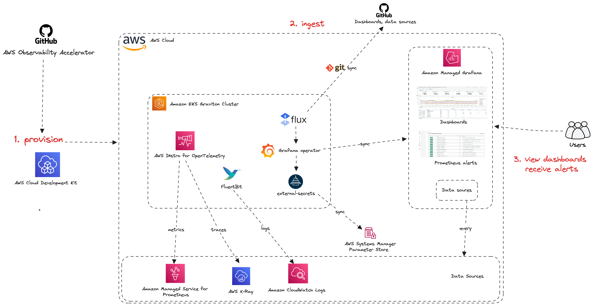
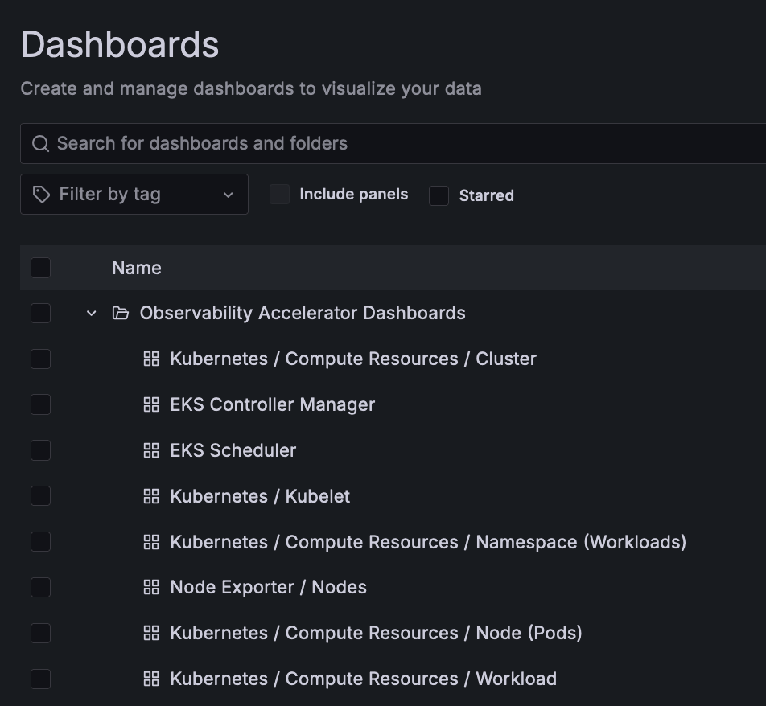
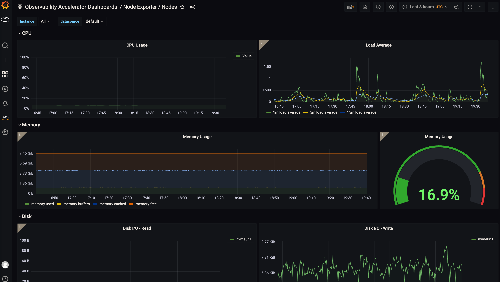
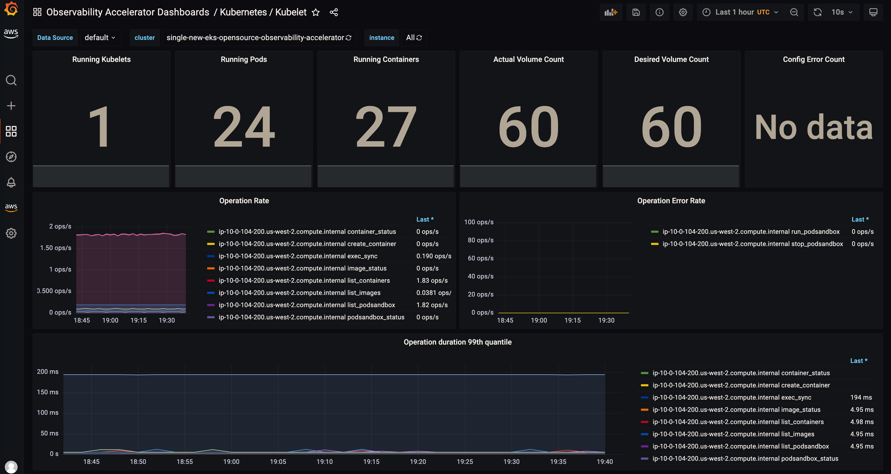
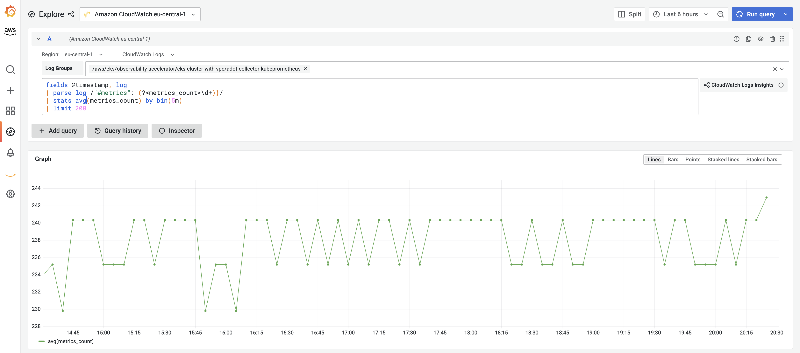

# Single New EKS Graviton Cluster Open Source Observability Accelerator

## Architecture

The following figure illustrates the architecture of the pattern we will be deploying for Single EKS Cluster Open Source Observability on Graviton pattern using open source tooling such as AWS Distro for Open Telemetry (ADOT), Amazon Managed Service for Prometheus and Amazon Managed Grafana:



Monitoring Amazon Elastic Kubernetes Service (Amazon EKS) for metrics has two categories:
the control plane and the Amazon EKS nodes (with Kubernetes objects).
The Amazon EKS control plane consists of control plane nodes that run the Kubernetes software,
such as etcd and the Kubernetes API server. To read more on the components of an Amazon EKS cluster,
please read the [service documentation](https://docs.aws.amazon.com/eks/latest/userguide/clusters.html).

### Graviton

[AWS Graviton](https://aws.amazon.com/ec2/graviton/) Processors are designed by AWS to deliver the best price to performance for your cloud workloads running in Amazon EC2.  These processors are ARM chips running on aarch64 architecture. These processors feature key capabilities, such as the [AWS Nitro System](https://aws.amazon.com/ec2/nitro/), that allow you to securely run cloud native applications at scale.

Visit our [EKS Blueprints docs](https://github.com/aws-quickstart/cdk-eks-blueprints/blob/main/docs/addons/index.md) for a list of supported addons on Graviton.

## Objective

- Deploys one production grade Amazon EKS cluster running on a Graviton3 Processor
- AWS Distro For OpenTelemetry Operator and Collector for Metrics and Traces
- Logs with [AWS for FluentBit](https://github.com/aws/aws-for-fluent-bit)
- Installs Grafana Operator to add AWS data sources and create Grafana Dashboards to Amazon Managed Grafana.
- Installs FluxCD to perform GitOps sync of a Git Repo to EKS Cluster. We will use this later for creating Grafana Dashboards and AWS datasources to Amazon Managed Grafana. You can also use your own GitRepo  to sync your own Grafana resources such as Dashboards, Datasources etc. Please check our One observability module - [GitOps with Amazon Managed Grafana](https://catalog.workshops.aws/observability/en-US/aws-managed-oss/gitops-with-amg) to learn more about this.
- Installs External Secrets Operator to retrieve and Sync the Grafana API keys.
- Amazon Managed Grafana Dashboard and data source
- Alerts and recording rules with Amazon Managed Service for Prometheus

## Prerequisites:

Ensure that you have installed the following tools on your machine.

1. [aws cli](https://docs.aws.amazon.com/cli/latest/userguide/install-cliv2.html)
2. [kubectl](https://Kubernetes.io/docs/tasks/tools/)
3. [cdk](https://docs.aws.amazon.com/cdk/v2/guide/getting_started.html#getting_started_install)
4. [npm](https://docs.npmjs.com/cli/v8/commands/npm-install)

## Deploying

1. Clone your forked repository

```sh
git clone https://github.com/aws-observability/cdk-aws-observability-accelerator.git
```

2. Install the AWS CDK Toolkit globally on your machine using

```bash
npm install -g aws-cdk
```

3. Amazon Managed Grafana workspace: To visualize metrics collected, you need an Amazon Managed Grafana workspace. If you have an existing workspace, create an environment variable as described below. To create a new workspace, visit [our supporting example for Grafana](https://aws-observability.github.io/terraform-aws-observability-accelerator/helpers/managed-grafana/)

!!! note
    For the URL `https://g-xyz.grafana-workspace.us-east-1.amazonaws.com`, the workspace ID would be `g-xyz`

```bash
export AWS_REGION=<YOUR AWS REGION>
export COA_AMG_WORKSPACE_ID=g-xxx
export COA_AMG_ENDPOINT_URL=https://g-xyz.grafana-workspace.us-east-1.amazonaws.com
```

!!! warning
    Setting up environment variables `COA_AMG_ENDPOINT_URL` and `AWS_REGION` is mandatory for successful execution of this pattern.

4. GRAFANA API KEY: Amazon Managed Grafana provides a control plane API for generating Grafana API keys.

```bash
export AMG_API_KEY=$(aws grafana create-workspace-api-key \
  --key-name "grafana-operator-key" \
  --key-role "ADMIN" \
  --seconds-to-live 432000 \
  --workspace-id $COA_AMG_WORKSPACE_ID \
  --query key \
  --output text)
```

5. AWS Secrets Manager for GRAFANA API KEY: Update the Grafana API key secret in AWS Secrets using the above new Grafana API key. This will be referenced by Grafana Operator deployment of our solution to access Amazon Managed Grafana from Amazon EKS Cluster

```bash
aws secretsmanager create-secret \
    --name grafana-api-key \
    --description "API Key of your Grafana Instance" \
    --secret-string "${AMG_API_KEY}" \
    --region $AWS_REGION \
    --query ARN \
    --output text
```

6. Install project dependencies by running `npm install` in the main folder of this cloned repository. 

7. The actual settings for dashboard urls are expected to be specified in the CDK context. Generically it is inside the cdk.json file of the current directory or in `~/.cdk.json` in your home directory. 

Example settings: Update the context in `cdk.json` file located in `cdk-eks-blueprints-patterns` directory

```
    "context": {
        "cluster.dashboard.url": "https://raw.githubusercontent.com/aws-observability/aws-observability-accelerator/main/artifacts/grafana-dashboards/eks/infrastructure/cluster.json",
        "kubelet.dashboard.url": "https://raw.githubusercontent.com/aws-observability/aws-observability-accelerator/main/artifacts/grafana-dashboards/eks/infrastructure/kubelet.json",
        "namespaceworkloads.dashboard.url": "https://raw.githubusercontent.com/aws-observability/aws-observability-accelerator/main/artifacts/grafana-dashboards/eks/infrastructure/namespace-workloads.json",
        "nodeexporter.dashboard.url": "https://raw.githubusercontent.com/aws-observability/aws-observability-accelerator/main/artifacts/grafana-dashboards/eks/infrastructure/nodeexporter-nodes.json",
        "nodes.dashboard.url": "https://raw.githubusercontent.com/aws-observability/aws-observability-accelerator/main/artifacts/grafana-dashboards/eks/infrastructure/nodes.json",
        "workloads.dashboard.url": "https://raw.githubusercontent.com/aws-observability/aws-observability-accelerator/main/artifacts/grafana-dashboards/eks/infrastructure/workloads.json"
      }
```

8. Once all pre-requisites are set you are ready to deploy the pipeline. Run the following command from the root of this repository to deploy the pipeline stack:

```bash
make build
make pattern single-new-eks-graviton-opensource-observability deploy
```

## Verify the resources

Run update-kubeconfig command. You should be able to get the command from CDK output message.

```bash
aws eks update-kubeconfig --name single-new-eks-graviton-opensource-observability-accelerator --region <your region> --role-arn arn:aws:iam::xxxxxxxxx:role/single-new-eks-gravitonop-singleneweksgravitonopens-82N8N3BMJYYI
```

Let’s verify the resources created by steps above.

```bash
kubectl get nodes -o wide
```
Output:

```console
NAME                                         STATUS   ROLES    AGE    VERSION               INTERNAL-IP    EXTERNAL-IP   OS-IMAGE         KERNEL-VERSION                  CONTAINER-RUNTIME
ip-10-0-104-200.us-west-2.compute.internal   Ready    <none>   2d1h   v1.27.1-eks-2f008fe   10.0.104.200   <none>        Amazon Linux 2   5.10.179-168.710.amzn2.aarch64   containerd://1.6.19
```

Next, lets verify the namespaces in the cluster:

```bash
kubectl get ns # Output shows all namespace
```

Output:

```console
NAME                            STATUS   AGE
cert-manager                    Active   2d1h
default                         Active   2d1h
external-secrets                Active   2d1h
flux-system                     Active   2d1h
grafana-operator                Active   2d1h
kube-node-lease                 Active   2d1h
kube-public                     Active   2d1h
kube-system                     Active   2d1h
opentelemetry-operator-system   Active   2d1h
prometheus-node-exporter        Active   2d1h
```

Next, lets verify all resources of `grafana-operator` namespace:

```bash
kubectl get all --namespace=grafana-operator
```

Output:

```console
NAME                                    READY   STATUS    RESTARTS   AGE
pod/grafana-operator-866d4446bb-g5srl   1/1     Running   0          2d1h

NAME                                       TYPE        CLUSTER-IP       EXTERNAL-IP   PORT(S)    AGE
service/grafana-operator-metrics-service   ClusterIP   172.20.223.125   <none>        9090/TCP   2d1h

NAME                               READY   UP-TO-DATE   AVAILABLE   AGE
deployment.apps/grafana-operator   1/1     1            1           2d1h

NAME                                          DESIRED   CURRENT   READY   AGE
replicaset.apps/grafana-operator-866d4446bb   1         1         1       2d1h
```

## Visualization

#### 1. Grafana dashboards

Login to your Grafana workspace and navigate to the Dashboards panel. You should see a list of dashboards under the `Observability Accelerator Dashboards`



Open the `Node Exporter` dashboard and you should be able to view its visualization as shown below :




Open the `Kubelet` dashboard and you should be able to view its visualization as shown below :



From the cluster to view all dashboards as Kubernetes objects, run:

```bash
kubectl get grafanadashboards -A
```

```console
NAMESPACE          NAME                                   AGE
grafana-operator   cluster-grafanadashboard               138m
grafana-operator   java-grafanadashboard                  143m
grafana-operator   kubelet-grafanadashboard               13h
grafana-operator   namespace-workloads-grafanadashboard   13h
grafana-operator   nginx-grafanadashboard                 134m
grafana-operator   node-exporter-grafanadashboard         13h
grafana-operator   nodes-grafanadashboard                 13h
grafana-operator   workloads-grafanadashboard             13h
```

You can inspect more details per dashboard using this command

```bash
kubectl describe grafanadashboards cluster-grafanadashboard -n grafana-operator
```

Grafana Operator and Flux always work together to synchronize your dashboards with Git. If you delete your dashboards by accident, they will be re-provisioned automatically.

## Viewing Logs

By default, we deploy a FluentBit daemon set in the cluster to collect worker logs for all namespaces. Logs are collected and exported to Amazon CloudWatch Logs, which enables you to centralize the logs from all of your systems, applications,
and AWS services that you use, in a single, highly scalable service.

## Using CloudWatch Logs as data source in Grafana

Follow [the documentation](https://docs.aws.amazon.com/grafana/latest/userguide/using-amazon-cloudwatch-in-AMG.html)
to enable Amazon CloudWatch as a data source. Make sure to provide permissions.

All logs are delivered in the following CloudWatch Log groups naming pattern:
`/aws/eks/single-new-eks-opensource-observability-accelerator`.
Log streams follow `{container-name}.{pod-name}`. In Grafana, querying and analyzing logs is done with [CloudWatch Logs Insights](https://docs.aws.amazon.com/AmazonCloudWatch/latest/logs/AnalyzingLogData.html)

### Example - ADOT collector logs

Select one or many log groups and run the following query. The example below,
queries AWS Distro for OpenTelemetry (ADOT) logs

```console
fields @timestamp, log
| order @timestamp desc
| limit 100
```


### Example - Using time series visualizations

[CloudWatch Logs syntax](https://docs.aws.amazon.com/AmazonCloudWatch/latest/logs/CWL_QuerySyntax.html)
provide powerful functions to extract data from your logs. The `stats()`
function allows you to calculate aggregate statistics with log field values.
This is useful to have visualization on non-metric data from your applications.

In the example below, we use the following query to graph the number of metrics
collected by the ADOT collector

```console
fields @timestamp, log
| parse log /"#metrics": (?<metrics_count>\d+)}/
| stats avg(metrics_count) by bin(5m)
| limit 100
```

!!! tip
    You can add logs in your dashboards with logs panel types or time series
    depending on your query results type.



!!! warning
    Querying CloudWatch logs will incur costs per GB scanned. Use small time
    windows and limits in your queries. Checkout the CloudWatch
    [pricing page](https://aws.amazon.com/cloudwatch/pricing/) for more infos.

## Teardown

You can teardown the whole CDK stack with the following command:

```bash
make pattern single-new-eks-graviton-opensource-observability destroy
```

## Troubleshooting

### 1. Grafana dashboards missing or Grafana API key expired

In case you don't see the grafana dashboards in your Amazon Managed Grafana console, check on the logs on your grafana operator pod using the below command :

```bash
kubectl get pods -n grafana-operator
```

Output:

```console
NAME                                READY   STATUS    RESTARTS   AGE
grafana-operator-866d4446bb-nqq5c   1/1     Running   0          3h17m
```

```bash
kubectl logs grafana-operator-866d4446bb-nqq5c -n grafana-operator
```

Output:

```console
1.6857285045556655e+09	ERROR	error reconciling datasource	{"controller": "grafanadatasource", "controllerGroup": "grafana.integreatly.org", "controllerKind": "GrafanaDatasource", "GrafanaDatasource": {"name":"grafanadatasource-sample-amp","namespace":"grafana-operator"}, "namespace": "grafana-operator", "name": "grafanadatasource-sample-amp", "reconcileID": "72cfd60c-a255-44a1-bfbd-88b0cbc4f90c", "datasource": "grafanadatasource-sample-amp", "grafana": "external-grafana", "error": "status: 401, body: {\"message\":\"Expired API key\"}\n"}
github.com/grafana-operator/grafana-operator/controllers.(*GrafanaDatasourceReconciler).Reconcile
```

If you observe, the the above `grafana-api-key error` in the logs, your grafana API key is expired. Please use the operational procedure to update your `grafana-api-key` :

- First, lets create a new Grafana API key.

```bash
export GO_AMG_API_KEY=$(aws grafana create-workspace-api-key \
  --key-name "grafana-operator-key-new" \
  --key-role "ADMIN" \
  --seconds-to-live 432000 \
  --workspace-id $COA_AMG_WORKSPACE_ID \
  --query key \
  --output text)
```

- Finally, update the Grafana API key secret in AWS Secrets Manager using the above new Grafana API key:

```bash
export API_KEY_SECRET_NAME="grafana-api-key"
aws secretsmanager update-secret \
    --secret-id $API_KEY_SECRET_NAME \
    --secret-string "${AMG_API_KEY}" \
    --region $AWS_REGION
```

- If the issue persists, you can force the synchronization by deleting the `externalsecret` Kubernetes object.

```bash
kubectl delete externalsecret/external-secrets-sm -n grafana-operator
```


