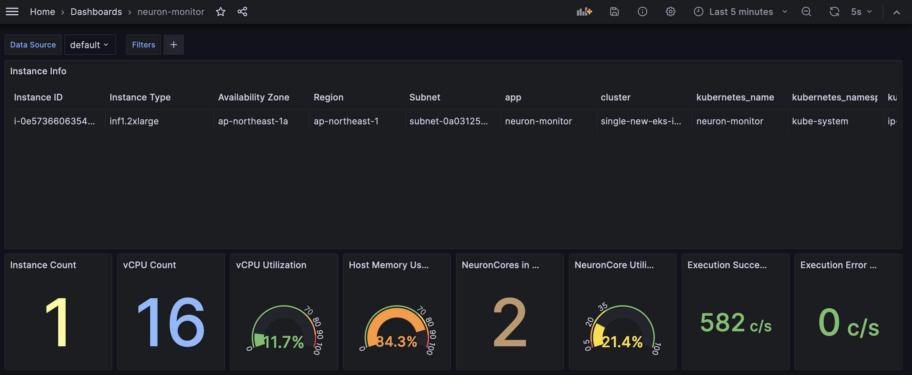
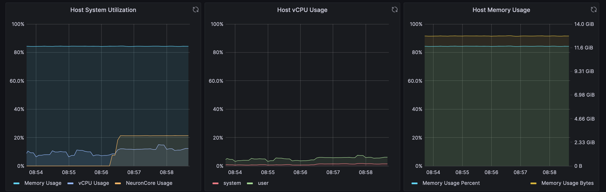

# Single Cluster Open Source Observability - Inferentia-based cluster

[AWS Inferentia](https://aws.amazon.com/machine-learning/inferentia/) is an accelerated Machine Learning (ML) chip, designed by AWS.

Amazon Elastic Compute Cloud (Amazon EC2) [Inf1](https://aws.amazon.com/ec2/instance-types/inf1/) and [Inf2](https://aws.amazon.com/ec2/instance-types/inf2/) instances feature AWS Inferentia chips and support high-performance and low-latency inference.

[AWS Neuron](https://awsdocs-neuron.readthedocs-hosted.com/en/latest/) is an SDK with a compiler, runtime, and profiling tools that helps developers deploy models on both AWS Inferentia accelerators and train them on [AWS Trainium](https://aws.amazon.com/machine-learning/trainium/) chips. It integrates natively with popular ML frameworks, such as PyTorch and TensorFlow.

This pattern shows you how to monitor the performance of ML chips, used in an Amazon EKS cluster running on Amazon EC2 Inf1 and Inf2 instances.

Amazon Managed Service for Prometheus and Amazon Managed Grafana are open source tools used in this pattern to collect and visualise metrics respectively.

Amazon Managed Service for Prometheus is a Prometheus-compatible service that monitors and provides alerts on containerized applications and infrastructure at scale.

Amazon Managed Grafana is a managed service for Grafana, a popular open-source analytics platform that enables you to query, visualize, and alert on your metrics, logs, and traces.

## Objective

This pattern deploys an Amazon EKS cluster with a node group that includes Inf1/Inf2 instances.

The AMI type of the node group is `AL2_x86_64_GPU AMI`, which uses the [Amazon EKS-optimized accelerated AMI](https://docs.aws.amazon.com/eks/latest/userguide/eks-optimized-ami.html). In addition to the standard Amazon EKS-optimized AMI configuration, the accelerated AMI includes the [NeuronX container runtime](https://awsdocs-neuron.readthedocs-hosted.com/en/latest/neuron-runtime/index.html).

To access the ML chips from Kubernetes, the pattern deploys the Neuron device plugin.

Metrics are exposed to Amazon Managed Service for Prometheus by the `neuron-monitor` DaemonSet, which deploys a minimal container, with the [Neuron Tools](https://awsdocs-neuron.readthedocs-hosted.com/en/latest/tools/index.html) installed. Specifically, the `neuron-monitor` DaemonSet runs the [`neuron-monitor`](https://awsdocs-neuron.readthedocs-hosted.com/en/latest/tools/neuron-sys-tools/neuron-monitor-user-guide.html#neuron-monitor-ug) command piped into the `neuron-monitor-prometheus.py` companion script (both commands are part of the container):

```bash
neuron-monitor | neuron-monitor-prometheus.py --port <port>
```

`neuron-monitor` collects metrics and stats from the Neuron Applications running on the system and streams the collected data to stdout [in JSON format](https://awsdocs-neuron.readthedocs-hosted.com/en/latest/tools/neuron-sys-tools/neuron-monitor-user-guide.html#the-json-output-format).

`neuron-monitor-prometheus.py` maps and exposes the telemetry data from JSON format into Prometheus compatible format.

Data is visualised in Amazon Managed Grafana by the corresponding dashboard.

The rest of the setup to collect and visualise metrics with Amazon Managed Service for Prometheus and Amazon Managed Grafana, is similar to that used in other open-source based patterns, included in this repository.

## Prerequisites:

Ensure that you have installed the following tools on your machine.

1. [aws cli](https://docs.aws.amazon.com/cli/latest/userguide/install-cliv2.html)
2. [kubectl](https://Kubernetes.io/docs/tasks/tools/)
3. [cdk](https://docs.aws.amazon.com/cdk/v2/guide/getting_started.html#getting_started_install)
4. [npm](https://docs.npmjs.com/cli/v8/commands/npm-install)

## Deploying

1. Clone your forked repository

```sh
git clone https://github.com/aws-observability/cdk-aws-observability-accelerator.git
```

2. Install the AWS CDK Toolkit globally on your machine using

```bash
npm install -g aws-cdk
```

3. Amazon Managed Grafana workspace: To visualize metrics collected, you need an Amazon Managed Grafana workspace. If you have an existing workspace, create an environment variable as described below. To create a new workspace, visit [our supporting example for Amazon Managed Grafana](https://aws-observability.github.io/terraform-aws-observability-accelerator/helpers/managed-grafana/)

!!! note
    For the URL `https://g-xyz.grafana-workspace.us-east-1.amazonaws.com`, the workspace ID would be `g-xyz`

```bash
export AWS_REGION=<YOUR AWS REGION>
export COA_AMG_WORKSPACE_ID=g-xxx
export COA_AMG_ENDPOINT_URL=https://g-xyz.grafana-workspace.us-east-1.amazonaws.com
```

!!! warning
    Setting up environment variables `COA_AMG_ENDPOINT_URL` and `AWS_REGION` is mandatory for successful execution of this pattern.

4. GRAFANA API KEY: Amazon Managed Grafana provides a control plane API for generating Grafana API keys.

```bash
export AMG_API_KEY=$(aws grafana create-workspace-api-key \
  --key-name "grafana-operator-key" \
  --key-role "ADMIN" \
  --seconds-to-live 432000 \
  --workspace-id $COA_AMG_WORKSPACE_ID \
  --query key \
  --output text)
```

5. AWS SSM Parameter Store for GRAFANA API KEY: Update the Grafana API key secret in AWS SSM Parameter Store using the above new Grafana API key. This will be referenced by Grafana Operator deployment of our solution to access Amazon Managed Grafana from Amazon EKS Cluster

```bash
aws ssm put-parameter --name "/cdk-accelerator/grafana-api-key" \
    --type "SecureString" \
    --value $AMG_API_KEY \
    --region $AWS_REGION
```

6. Install project dependencies by running `npm install` in the main folder of this cloned repository. 

7. The actual settings for dashboard urls and EKS managed node group are expected to be specified in the CDK context. Generically it is inside the cdk.json file of the current directory or in `~/.cdk.json` in your home directory.

Example settings: Update the context in `cdk.json` file located in `cdk-eks-blueprints-patterns` directory

```typescript
  "context": {
    "fluxRepository": {
      "name": "grafana-dashboards",
      "namespace": "grafana-operator",
      "repository": {
        "repoUrl": "https://github.com/aws-observability/aws-observability-accelerator",
        "name": "grafana-dashboards",
        "targetRevision": "main",
        "path": "./artifacts/grafana-operator-manifests/eks/infrastructure"
      },
      "values": {
        "GRAFANA_CLUSTER_DASH_URL" : "https://raw.githubusercontent.com/aws-observability/aws-observability-accelerator/main/artifacts/grafana-dashboards/eks/infrastructure/cluster.json",
        "GRAFANA_KUBELET_DASH_URL" : "https://raw.githubusercontent.com/aws-observability/aws-observability-accelerator/main/artifacts/grafana-dashboards/eks/infrastructure/kubelet.json",
        "GRAFANA_NSWRKLDS_DASH_URL" : "https://raw.githubusercontent.com/aws-observability/aws-observability-accelerator/main/artifacts/grafana-dashboards/eks/infrastructure/namespace-workloads.json",
        "GRAFANA_NODEEXP_DASH_URL" : "https://raw.githubusercontent.com/aws-observability/aws-observability-accelerator/main/artifacts/grafana-dashboards/eks/infrastructure/nodeexporter-nodes.json",
        "GRAFANA_NODES_DASH_URL" : "https://raw.githubusercontent.com/aws-observability/aws-observability-accelerator/main/artifacts/grafana-dashboards/eks/infrastructure/nodes.json",
        "GRAFANA_WORKLOADS_DASH_URL" : "https://raw.githubusercontent.com/aws-observability/aws-observability-accelerator/main/artifacts/grafana-dashboards/eks/infrastructure/workloads.json",
        "GRAFANA_NEURON_DASH_URL" : "https://raw.githubusercontent.com/aws-observability/aws-observability-accelerator/main/artifacts/grafana-dashboards/eks/neuron/neuron-monitor.json"
      },
      "kustomizations": [
        {
          "kustomizationPath": "./artifacts/grafana-operator-manifests/eks/infrastructure"
        },
        {
          "kustomizationPath": "./artifacts/grafana-operator-manifests/eks/neuron"
        }
      ]
    },
     "neuronNodeGroup": {
      "instanceClass": "inf1",
      "instanceSize": "2xlarge",
      "desiredSize": 1, 
      "minSize": 1, 
      "maxSize": 3,
      "ebsSize": 512
    },
  }
```

**Note**: you can replace the inf1 instance type with inf2 and the size as you prefer; to check availability in your selected Region, you can run the following command (amend `Values` below as you see fit):

```bash
aws ec2 describe-instance-type-offerings \
    --filters Name=instance-type,Values="inf1*" \
    --query "InstanceTypeOfferings[].InstanceType" \
    --region $AWS_REGION
```

8. Once all pre-requisites are set you are ready to deploy the pipeline. Run the following command from the root of this repository to deploy the pipeline stack:

```bash
make build
make pattern single-new-eks-inferentia-opensource-observability deploy
```

## Verify the resources

Run update-kubeconfig command. You should be able to get the command from CDK output message.

```bash
aws eks update-kubeconfig --name single-new-eks-inferentia-opensource... --region <your region> --role-arn arn:aws:iam::xxxxxxxxx:role/single-new-eks-inferentia-opensource-singleneweksgpuopensourc...
```

Let’s verify the resources created by steps above:

```bash
kubectl get pods -A
```

Output:


Specifically, ensure `neuron-device-plugin-daemonset` DaemonSet is running:

```bash
kubectl get ds neuron-device-plugin-daemonset --namespace kube-system
```

Output:

```bash
NAME                             DESIRED   CURRENT   READY   UP-TO-DATE   AVAILABLE   NODE SELECTOR   AGE
neuron-device-plugin-daemonset   1         1         1       1            1           <none>          2h
```

And also that `neuron-monitor` DaemonSet is running:


```bash
kubectl get ds neuron-monitor --namespace kube-system
```

Output:

```bash
NAME             DESIRED   CURRENT   READY   UP-TO-DATE   AVAILABLE   NODE SELECTOR   AGE
neuron-monitor   1         1         1       1            1           <none>          2h
```

Next, let's verify that Neuron devices and cores are visible, by running [`neuron-ls`](https://awsdocs-neuron.readthedocs-hosted.com/en/latest/tools/neuron-sys-tools/neuron-ls.html) and [`neuron-top`](https://awsdocs-neuron.readthedocs-hosted.com/en/latest/tools/neuron-sys-tools/neuron-top-user-guide.html) commands from e.g. your neuron-monitor pod:

```bash
kubectl exec -it {your neuron-monitor pod} -n kube-system -- /bin/bash -c "neuron-ls"
```

Output:


```bash
kubectl exec -it {your neuron-monitor pod} -n kube-system -- /bin/bash -c "neuron-top"
```

Output:


## Visualization

### Grafana Neuron Dashboard

Login to your Amazon Managed Grafana workspace and navigate to the Dashboards panel. You should see a dashboard named `Neuron / Monitor`.

To actually see some interesting metrics on the Grafana dashboard, we will apply the following manifest:

```bash
curl https://raw.githubusercontent.com/aws-observability/aws-observability-accelerator/main/artifacts/k8s-deployment-manifest-templates/neuron/pytorch-inference-resnet50.yml | kubectl apply -f -
```

This is just a sample workload that compiles the [torchvision ResNet50 model](https://docs.aws.amazon.com/dlami/latest/devguide/tutorial-inferentia-pytorch-neuron.html) and runs repetitive inference in a loop to generate telemetry data.

To verify the Pod was successfully deployed, please run:

```bash
kubectl get pods
```

You should see a pod named `pytorch-inference-resnet50`.

After a few minutes, looking into the `Neuron / Monitor`, you should see the gathered metrics, similar to: 






Grafana Operator and Flux always work together to synchronize your dashboards with Git. If you delete your dashboards by accident, they will be re-provisioned automatically.
    
## Teardown

You can teardown the whole CDK stack with the following command:

```bash
make pattern single-new-eks-inferentia-opensource-observability destroy
```
