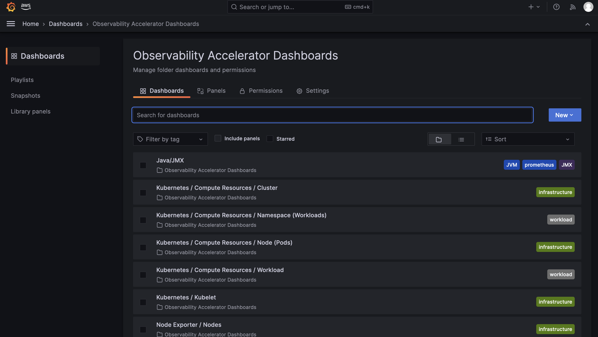
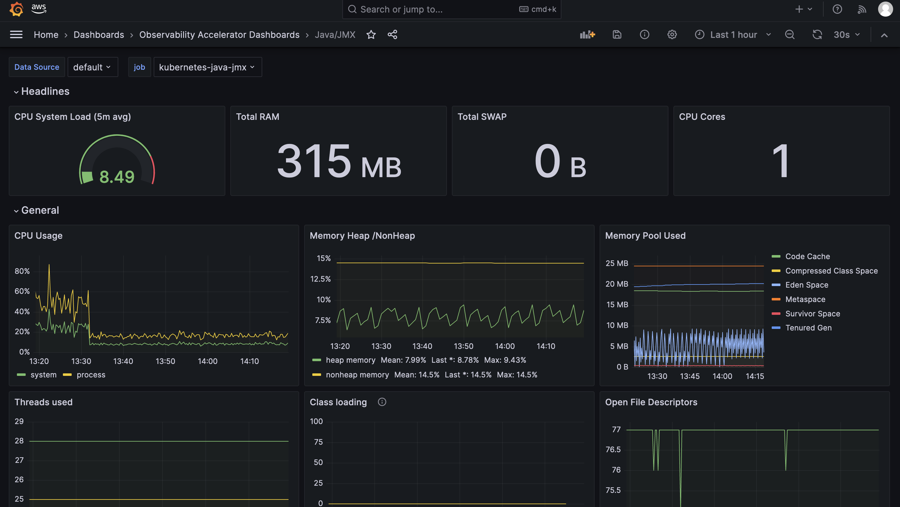

# Single Cluster Open Source Observability - Java Monitoring

## Objective

This pattern demonstrates how to use the _New EKS Cluster Open Source Observability Accelerator_ with Java based workloads.

## Prerequisites

Ensure that you have installed the following tools on your machine.

1. [aws cli](https://docs.aws.amazon.com/cli/latest/userguide/install-cliv2.html)
2. [kubectl](https://Kubernetes.io/docs/tasks/tools/)
3. [cdk](https://docs.aws.amazon.com/cdk/v2/guide/getting_started.html#getting_started_install)
4. [npm](https://docs.npmjs.com/cli/v8/commands/npm-install)

## Deploying

Please follow the _Deploying_ instructions of the [New EKS Cluster Open Source Observability Accelerator](./single-new-eks-opensource-observability.md) pattern, except for step 7, where you need to replace "context" in `~/.cdk.json` with the following:

```typescript
  "context": {
    "fluxRepository": {
      "name": "grafana-dashboards",
      "namespace": "grafana-operator",
      "repository": {
        "repoUrl": "https://github.com/aws-observability/aws-observability-accelerator",
        "name": "grafana-dashboards",
        "targetRevision": "main",
        "path": "./artifacts/grafana-operator-manifests/eks/infrastructure"
      },
      "values": {
        "GRAFANA_CLUSTER_DASH_URL" : "https://raw.githubusercontent.com/aws-observability/aws-observability-accelerator/main/artifacts/grafana-dashboards/eks/infrastructure/cluster.json",
        "GRAFANA_KUBELET_DASH_URL" : "https://raw.githubusercontent.com/aws-observability/aws-observability-accelerator/main/artifacts/grafana-dashboards/eks/infrastructure/kubelet.json",
        "GRAFANA_NSWRKLDS_DASH_URL" : "https://raw.githubusercontent.com/aws-observability/aws-observability-accelerator/main/artifacts/grafana-dashboards/eks/infrastructure/namespace-workloads.json",
        "GRAFANA_NODEEXP_DASH_URL" : "https://raw.githubusercontent.com/aws-observability/aws-observability-accelerator/main/artifacts/grafana-dashboards/eks/infrastructure/nodeexporter-nodes.json",
        "GRAFANA_NODES_DASH_URL" : "https://raw.githubusercontent.com/aws-observability/aws-observability-accelerator/main/artifacts/grafana-dashboards/eks/infrastructure/nodes.json",
        "GRAFANA_WORKLOADS_DASH_URL" : "https://raw.githubusercontent.com/aws-observability/aws-observability-accelerator/main/artifacts/grafana-dashboards/eks/infrastructure/workloads.json",
        "GRAFANA_JAVA_JMX_DASH_URL" : "https://raw.githubusercontent.com/aws-observability/aws-observability-accelerator/main/artifacts/grafana-dashboards/eks/java/default.json"
      },
      "kustomizations": [
        {
          "kustomizationPath": "./artifacts/grafana-operator-manifests/eks/infrastructure"
        },
        {
          "kustomizationPath": "./artifacts/grafana-operator-manifests/eks/java"
        }
      ]
    },
    "java.pattern.enabled": true
  }
```

Once completed the rest of the _Deploying_ steps, you can move on with the deployment of the Java workload.

## Deploy an example Java application

In this section we will reuse an example from the AWS OpenTelemetry collector [repository](https://github.com/aws-observability/aws-otel-collector/blob/main/docs/developers/container-insights-eks-jmx.md). For convenience, the steps can be found below.

1. Clone [this repository](https://github.com/aws-observability/aws-otel-test-framework) and navigate to the `sample-apps/jmx/` directory.

2. Authenticate to Amazon ECR (_AWS_REGION_ was set during the deployment stage)

```bash
export AWS_ACCOUNT_ID=`aws sts get-caller-identity --query Account --output text`
aws ecr get-login-password --region $AWS_REGION | docker login --username AWS --password-stdin $AWS_ACCOUNT_ID.dkr.ecr.$AWS_REGION.amazonaws.com
```

3. Create an Amazon ECR repository

```bash
aws ecr create-repository --repository-name prometheus-sample-tomcat-jmx \
  --image-scanning-configuration scanOnPush=true \
  --region $AWS_REGION 
```

4. Build Docker image and push to ECR.

```bash
docker build -t $AWS_ACCOUNT_ID.dkr.ecr.$AWS_REGION.amazonaws.com/prometheus-sample-tomcat-jmx:latest .
docker push $AWS_ACCOUNT_ID.dkr.ecr.$AWS_REGION.amazonaws.com/prometheus-sample-tomcat-jmx:latest 
```

5. Install the sample application in the cluster

```bash
SAMPLE_TRAFFIC_NAMESPACE=javajmx-sample
curl https://raw.githubusercontent.com/aws-observability/aws-otel-test-framework/terraform/sample-apps/jmx/examples/prometheus-metrics-sample.yaml | 
sed "s/{{aws_account_id}}/$AWS_ACCOUNT_ID/g" |
sed "s/{{region}}/$AWS_REGION/g" |
sed "s/{{namespace}}/$SAMPLE_TRAFFIC_NAMESPACE/g" | 
kubectl apply -f -
```

## Verify the resources

```bash
kubectl get pods -n $SAMPLE_TRAFFIC_NAMESPACE

NAME                              READY   STATUS    RESTARTS   AGE
tomcat-bad-traffic-generator      1/1     Running   0          90m
tomcat-example-77b46cc546-z22jf   1/1     Running   0          25m
tomcat-traffic-generator          1/1     Running   0          90m
```

## Visualization

Login to your Grafana workspace and navigate to the Dashboards panel. You should see a new dashboard named `Java/JMX`, under `Observability Accelerator Dashboards`:



Open the `Java/JMX` dashboard and you should be able to view its visualization as shown below:



## Teardown

You can teardown the whole CDK stack with the following command:

```bash
make pattern single-new-eks-opensource-observability destroy
```