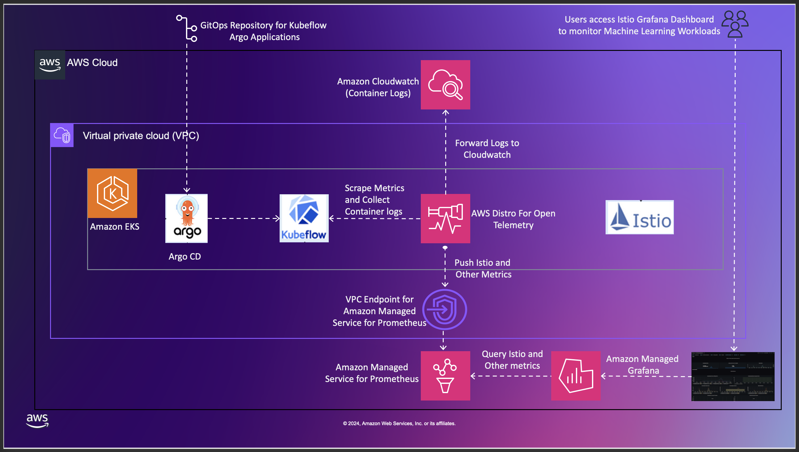
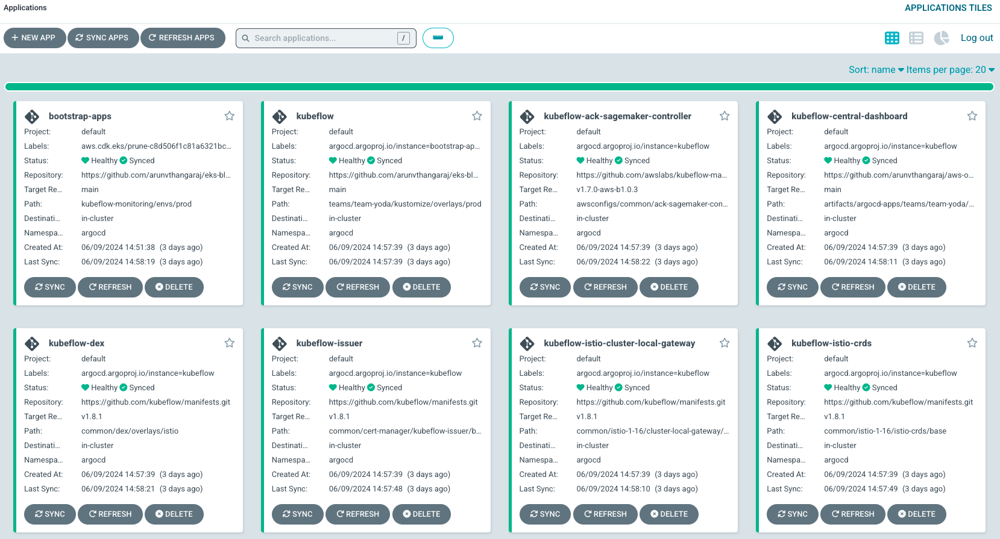

# Single Cluster Open Source Observability - Kubeflow Monitoring

## Objective

As part of day 2 operations, customers want to monitor their Infrastructure, Amazon EKS clusters and application components. AWS customers use Amazon EKS to run machine learning workloads. Containerization allows machine learning engineers to package and distribute models easily, while Kubernetes helps in deploying, scaling, and improving. In addition to monitoring the behavior of the Amazon EKS clusters, it’s essential to monitor the behavior of machine learning workflows as well to ensure the operational resilience of workloads and platforms run by an organization. This pattern demonstrates how to use the _New EKS Cluster Open Source Observability Accelerator_ to monitor kubeflow machine learning workloads using AWS Distro for OpenTelemetry Collector(ADOT Collector), Amazon Managed Service for Prometheus(AMP) and Amazon Managed Grafana(AMG).

## Architecture

The following figure illustrates the architecture of the pattern we will be deploying for the Kubeflow Monitoring pattern. The pattern deploys a single EKS cluster and ArgoCD is used to bootsrap the cluster with components required for Kubeflow machine learning worklods. Istio Ingress gatway will be utilized to access the Kubeflow dashboard. ADOT collector scrapes metrics from the kuebflow machine learning PODs and pushes the metrics to AMP utilizing a VPC Interface endpoint for AMP. ADOT Collector also pushes container logs to Amazon Cloudwatch. AMG is used to visualize the metrics pushed to AMP and also AMG is bootstrapped with Istio Workload and other EKS infrastructure dashboards.



## Prerequisites

Ensure that you have installed the following tools on your machine.

1. [aws cli](https://docs.aws.amazon.com/cli/latest/userguide/install-cliv2.html)
2. [kubectl](https://Kubernetes.io/docs/tasks/tools/)
3. [cdk](https://docs.aws.amazon.com/cdk/v2/guide/getting_started.html#getting_started_install)
4. [npm](https://docs.npmjs.com/cli/v8/commands/npm-install)

## Deploying

Please follow the _Deploying_ instructions of the [New EKS Cluster Open Source Observability Accelerator](./single-new-eks-opensource-observability.md) pattern till step 7. At step 8, execute the following:

```
make build
make pattern single-new-eks-kubeflow-observability deploy
```

!! warning This scenario might need larger worker node for the pod. 

Once the rest of the _Deploying_ steps are completed, Please follow the remaining steps to run a machine learning workload and monitor the worklods using Istio Grafana Dashboard.

## Verify The Resources

Run update-kubeconfig command. You should be able to get the command from CDK output message.

```
aws eks update-kubeconfig --name single-new-eks-kubeflow-observability-accelerator --region <Your Region> --role-arn arn:aws:iam::xxxxxxxxxxxx:role/single-new-eks-kubeflow-o-singlenewekskubeflowobser-xxxxxxxxxxxx
```

Let’s verify the resources created by steps above and make sure all the pods are in Running status.

```
kubectl get pods -o wide -A
```

```
Output:
NAMESPACE                       NAME                                                              READY   STATUS    RESTARTS     AGE     IP             NODE                           NOMINATED NODE   READINESS GATES
ack-system                      ack-sagemaker-controller-59db6db46d-4p64h                         1/1     Running   0            3d      10.0.99.81     ip-10-0-108-154.ec2.internal   <none>           <none>
argocd                          blueprints-addon-argocd-application-controller-0                  1/1     Running   0            3d      10.0.120.11    ip-10-0-108-154.ec2.internal   <none>           <none>
argocd                          blueprints-addon-argocd-applicationset-controller-7d77d5cd9vm5l   1/1     Running   0            3d      10.0.132.119   ip-10-0-141-191.ec2.internal   <none>           <none>
argocd                          blueprints-addon-argocd-dex-server-84dc54844f-vplsz               1/1     Running   0            3d      10.0.102.223   ip-10-0-120-39.ec2.internal    <none>           <none>
argocd                          blueprints-addon-argocd-notifications-controller-597477df8w5r6g   1/1     Running   0            3d      10.0.107.238   ip-10-0-120-39.ec2.internal    <none>           <none>
argocd                          blueprints-addon-argocd-redis-79cb6b87dc-jdd68                    1/1     Running   0            3d      10.0.181.8     ip-10-0-170-58.ec2.internal    <none>           <none>
argocd                          blueprints-addon-argocd-repo-server-584549c456-hgf5w              1/1     Running   0            3d      10.0.167.190   ip-10-0-170-58.ec2.internal    <none>           <none>
argocd                          blueprints-addon-argocd-server-7b7b488dd4-xrsz2                   1/1     Running   0            3d      10.0.114.91    ip-10-0-108-154.ec2.internal   <none>           <none>
auth                            dex-7bd9c9fcd8-z5j2r                                              1/1     Running   0            3d      10.0.128.244   ip-10-0-141-191.ec2.internal   <none>           <none>
cert-manager                    cert-manager-6d988558d6-dnbtp                                     1/1     Running   0            3d      10.0.129.193   ip-10-0-141-191.ec2.internal   <none>           <none>
cert-manager                    cert-manager-cainjector-6976895488-hqqgm                          1/1     Running   0            3d      10.0.169.195   ip-10-0-169-92.ec2.internal    <none>           <none>
cert-manager                    cert-manager-webhook-fcf48cc54-4dj2w                              1/1     Running   0            3d      10.0.120.129   ip-10-0-120-39.ec2.internal    <none>           <none>
default                         otel-collector-amp-collector-4l6zm                                1/1     Running   0            9m23s   10.0.102.230   ip-10-0-120-39.ec2.internal    <none>           <none>
default                         otel-collector-amp-collector-8ztk4                                1/1     Running   0            9m25s   10.0.191.5     ip-10-0-170-58.ec2.internal    <none>           <none>
default                         otel-collector-amp-collector-c9ksr                                1/1     Running   0            9m29s   10.0.142.206   ip-10-0-141-191.ec2.internal   <none>           <none>
default                         otel-collector-amp-collector-gmfvw                                1/1     Running   0            9m27s   10.0.122.92    ip-10-0-108-154.ec2.internal   <none>           <none>
default                         otel-collector-amp-collector-xm7gs                                1/1     Running   0            9m30s   10.0.179.248   ip-10-0-169-92.ec2.internal    <none>           <none>
default                         otel-collector-xray-collector-58f45c8d64-n4kr8                    1/1     Running   0            3d      10.0.182.33    ip-10-0-169-92.ec2.internal    <none>           <none>
external-secrets                blueprints-addon-external-secrets-675f847b97-pz65m                1/1     Running   0            3d      10.0.120.175   ip-10-0-108-154.ec2.internal   <none>           <none>
external-secrets                blueprints-addon-external-secrets-cert-controller-68cbb65dck6qh   1/1     Running   0            3d      10.0.161.8     ip-10-0-170-58.ec2.internal    <none>           <none>
external-secrets                blueprints-addon-external-secrets-webhook-6cfdbdf896-nxwzl        1/1     Running   0            3d      10.0.98.29     ip-10-0-120-39.ec2.internal    <none>           <none>
flux-system                     helm-controller-77d967565f-svrrf                                  1/1     Running   0            3d      10.0.164.109   ip-10-0-169-92.ec2.internal    <none>           <none>
flux-system                     image-automation-controller-65dc6fb844-czs4g                      1/1     Running   0            3d      10.0.110.2     ip-10-0-120-39.ec2.internal    <none>           <none>
flux-system                     image-reflector-controller-c68896d7d-fsq8b                        1/1     Running   0            3d      10.0.106.25    ip-10-0-120-39.ec2.internal    <none>           <none>
flux-system                     kustomize-controller-5575d67f8f-xj49h                             1/1     Running   0            3d      10.0.168.42    ip-10-0-169-92.ec2.internal    <none>           <none>
flux-system                     notification-controller-5487f8c847-26pd4                          1/1     Running   0            3d      10.0.140.149   ip-10-0-141-191.ec2.internal   <none>           <none>
flux-system                     source-controller-69bcb7cd85-mjbwk                                1/1     Running   0            3d      10.0.177.215   ip-10-0-170-58.ec2.internal    <none>           <none>
grafana-operator                grafana-operator-787f78d449-kmm6m                                 1/1     Running   0            2d1h    10.0.144.116   ip-10-0-141-191.ec2.internal   <none>           <none>
istio-system                    cluster-local-gateway-c54778958-x7npg                             1/1     Running   0            3d      10.0.127.13    ip-10-0-120-39.ec2.internal    <none>           <none>
istio-system                    istio-ingressgateway-6f7997fc44-vqf46                             1/1     Running   0            3d      10.0.178.195   ip-10-0-169-92.ec2.internal    <none>           <none>
istio-system                    istiod-5f75d5b598-d7vd2                                           1/1     Running   0            3d      10.0.191.114   ip-10-0-169-92.ec2.internal    <none>           <none>
knative-eventing                eventing-controller-745467fc5b-nprt9                              1/1     Running   0            3d      10.0.172.45    ip-10-0-170-58.ec2.internal    <none>           <none>
knative-eventing                eventing-webhook-77c789b7f8-p966x                                 1/1     Running   0            3d      10.0.129.111   ip-10-0-141-191.ec2.internal   <none>           <none>
knative-serving                 activator-bd5fdc585-4gm7g                                         2/2     Running   0            3d      10.0.112.1     ip-10-0-120-39.ec2.internal    <none>           <none>
knative-serving                 autoscaler-756f4c9d6-pz567                                        2/2     Running   0            3d      10.0.96.207    ip-10-0-108-154.ec2.internal   <none>           <none>
knative-serving                 controller-86d8fbfb9d-qhfb2                                       2/2     Running   0            3d      10.0.140.14    ip-10-0-141-191.ec2.internal   <none>           <none>
knative-serving                 domain-mapping-766765556f-wtlqf                                   2/2     Running   0            3d      10.0.189.91    ip-10-0-169-92.ec2.internal    <none>           <none>
knative-serving                 domainmapping-webhook-7b56785669-76pjz                            2/2     Running   0            3d      10.0.141.9     ip-10-0-141-191.ec2.internal   <none>           <none>
knative-serving                 net-istio-controller-5f89595bcb-8jg4t                             2/2     Running   0            3d      10.0.177.93    ip-10-0-170-58.ec2.internal    <none>           <none>
knative-serving                 net-istio-webhook-dc448cfc4-k97nr                                 2/2     Running   0            3d      10.0.172.115   ip-10-0-169-92.ec2.internal    <none>           <none>
knative-serving                 webhook-66ff66cb44-bsfms                                          2/2     Running   0            3d      10.0.184.192   ip-10-0-169-92.ec2.internal    <none>           <none>
kube-system                     aws-load-balancer-controller-6b4dbdfb8d-47mf4                     1/1     Running   0            3d      10.0.164.134   ip-10-0-170-58.ec2.internal    <none>           <none>
kube-system                     aws-load-balancer-controller-6b4dbdfb8d-pnxg7                     1/1     Running   0            3d      10.0.155.48    ip-10-0-141-191.ec2.internal   <none>           <none>
kube-system                     aws-node-2jbjr                                                    2/2     Running   0            3d      10.0.169.92    ip-10-0-169-92.ec2.internal    <none>           <none>
kube-system                     aws-node-2xm4d                                                    2/2     Running   0            3d      10.0.141.191   ip-10-0-141-191.ec2.internal   <none>           <none>
kube-system                     aws-node-f25gh                                                    2/2     Running   0            3d      10.0.108.154   ip-10-0-108-154.ec2.internal   <none>           <none>
kube-system                     aws-node-j9m8v                                                    2/2     Running   0            3d      10.0.120.39    ip-10-0-120-39.ec2.internal    <none>           <none>
kube-system                     aws-node-lwlll                                                    2/2     Running   0            3d      10.0.170.58    ip-10-0-170-58.ec2.internal    <none>           <none>
kube-system                     blueprints-addon-metrics-server-7cb6564d98-7zvms                  1/1     Running   0            3d      10.0.178.73    ip-10-0-169-92.ec2.internal    <none>           <none>
kube-system                     coredns-54d6f577c6-9jfvw                                          1/1     Running   0            3d      10.0.111.87    ip-10-0-108-154.ec2.internal   <none>           <none>
kube-system                     coredns-54d6f577c6-jv5bt                                          1/1     Running   0            3d      10.0.124.73    ip-10-0-108-154.ec2.internal   <none>           <none>
kube-system                     ebs-csi-controller-774bd47d6c-rcxzp                               6/6     Running   0            3d      10.0.184.162   ip-10-0-169-92.ec2.internal    <none>           <none>
kube-system                     ebs-csi-controller-774bd47d6c-tfzmk                               6/6     Running   0            3d      10.0.121.61    ip-10-0-120-39.ec2.internal    <none>           <none>
kube-system                     ebs-csi-node-258gj                                                3/3     Running   0            3d      10.0.98.35     ip-10-0-120-39.ec2.internal    <none>           <none>
kube-system                     ebs-csi-node-cks4w                                                3/3     Running   0            3d      10.0.174.228   ip-10-0-169-92.ec2.internal    <none>           <none>
kube-system                     ebs-csi-node-ckwzw                                                3/3     Running   0            3d      10.0.150.107   ip-10-0-141-191.ec2.internal   <none>           <none>
kube-system                     ebs-csi-node-mq9ml                                                3/3     Running   0            3d      10.0.181.193   ip-10-0-170-58.ec2.internal    <none>           <none>
kube-system                     ebs-csi-node-rmws9                                                3/3     Running   0            3d      10.0.97.65     ip-10-0-108-154.ec2.internal   <none>           <none>
kube-system                     kube-proxy-4bfmk                                                  1/1     Running   0            3d      10.0.141.191   ip-10-0-141-191.ec2.internal   <none>           <none>
kube-system                     kube-proxy-9nxpp                                                  1/1     Running   0            3d      10.0.108.154   ip-10-0-108-154.ec2.internal   <none>           <none>
kube-system                     kube-proxy-fsgqw                                                  1/1     Running   0            3d      10.0.170.58    ip-10-0-170-58.ec2.internal    <none>           <none>
kube-system                     kube-proxy-jb9d2                                                  1/1     Running   0            3d      10.0.120.39    ip-10-0-120-39.ec2.internal    <none>           <none>
kube-system                     kube-proxy-lcdc5                                                  1/1     Running   0            3d      10.0.169.92    ip-10-0-169-92.ec2.internal    <none>           <none>
kube-system                     kube-state-metrics-6cf6f65cf7-96q2l                               1/1     Running   0            3d      10.0.131.19    ip-10-0-141-191.ec2.internal   <none>           <none>
kubeflow-user-example-com       ml-pipeline-ui-artifact-6d4f744767-wmvj7                          2/2     Running   0            3d      10.0.180.45    ip-10-0-170-58.ec2.internal    <none>           <none>
kubeflow-user-example-com       ml-pipeline-visualizationserver-b889679b5-vk4mm                   2/2     Running   0            3d      10.0.165.221   ip-10-0-170-58.ec2.internal    <none>           <none>
kubeflow                        admission-webhook-deployment-69dbff88fb-xn45w                     1/1     Running   0            3d      10.0.133.56    ip-10-0-141-191.ec2.internal   <none>           <none>
kubeflow                        cache-server-77cb58d8b5-2j4sw                                     1/1     Running   0            3d      10.0.135.143   ip-10-0-141-191.ec2.internal   <none>           <none>
kubeflow                        centraldashboard-74974d768f-xcjxk                                 1/1     Running   0            3d      10.0.177.202   ip-10-0-169-92.ec2.internal    <none>           <none>
kubeflow                        jupyter-web-app-deployment-86d958b678-x2fmz                       1/1     Running   0            3d      10.0.169.90    ip-10-0-170-58.ec2.internal    <none>           <none>
kubeflow                        katib-controller-577b85fd55-mrxdq                                 1/1     Running   0            3d      10.0.165.164   ip-10-0-169-92.ec2.internal    <none>           <none>
kubeflow                        katib-db-manager-6bfdd64d6d-b5mhs                                 1/1     Running   0            3d      10.0.118.81    ip-10-0-120-39.ec2.internal    <none>           <none>
kubeflow                        katib-mysql-76b79df5b5-dp5xb                                      1/1     Running   0            3d      10.0.124.63    ip-10-0-108-154.ec2.internal   <none>           <none>
kubeflow                        katib-ui-585fb4b984-rxztz                                         1/1     Running   0            3d      10.0.136.255   ip-10-0-141-191.ec2.internal   <none>           <none>
kubeflow                        kserve-controller-manager-7fd98bf845-wc5mb                        2/2     Running   0            3d      10.0.109.53    ip-10-0-108-154.ec2.internal   <none>           <none>
kubeflow                        kserve-models-web-app-686df54cf5-gnb6p                            1/1     Running   0            3d      10.0.149.199   ip-10-0-141-191.ec2.internal   <none>           <none>
kubeflow                        kubeflow-pipelines-profile-controller-5dcf75b69f-wn7dc            1/1     Running   0            3d      10.0.162.237   ip-10-0-170-58.ec2.internal    <none>           <none>
kubeflow                        metacontroller-0                                                  1/1     Running   0            3d      10.0.181.155   ip-10-0-169-92.ec2.internal    <none>           <none>
kubeflow                        metadata-envoy-deployment-67f68b6c97-j246b                        1/1     Running   0            3d      10.0.126.133   ip-10-0-120-39.ec2.internal    <none>           <none>
kubeflow                        metadata-grpc-deployment-d94cc8676-9fhp9                          1/1     Running   2 (3d ago)   3d      10.0.157.146   ip-10-0-141-191.ec2.internal   <none>           <none>
kubeflow                        metadata-writer-5779f4656d-5m97g                                  1/1     Running   0            3d      10.0.163.117   ip-10-0-170-58.ec2.internal    <none>           <none>
kubeflow                        minio-5dc6ff5b96-ns5n4                                            1/1     Running   0            3d      10.0.191.213   ip-10-0-169-92.ec2.internal    <none>           <none>
kubeflow                        ml-pipeline-795547f6b4-zxqvq                                      1/1     Running   0            3d      10.0.187.17    ip-10-0-170-58.ec2.internal    <none>           <none>
kubeflow                        ml-pipeline-persistenceagent-65d985fff-czb88                      1/1     Running   0            3d      10.0.119.190   ip-10-0-108-154.ec2.internal   <none>           <none>
kubeflow                        ml-pipeline-scheduledworkflow-7758fdc675-r49xr                    1/1     Running   0            3d      10.0.111.108   ip-10-0-120-39.ec2.internal    <none>           <none>
kubeflow                        ml-pipeline-ui-7b4dcfc678-xnk2j                                   1/1     Running   0            3d      10.0.150.123   ip-10-0-141-191.ec2.internal   <none>           <none>
kubeflow                        ml-pipeline-viewer-crd-6d4b6c9794-zvhv7                           1/1     Running   0            3d      10.0.182.227   ip-10-0-169-92.ec2.internal    <none>           <none>
kubeflow                        ml-pipeline-visualizationserver-5dc47dfff-9gbt2                   1/1     Running   0            3d      10.0.190.154   ip-10-0-169-92.ec2.internal    <none>           <none>
kubeflow                        mysql-5b446b5744-5r74d                                            1/1     Running   0            3d      10.0.100.92    ip-10-0-120-39.ec2.internal    <none>           <none>
kubeflow                        notebook-controller-deployment-678fb886f7-wb987                   1/1     Running   0            3d      10.0.146.110   ip-10-0-141-191.ec2.internal   <none>           <none>
kubeflow                        profiles-deployment-5f99775656-mkx9b                              2/2     Running   0            3d      10.0.117.81    ip-10-0-108-154.ec2.internal   <none>           <none>
kubeflow                        tensorboard-controller-deployment-6685f78994-wq6bl                2/2     Running   0            3d      10.0.150.41    ip-10-0-141-191.ec2.internal   <none>           <none>
kubeflow                        tensorboards-web-app-deployment-57b69849c-8jg75                   1/1     Running   0            3d      10.0.173.230   ip-10-0-170-58.ec2.internal    <none>           <none>
kubeflow                        training-operator-64c768746c-t5jch                                1/1     Running   0            3d      10.0.173.211   ip-10-0-169-92.ec2.internal    <none>           <none>
kubeflow                        volumes-web-app-deployment-6d4767b875-7kvmr                       1/1     Running   0            3d      10.0.187.56    ip-10-0-169-92.ec2.internal    <none>           <none>
kubeflow                        workflow-controller-5f8c886bd6-hktl4                              1/1     Running   0            3d      10.0.125.9     ip-10-0-120-39.ec2.internal    <none>           <none>
opentelemetry-operator-system   opentelemetry-operator-98f5b9c89-mv9xt                            2/2     Running   0            3d      10.0.117.146   ip-10-0-108-154.ec2.internal   <none>           <none>
prometheus-node-exporter        prometheus-node-exporter-8vhbm                                    1/1     Running   0            3d      10.0.141.191   ip-10-0-141-191.ec2.internal   <none>           <none>
prometheus-node-exporter        prometheus-node-exporter-9gd28                                    1/1     Running   0            3d      10.0.120.39    ip-10-0-120-39.ec2.internal    <none>           <none>
prometheus-node-exporter        prometheus-node-exporter-r4p9z                                    1/1     Running   0            3d      10.0.108.154   ip-10-0-108-154.ec2.internal   <none>           <none>
prometheus-node-exporter        prometheus-node-exporter-xnn2j                                    1/1     Running   0            3d      10.0.169.92    ip-10-0-169-92.ec2.internal    <none>           <none>
prometheus-node-exporter        prometheus-node-exporter-z9zbs                                    1/1     Running   0            3d      10.0.170.58    ip-10-0-170-58.ec2.internal    <none>           <none>
```

We can also verify the Argo applications installed by ArgoCD by following the steps below.

Get the default passwrod for ArgoCD

```
kubectl -n argocd get secret argocd-initial-admin-secret -o jsonpath="{.data.password}" | base64 -d; echo
```

Run the port forwarding command to access the ArgoCD dashboard on PORT 8080.

```
kubectl -n argocd port-forward svc/blueprints-addon-argocd-server -n argocd 8080:80
```

Open your browser and visit http://localhost:8080. Use the user name as `admin` and password from the previous step to log into the ArgoCD dashboard.



## Accessing Kubeflow Central Dashboard

Kubeflow can be accessed via port-forward and this enables you to get started quickly without imposing any requirements on your environment. Run the following to port-forward Istio's Ingress-Gateway to local port 8000:

```
kubectl port-forward svc/istio-ingressgateway -n istio-system 8000:80
```

After running the command, you can access the Kubeflow Central Dashboard by doing the following:

1. Dex is an OpenID Connect Identity (OIDC) with multiple authentication backends. Open your browser and visit http://localhost:8000 and You should get the Dex login screen.
2. Login with the default user's credential. The default email address is user@example.com and the default password is 12341234.


## Creating a sample Machine Learning pipeline in Kubeflow

Access Kubeflow dashboard as described in the previous sections, via port-forwarding. Select Notebooks, and create a new CPU-based notebook, using the following configurations:

* name: ml-training-notebook
* docker image: kubeflow-on-aws/notebook-servers/jupyter-
    pytorch:2.0.0-cpu-py310-ubuntu20.04-ec2-v1.0
* Requested CPUs: 1
* Requested memory in Gi: 5
* Advanced Options → Configurations: Allow access to Kubeflow Pipelines  (This configuration is the token we have generated above)

With all other configurations as defaults, you should be able to see the notebook generate successfully and show up on the Kubeflow dashboard. 


You can also verify that the notebook is created by verifying the Kubernetes resources being created:

```
kubectl get pods -n kubeflow-user-example-com --field-selector=status.phase==Running
```

```
NAME                                               READY   STATUS     RESTARTS   AGE
ml-pipeline-ui-artifact-5b7794c7b5-5hkqf           2/2     Running   0          100m
ml-pipeline-visualizationserver-85c6d6cc9f-vs24x   2/2     Running   0          100m
ml-training-notebook-0                             2/2     Running   0          11m
```

You will be able to access the JupyterLab notebook by clicking CONNECT. This will open up a new JupyterLab window:


We will run a simple pipeline training notebook that uses Kubeflow Pipelines, from an existing [AWS Deep Learning sample repository](https://github.com/aws-samples/aws-deeplearning-labs). This is a simple model training to predict the taxi fare of Chicago cabs, and demonstrates continuous training using a recursive loop. It triggers a Kubeflow pipeline to train the initial model and then gradually trains the model until evaluation metrics are good enough. Lets run the Kubeflow pipeline using the following steps on the console :

* Clone the following repo by selecting Git -> Clone a Repository from the top navigation bar and paste https://github.com/aws-samples/aws-deeplearning-labs and press enter. 
* Open the following notebook from the directory view in the left pane: aws-deeplearning-labs/workshop/pytorch-distributed-training/STEP2_simple_xgboost_training_pipeline.ipynb.
* Run all the cells of the model by selecting Kernel -> Restart Kernel and Run All Cells from the top menu


## Visualizing Machine Learning pipeline metrics on Amazon Managed Grafana

Using the Amazon Managed Grafana, we can show the resource utilization from our Machine Learning Pipelines with the same method we used to look above: using the Istio Workload Dashboard (7630). Select the following to monitor your resources for this particular ML pipeline:

* Datasource: aws-observability-accelerator
* Namespace: kubeflow-user-example-com
* Workload: ml-training-notebook


## Teardown

You can teardown the whole CDK stack with the following command:

```
make pattern single-new-eks-kubeflow-observability destroy
``` 