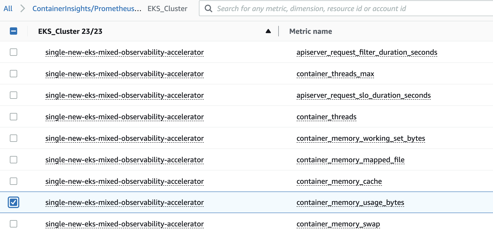

# Single New EKS Cluster AWS Mixed Observability Accelerator

## Architecture

The following figure illustrates the architecture of the pattern we will be deploying for Single EKS Cluster Mixed Observability pattern using AWS native tools such as CloudWatch and X-Ray and Open Source tools such as AWS Distro for OpenTelemetry(ADOT) and Prometheus Node Exporter.


This example makes use of CloudWatch as a metric and log aggregation layer while X-Ray is used as a trace-aggregation layer. In order to collect the metrics and traces we use the Open Source ADOT collector. Fluent Bit is used to export the logs to CloudWatch Logs.

In this architecture AWS X-Ray provides a complete view of requests as they travel through your application and filters visual data across payloads, functions, traces, services, and APIs. X-Ray also allows you to perform analytics to gain powerful insights about your distributed trace data.

Utilizing CloudWatch and X-Ray as an aggregation layer allows for a fully-managed scalable telemetry backend. In this example we get those benefits while still having the flexibility and rapid development of the Open Source collection tools.

## Objective

- Deploys one production grade Amazon EKS cluster.
- AWS Distro For OpenTelemetry Operator and Collector configured to collect metrics and traces.
- Logs with [AWS for FluentBit](https://github.com/aws/aws-for-fluent-bit) and CloudWatch Logs
- Aggregate Metrics in CloudWatch
- Aggregate Traces in X-Ray

Ensure that you have installed the following tools on your machine.

1. [aws cli](https://docs.aws.amazon.com/cli/latest/userguide/install-cliv2.html)
2. [kubectl](https://Kubernetes.io/docs/tasks/tools/)
3. [cdk](https://docs.aws.amazon.com/cdk/v2/guide/getting_started.html#getting_started_install)
4. [npm](https://docs.npmjs.com/cli/v8/commands/npm-install)

## Deploying

1. Clone your forked repository

```sh
git clone https://github.com/aws-observability/cdk-aws-observability-accelerator.git
```

2. Install the AWS CDK Toolkit globally on your machine using

```bash
npm install -g aws-cdk
```

3. Install project dependencies by running `npm install` in the main folder of this cloned repository

4. Once all pre-requisites are set you are ready to deploy the pipeline. Run the following command from the root of this repository to deploy the pipeline stack:

```bash
make build
make pattern single-new-eks-mixed-observability deploy
```

## Verify the resources

Run update-kubeconfig command. You should be able to get the command from CDK output message.

```bash
aws eks update-kubeconfig --name single-new-eks-mixed-observability-accelerator --region <your region> --role-arn arn:aws:iam::xxxxxxxxx:role/single-new-eks-opensource-singleneweksopensourceob-82N8N3BMJYYI
```

Let’s verify the resources created by steps above.

```bash
kubectl get nodes -o wide
```

Output:

```console
NAME                                         STATUS   ROLES    AGE    VERSION               INTERNAL-IP    EXTERNAL-IP   OS-IMAGE         KERNEL-VERSION                  CONTAINER-RUNTIME
ip-10-0-144-134.us-west-1.compute.internal   Ready    <none>   143m   v1.25.9-eks-0a21954   10.0.144.134   <none>        Amazon Linux 2   5.10.179-168.710.amzn2.x86_64   containerd://1.6.19
```

Next, lets verify the namespaces in the cluster:

```bash
kubectl get ns # Output shows all namespace
```

Output:

```console
NAME                            STATUS   AGE
aws-for-fluent-bit              Active   142m
cert-manager                    Active   142m
default                         Active   148m
external-secrets                Active   142m
kube-node-lease                 Active   149m
kube-public                     Active   149m
kube-system                     Active   149m
opentelemetry-operator-system   Active   142m
prometheus-node-exporter        Active   142m
```

## Visualization

Navigate to CloudWatch and go to Metrics -> All Metrics.

Select the metrics in the ContainerInsights/Prometheus Namespace:



View the graph of the selected metrics:


## Viewing Logs

Refer to "Using CloudWatch Logs Insights to Query Logs in [Logging](../../logs.md).

## Teardown

You can teardown the whole CDK stack with the following command:

```bash
make pattern single-new-eks-mixed-observability destroy
```


