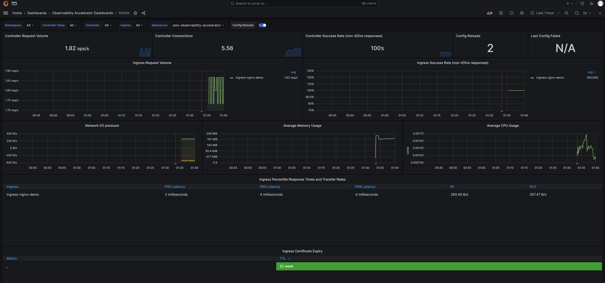

# Single Cluster Open Source Observability - NGINX Monitoring

## Objective

This pattern demonstrates how to use the _New EKS Cluster Open Source Observability Accelerator_ with Nginx based workloads.

## Prerequisites

Ensure that you have installed the following tools on your machine.

1. [aws cli](https://docs.aws.amazon.com/cli/latest/userguide/install-cliv2.html)
2. [kubectl](https://Kubernetes.io/docs/tasks/tools/)
3. [cdk](https://docs.aws.amazon.com/cdk/v2/guide/getting_started.html#getting_started_install)
4. [npm](https://docs.npmjs.com/cli/v8/commands/npm-install)

## Deploying

Please follow the _Deploying_ instructions of the [New EKS Cluster Open Source Observability Accelerator](./single-new-eks-opensource-observability.md) pattern, except for step 7, where you need to replace "context" in `~/.cdk.json` with the following:

```typescript
  "context": {
    "fluxRepository": {
      "name": "grafana-dashboards",
      "namespace": "grafana-operator",
      "repository": {
        "repoUrl": "https://github.com/aws-observability/aws-observability-accelerator",
        "name": "grafana-dashboards",
        "targetRevision": "main",
        "path": "./artifacts/grafana-operator-manifests/eks/infrastructure"
      },
      "values": {
        "GRAFANA_CLUSTER_DASH_URL" : "https://raw.githubusercontent.com/aws-observability/aws-observability-accelerator/main/artifacts/grafana-dashboards/eks/infrastructure/cluster.json",
        "GRAFANA_KUBELET_DASH_URL" : "https://raw.githubusercontent.com/aws-observability/aws-observability-accelerator/main/artifacts/grafana-dashboards/eks/infrastructure/kubelet.json",
        "GRAFANA_NSWRKLDS_DASH_URL" : "https://raw.githubusercontent.com/aws-observability/aws-observability-accelerator/main/artifacts/grafana-dashboards/eks/infrastructure/namespace-workloads.json",
        "GRAFANA_NODEEXP_DASH_URL" : "https://raw.githubusercontent.com/aws-observability/aws-observability-accelerator/main/artifacts/grafana-dashboards/eks/infrastructure/nodeexporter-nodes.json",
        "GRAFANA_NODES_DASH_URL" : "https://raw.githubusercontent.com/aws-observability/aws-observability-accelerator/main/artifacts/grafana-dashboards/eks/infrastructure/nodes.json",
        "GRAFANA_WORKLOADS_DASH_URL" : "https://raw.githubusercontent.com/aws-observability/aws-observability-accelerator/main/artifacts/grafana-dashboards/eks/infrastructure/workloads.json",
        "GRAFANA_NGINX_DASH_URL" : "https://raw.githubusercontent.com/aws-observability/aws-observability-accelerator/main/artifacts/grafana-dashboards/eks/nginx/nginx.json"
      },
      "kustomizations": [
        {
          "kustomizationPath": "./artifacts/grafana-operator-manifests/eks/infrastructure"
        },
        {
          "kustomizationPath": "./artifacts/grafana-operator-manifests/eks/nginx"
        }
      ]
    },
    "nginx.pattern.enabled": true
  }
```

!! warning This scenario might need larger worker node for the pod. 


Once completed the rest of the _Deploying_ steps, you can move on with the deployment of the Nginx workload.

## Deploy an example Nginx application

In this section we will deploy sample application and extract metrics using AWS OpenTelemetry collector.

1. Add NGINX ingress controller add-on into [lib/single-new-eks-opensource-observability-pattern/index.ts](../../../lib/single-new-eks-opensource-observability-pattern/index.ts) in add-on array.
```
        const addOns: Array<blueprints.ClusterAddOn> = [
            new blueprints.addons.CloudWatchLogsAddon({
                logGroupPrefix: `/aws/eks/${stackId}`,
                logRetentionDays: 30
            }),
            new blueprints.addons.XrayAdotAddOn(),
            new blueprints.addons.FluxCDAddOn({"repositories": [fluxRepository]}),
            new GrafanaOperatorSecretAddon(),
            new blueprints.addons.NginxAddOn({
                name: "ingress-nginx",
                chart: "ingress-nginx",
                repository: "https://kubernetes.github.io/ingress-nginx",
                version: "4.7.2",
                namespace: "nginx-ingress-sample",
                values: {
                    controller: { 
                        metrics: {
                            enabled: true,
                            service: {
                                annotations: {
                                    "prometheus.io/port": "10254",
                                    "prometheus.io/scrape": "true"
                                }
                            }
                        }
                    }
                }
            }),
        ];
```

2. Deploy pattern again 
```
make pattern single-new-eks-opensource-observability deploy
```

3. Verify if the application is running
```
kubectl get pods -n nginx-ingress-sample
```

4. Set an EXTERNAL-IP variable to the value of the EXTERNAL-IP column in the row of the NGINX ingress controller.
```
EXTERNAL_IP=$(kubectl get svc blueprints-addon-nginx-ingress-nginx-controller -n nginx-ingress-sample --output jsonpath='{.status.loadBalancer.ingress[0].hostname}')
```

5. Start some sample NGINX traffic by entering the following command.
```
SAMPLE_TRAFFIC_NAMESPACE=nginx-sample-traffic
curl https://raw.githubusercontent.com/aws-observability/aws-observability-accelerator/main/artifacts/k8s-deployment-manifest-templates/nginx/nginx-traffic-sample.yaml |
sed "s/{{external_ip}}/$EXTERNAL_IP/g" |
sed "s/{{namespace}}/$SAMPLE_TRAFFIC_NAMESPACE/g" |
kubectl apply -f -
```

## Verify the resources

```
kubectl get pod -n nginx-sample-traffic 
```

## Visualization

Login to your Grafana workspace and navigate to the Dashboards panel. You should see a new dashboard named `NGINX`, under `Observability Accelerator Dashboards`.



## Teardown

You can teardown the whole CDK stack with the following command:

```bash
make pattern single-new-eks-opensource-observability destroy
```
